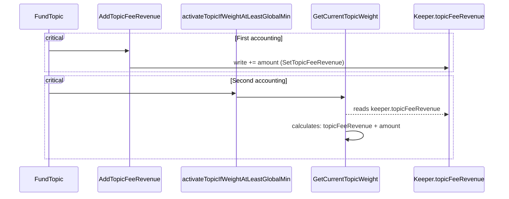

Nice Fiery Bull

High

# Funding amount is accounted twice leading to activating topic before reaching the global minimum

## Summary

The amount deposited through `FundTopic` is accounted twice during the topic activation calculation, leading to activating the topic too early (before reaching the minimum).

## Vulnerability Detail

During the funding of a topic through `FundTopic`, the funded amount will be added to the topic fee revenue.
It will then check if the topic has enough weight to become active.

However, during the check to see if enough weight is met, the funded amount will be accounted and added to the topic fee revenue.
This is problematic because the topic fee revenue was already modified to account for this funded amount.

This leads the funded amount to be accounted twice.

Then, this double accounting leads to overestimate the weight of a topic. So a topic may be activate without reaching the expected minimum weight.

## Impact

Topics will be activated before reaching the expected minimum weight.

## Code Snippet



The `FundTopic` function calls `AddTopicFeeRevenue` to add the amount to the `TopicFeeRevenue`.
It then calls the `activateTopicIfWeightAtLeastGlobalMin` function, which will read the `TopicFeeRevenue` but will also add the amount.

See [msg_server_demand.go#L44-L52](https://github.com/sherlock-audit/2024-06-allora/blob/main/allora-chain/x/emissions/keeper/msgserver/msg_server_demand.go#L44-L52)

```go
func (ms msgServer) FundTopic(ctx context.Context, msg *types.MsgFundTopic) (*types.MsgFundTopicResponse, error) {
    // ...

	// Account for the revenue the topic has generated
	err = ms.k.AddTopicFeeRevenue(ctx, msg.TopicId, msg.Amount) // POC: Add funded amount (First accounting)
	if err != nil {
		return nil, err
	}

	// Activate topic if it exhibits minimum weight
	err = activateTopicIfWeightAtLeastGlobalMin(ctx, ms, msg.TopicId, msg.Amount) // @POc: will use the funded amount (second accounting)
	return &types.MsgFundTopicResponse{}, err
}
```

### First accounting

First, the funded amount is added through a call to `AddTopicFeeRevenue`.
This function will modify `k.topicFeeRevenue`.

See [keeper.go#L1681](https://github.com/sherlock-audit/2024-06-allora/blob/main/allora-chain/x/emissions/keeper/keeper.go#L1681).
```go
// Add to the fee revenue collected by a topic
func (k *Keeper) AddTopicFeeRevenue(ctx context.Context, topicId TopicId, amount cosmosMath.Int) error {
	topicFeeRevenue, err := k.GetTopicFeeRevenue(ctx, topicId)
	if err != nil {
		return err
	}
	topicFeeRevenue = topicFeeRevenue.Add(amount)
	return k.topicFeeRevenue.Set(ctx, topicId, topicFeeRevenue) // @POC: set the new value (add amount)
}
```

### Second accounting

Then, the `activateTopicIfWeightAtLeastGlobalMin` function will call `GetCurrentTopicWeight` with
the funded amount as argument. See [msg_server_util_topic_activation.go#L28-L47](https://github.com/sherlock-audit/2024-06-allora/blob/main/allora-chain/x/emissions/keeper/msgserver/msg_server_util_topic_activation.go#L28-L47)

```go
func activateTopicIfWeightAtLeastGlobalMin(ctx context.Context, ms msgServer, topicId TopicId, amount Allo) error {
	//...
	if !isActivated {
		// ...

		newTopicWeight, _, err := ms.k.GetCurrentTopicWeight( // @POC: Incorrect calculation
			ctx,
			topicId,
			topic.EpochLength,
			params.TopicRewardAlpha,
			params.TopicRewardStakeImportance,
			params.TopicRewardFeeRevenueImportance,
			amount,
		)
		// ...

		if newTopicWeight.Gte(params.MinTopicWeight) { // @POC: Overestimated topic weight will activate the topic
			err = ms.k.ActivateTopic(ctx, topicId)
			if err != nil {
				return err
			}
		}
	}

	return nil
}
```

Finally, the issue lies in `GetCurrentTopicWeight` which will do the addition of the funded amount
to `k.topicFeeRevenue`. However, `k.topicFeeRevenue` was already increased by this amount (see previous section).
See [topic_weight.go#L61-L68](https://github.com/sherlock-audit/2024-06-allora/blob/main/allora-chain/x/emissions/keeper/topic_weight.go#L61-L68).

```go
func (k *Keeper) GetCurrentTopicWeight(
	ctx context.Context,
	topicId TopicId,
	topicEpochLength BlockHeight,
	topicRewardAlpha alloraMath.Dec,
	stakeImportance alloraMath.Dec,
	feeImportance alloraMath.Dec,
	additionalRevenue cosmosMath.Int,
) (weight alloraMath.Dec, topicRevenue cosmosMath.Int, err error) {
	// ...
	// Get and total topic fee revenue
	topicFeeRevenue, err := k.GetTopicFeeRevenue(ctx, topicId) // @POc: retrieves `k.topicFeeRevenue`
	if err != nil {
		return alloraMath.Dec{}, cosmosMath.Int{}, errors.Wrapf(err, "failed to get topic fee revenue")
	}

	// Calc target weight using fees, epoch length, stake, and params
	newFeeRevenue := additionalRevenue.Add(topicFeeRevenue) // @POC: Adds the funded amount to the `topicFeeRevenue`
	feeRevenue, err := alloraMath.NewDecFromSdkInt(newFeeRevenue)
	if err != nil {
		return alloraMath.Dec{}, cosmosMath.Int{}, errors.Wrapf(err, "failed to convert topic fee revenue to dec")
	}

    // ...

```


## Proof of Concept

The following patch should be applied to import the PoC.
Then, go in `allora-chain/x/emissions` and run the PoC with `go test ./keeper/msgserver/... -v -run "TestMsgServerTestSuite/TestPocDoubleAccounting"`.

```diff
diff --git a/allora-chain/x/emissions/keeper/msgserver/msg_server_demand_test.go b/allora-chain/x/emissions/keeper/msgserver/msg_server_demand_test.go
index abbdb54..978d390 100644
--- a/allora-chain/x/emissions/keeper/msgserver/msg_server_demand_test.go
+++ b/allora-chain/x/emissions/keeper/msgserver/msg_server_demand_test.go
@@ -59,6 +59,58 @@ func (s *MsgServerTestSuite) TestFundTopicSimple() {
 	s.Require().True(topicWeightAfter.Gt(topicWeightBefore), "Topic weight should be greater after funding the topic")
 }
 
+func (s *MsgServerTestSuite) TestPocDoubleAccounting() {
+	senderAddr := sdk.AccAddress(PKS[0].Address())
+	sender := senderAddr.String()
+	topicId := s.CreateOneTopic()
+	// put some stake in the topic
+	err := s.emissionsKeeper.AddReputerStake(s.ctx, topicId, PKS[1].Address().String(), cosmosMath.NewInt(500000))
+	s.Require().NoError(err)
+	s.emissionsKeeper.InactivateTopic(s.ctx, topicId)
+	var initialStake int64 = 1000
+	initialStakeCoins := sdk.NewCoins(sdk.NewCoin(params.DefaultBondDenom, cosmosMath.NewInt(initialStake)))
+	s.bankKeeper.MintCoins(s.ctx, types.AlloraStakingAccountName, initialStakeCoins)
+	s.bankKeeper.SendCoinsFromModuleToAccount(s.ctx, types.AlloraStakingAccountName, senderAddr, initialStakeCoins)
+	r := types.MsgFundTopic{
+		Sender:  sender,
+		TopicId: topicId,
+		Amount:  cosmosMath.NewInt(initialStake),
+	}
+	params, err := s.emissionsKeeper.GetParams(s.ctx)
+	s.Require().NoError(err, "GetParams should not return an error")
+	topicWeightBefore, feeRevBefore, err := s.emissionsKeeper.GetCurrentTopicWeight(
+		s.ctx,
+		r.TopicId,
+		10800,
+		params.TopicRewardAlpha,
+		params.TopicRewardStakeImportance,
+		params.TopicRewardFeeRevenueImportance,
+		r.Amount,
+	)
+	s.Require().NoError(err)
+	response, err := s.msgServer.FundTopic(s.ctx, &r)
+	s.Require().NoError(err, "RequestInference should not return an error")
+	s.Require().NotNil(response, "Response should not be nil")
+
+	// Check if the topic is activated
+	res, err := s.emissionsKeeper.IsTopicActive(s.ctx, r.TopicId)
+	s.Require().NoError(err)
+	s.Require().Equal(true, res, "TopicId is not activated")
+	// check that the topic fee revenue has been updated
+	topicWeightAfter, feeRevAfter, err := s.emissionsKeeper.GetCurrentTopicWeight(
+		s.ctx,
+		r.TopicId,
+		10800,
+		params.TopicRewardAlpha,
+		params.TopicRewardStakeImportance,
+		params.TopicRewardFeeRevenueImportance,
+		r.Amount,
+	)
+	s.Require().NoError(err)
+	s.Require().True(feeRevAfter.GT(feeRevBefore), "Topic fee revenue should be greater after funding the topic")
+	s.Require().True(topicWeightAfter.Gt(topicWeightBefore), "Topic weight should be greater after funding the topic")
+}
+
 func (s *MsgServerTestSuite) TestHighWeightForHighFundedTopic() {
 	senderAddr := sdk.AccAddress(PKS[0].Address())
 	sender := senderAddr.String()
diff --git a/allora-chain/x/emissions/keeper/msgserver/msg_server_util_topic_activation.go b/allora-chain/x/emissions/keeper/msgserver/msg_server_util_topic_activation.go
index e338495..cbc4c10 100644
--- a/allora-chain/x/emissions/keeper/msgserver/msg_server_util_topic_activation.go
+++ b/allora-chain/x/emissions/keeper/msgserver/msg_server_util_topic_activation.go
@@ -2,6 +2,7 @@ package msgserver
 
 import (
 	"context"
+	"fmt"
 
 	"cosmossdk.io/errors"
 	cosmosMath "cosmossdk.io/math"
@@ -34,9 +35,19 @@ func activateTopicIfWeightAtLeastGlobalMin(ctx context.Context, ms msgServer, to
 			params.TopicRewardFeeRevenueImportance,
 			amount,
 		)
+		pocTopicWeight, _, err := ms.k.GetCurrentTopicWeight(
+			ctx,
+			topicId,
+			topic.EpochLength,
+			params.TopicRewardAlpha,
+			params.TopicRewardStakeImportance,
+			params.TopicRewardFeeRevenueImportance,
+			cosmosMath.NewInt(0), // @POC: should be zero here
+		)
 		if err != nil {
 			return errors.Wrapf(err, "error getting current topic weight")
 		}
+		fmt.Println("POC - newTopicWeight = ", newTopicWeight, " but should be", pocTopicWeight, " and minTopicWeight =", params.MinTopicWeight)
 
 		if newTopicWeight.Gte(params.MinTopicWeight) {
 			err = ms.k.ActivateTopic(ctx, topicId)

```

### PoC results

The PoC will output the following:

```text
=== RUN   TestMsgServerTestSuite
=== RUN   TestMsgServerTestSuite/TestPocDoubleAccounting
POC - newTopicWeight =  304.2903097250922852538721015560012  but should be 215.1657414559676047321814110990222  and minTopicWeight = 100
--- PASS: TestMsgServerTestSuite (0.00s)
    --- PASS: TestMsgServerTestSuite/TestPocDoubleAccounting (0.00s)
PASS
ok      github.com/allora-network/allora-chain/x/emissions/keeper/msgserver     0.030s
```

## Tool used

Manual Review

## Recommendation

`FundTopic` should call `activateTopicIfWeightAtLeastGlobalMin` with an amount of zero.

The following patch applies this recommendation.

```diff
diff --git a/allora-chain/x/emissions/keeper/msgserver/msg_server_demand.go b/allora-chain/x/emissions/keeper/msgserver/msg_server_demand.go
index 3de71dd..18fffe7 100644
--- a/allora-chain/x/emissions/keeper/msgserver/msg_server_demand.go
+++ b/allora-chain/x/emissions/keeper/msgserver/msg_server_demand.go
@@ -3,6 +3,7 @@ package msgserver
 import (
 	"context"
 
+	"cosmossdk.io/math"
 	appParams "github.com/allora-network/allora-chain/app/params"
 	alloraMath "github.com/allora-network/allora-chain/math"
 	"github.com/allora-network/allora-chain/x/emissions/types"
@@ -48,6 +49,6 @@ func (ms msgServer) FundTopic(ctx context.Context, msg *types.MsgFundTopic) (*ty
 	}
 
 	// Activate topic if it exhibits minimum weight
-	err = activateTopicIfWeightAtLeastGlobalMin(ctx, ms, msg.TopicId, msg.Amount)
+	err = activateTopicIfWeightAtLeastGlobalMin(ctx, ms, msg.TopicId, math.NewInt(0))
 	return &types.MsgFundTopicResponse{}, err
 }

```