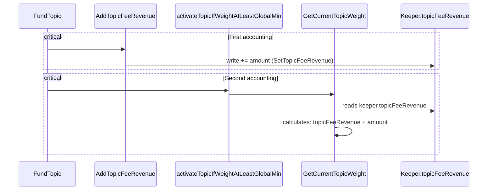

# Issue H-1: Topic Activation Failure Due to Unhandled Error 

Source: https://github.com/sherlock-audit/2024-06-allora-judging/issues/1 

## Found by 
defsec
## Summary

The `activateTopicIfWeightAtLeastGlobalMin` function returns an error if any of the internal operations encounter an error. However, the returned error is not being properly handled or propagated in the `FundTopic` method.


## Vulnerability Detail

In the provided code snippet, the `activateTopicIfWeightAtLeastGlobalMin` function is called within the `FundTopic` method of the `msgServer` to potentially activate a topic if its weight meets the global minimum threshold. However, there is a risk that the topic may not be activated even if it meets the necessary criteria due to an unhandled error.

The specific issue lies in the following line of code:
```go
err = activateTopicIfWeightAtLeastGlobalMin(ctx, ms, msg.TopicId, msg.Amount)
```

## Impact

If an error occurs during the topic activation process, it will be silently ignored, and the topic may remain inactive even if it should have been activated based on the weight criteria. 

## Code Snippet

[msg_server_demand.go#L51](https://github.com/allora-network/allora-chain/blob/3a97afe7af027c96749fac7c4327ae85359a61c8/x/emissions/keeper/msgserver/msg_server_demand.go#L51)

```go
func (ms msgServer) FundTopic(ctx context.Context, msg *types.MsgFundTopic) (*types.MsgFundTopicResponse, error) {
	// Check the topic is valid
	topicExists, err := ms.k.TopicExists(ctx, msg.TopicId)
	if err != nil {
		return nil, err
	}
	if !topicExists {
		return nil, types.ErrInvalidTopicId
	}

	// Check that the request isn't spam by checking that the amount of funds it bids is greater than a global minimum demand per request
	params, err := ms.k.GetParams(ctx)
	if err != nil {
		return nil, err
	}
	amountDec, err := alloraMath.NewDecFromSdkInt(msg.Amount)
	if err != nil {
		return nil, err
	}
	if amountDec.Lte(params.Epsilon) {
		return nil, types.ErrFundAmountTooLow
	}
	// Check sender has funds to pay for the inference request
	// bank module does this for us in module SendCoins / subUnlockedCoins so we don't need to check
	// Send funds
	coins := sdk.NewCoins(sdk.NewCoin(appParams.DefaultBondDenom, msg.Amount))
	err = ms.k.SendCoinsFromAccountToModule(ctx, msg.Sender, minttypes.EcosystemModuleName, coins)
	if err != nil {
		return nil, err
	}

	// Account for the revenue the topic has generated
	err = ms.k.AddTopicFeeRevenue(ctx, msg.TopicId, msg.Amount)
	if err != nil {
		return nil, err
	}

	// Activate topic if it exhibits minimum weight
	err = activateTopicIfWeightAtLeastGlobalMin(ctx, ms, msg.TopicId, msg.Amount)
	return &types.MsgFundTopicResponse{}, err
}
```


## Tool used

Manual Review

## Recommendation

Modify the `FundTopic` method to properly handle the error returned by `activateTopicIfWeightAtLeastGlobalMin`.
   - If an error occurs during topic activation, it should be logged, and an appropriate error response should be returned to the caller.

   ```go
   err = activateTopicIfWeightAtLeastGlobalMin(ctx, ms, msg.TopicId, msg.Amount)
   if err != nil {
       // Log the error for visibility and debugging purposes
       ms.k.Logger(ctx).Error("Failed to activate topic", "error", err)
       return nil, err
   }
   ```


## Discussion

**sherlock-admin2**

1 comment(s) were left on this issue during the judging contest.

**0xmystery** commented:
> Error is silently handled


# Issue H-2: anybody can halt chain in `nsertBulkWorkerPayload` 

Source: https://github.com/sherlock-audit/2024-06-allora-judging/issues/11 

## Found by 
volodya
## Summary
anybody can halt chain in `nsertBulkWorkerPayload` by providing `bundle.InferenceForecastsBundle.Inference = nil`
## Vulnerability Detail
Anybody can call `InsertBulkWorkerPayload`

```go
func (ms msgServer) InsertBulkWorkerPayload(ctx context.Context, msg *types.MsgInsertBulkWorkerPayload) (*types.MsgInsertBulkWorkerPayloadResponse, error) {
...
	acceptedInferers, err := verifyAndInsertInferencesFromTopInferers(
		ctx,
		ms,
		msg.TopicId,
		*msg.Nonce,
		msg.WorkerDataBundles,
		moduleParams.MaxTopInferersToReward,
	)
```
[msgserver/msg_server_worker_payload.go#L219](https://github.com/sherlock-audit/2024-06-allora/blob/main/allora-chain/x/emissions/keeper/msgserver/msg_server_worker_payload.go#L219)
bundle.InferenceForecastsBundle.Inference can be assigned to nil by sender, so there will an error when trying to access its property.
There is no validation for it

```go
func verifyAndInsertInferencesFromTopInferers(
	ctx context.Context,
	ms msgServer,
	topicId uint64,
	nonce types.Nonce,
	// inferences []*types.Inference,
	workerDataBundles []*types.WorkerDataBundle,
	maxTopWorkersToReward uint64,
) (map[string]bool, error) {
...
		if inference.TopicId != topicId ||
			inference.BlockHeight != nonce.BlockHeight {
			errors[workerDataBundle.Worker] = "Worker data bundle does not match topic or nonce"
			continue
		}
```

Iniside validation it will be passed
```go
func (bundle *WorkerDataBundle) Validate() error {
...

	// Validate the inference and forecast of the bundle
	if bundle.InferenceForecastsBundle.Inference == nil && bundle.InferenceForecastsBundle.Forecast == nil {
		return errors.Wrap(sdkerrors.ErrInvalidRequest, "inference and forecast cannot both be nil")
	}
	if bundle.InferenceForecastsBundle.Inference != nil {
		if err := bundle.InferenceForecastsBundle.Inference.Validate(); err != nil {
			return err
		}
	}
	if bundle.InferenceForecastsBundle.Forecast != nil {
		if err := bundle.InferenceForecastsBundle.Forecast.Validate(); err != nil {
			return err
		}
	}

```
## Impact

## Code Snippet

## Tool used

Manual Review

## Recommendation
Implement the same validation like inside `verifyAndInsertForecastsFromTopForecasters` function
```diff
		inference := workerDataBundle.InferenceForecastsBundle.Inference

		// Check if the topic and nonce are correct
+		if  inference == nil ||
                        inference.TopicId != topicId ||
			inference.BlockHeight != nonce.BlockHeight {
			errors[workerDataBundle.Worker] = "Worker data bundle does not match topic or nonce"
			continue
		}
```


## Discussion

**sherlock-admin3**

1 comment(s) were left on this issue during the judging contest.

**0xmystery** commented:
> InsertBulkWorkerPayload could halt chain


**sherlock-admin2**

The protocol team fixed this issue in the following PRs/commits:
https://github.com/allora-network/allora-chain/pull/446


# Issue H-3: forecast-implied inferences can be set to any value due to ForecastElements is not filtered by duplicate. 

Source: https://github.com/sherlock-audit/2024-06-allora-judging/issues/12 

## Found by 
volodya
## Summary
forecast-implied inferences can be set to any value due to ForecastElements is not filtered by duplicate.
## Vulnerability Detail
The function `InsertBulkWorkerPayload` doesn't have any authentication. There is no validation for duplicates inside the input variable `workerDataBundle.InferenceForecastsBundle.Forecast.ForecastElements`
```go
			for _, el := range forecast.ForecastElements {
				if _, ok := acceptedInferersOfBatch[el.Inferer]; ok {
					acceptedForecastElements = append(acceptedForecastElements, el)
				}
			}

			// Discard if empty
			if len(acceptedForecastElements) == 0 {
				continue
			}

```
[msg_server_worker_payload.go#L164](https://github.com/sherlock-audit/2024-06-allora/blob/main/allora-chain/x/emissions/keeper/msgserver/msg_server_worker_payload.go#L164)

`.ForecastElements` is being used inside `CalcForecastImpliedInferences` to calculate forecast-implied inference value.
## Impact
forecastValue can be set to any value due to duplication
## Code Snippet

## Tool used

Manual Review

## Recommendation
Filter out duplicates inside workerDataBundle.InferenceForecastsBundle.Forecast.ForecastElements inside `verifyAndInsertForecastsFromTopForecasters` before saving via `ms.k.InsertForecasts(`


## Discussion

**sherlock-admin2**

1 comment(s) were left on this issue during the judging contest.

**0xmystery** commented:
> forecastValue can be set to any value due to duplication


**sherlock-admin2**

The protocol team fixed this issue in the following PRs/commits:
https://github.com/allora-network/allora-chain/pull/449


# Issue H-4: Not appropriate Inferences will be used when calculating the forecast 

Source: https://github.com/sherlock-audit/2024-06-allora-judging/issues/14 

## Found by 
volodya
## Summary
Not appropriate Inferences will be used when calculating the forecast due to not saving filtered results
## Vulnerability Detail
Current variable `acceptedInferersOfBatch` doesn't do anything due to `acceptedForecastElements` is not being saved. It should filter out accepted Inferers according to the comment and a function logic otherwise all inferences will be used when calculating forecast
```go
func verifyAndInsertForecastsFromTopForecasters(
	ctx context.Context,
	ms msgServer,
	topicId uint64,
	nonce types.Nonce,
	workerDataBundle []*types.WorkerDataBundle,
	// Inferers in the current batch, assumed to have passed VerifyAndInsertInferencesFromTopInferers() filters
	acceptedInferersOfBatch map[string]bool,
	maxTopWorkersToReward uint64,
) error {
			// Examine forecast elements to verify that they're for inferers in the current set.
			// We assume that set of inferers has been verified above.
			// We keep what we can, ignoring the forecaster and their contribution (forecast) entirely
			// if they're left with no valid forecast elements.
			acceptedForecastElements := make([]*types.ForecastElement, 0)
			for _, el := range forecast.ForecastElements {
				if _, ok := acceptedInferersOfBatch[el.Inferer]; ok {
					acceptedForecastElements = append(acceptedForecastElements, el)
				}
			}
...
```
[keeper/msgserver/msg_server_worker_payload.go#L163](https://github.com/sherlock-audit/2024-06-allora/blob/main/allora-chain/x/emissions/keeper/msgserver/msg_server_worker_payload.go#L163)
## Impact
Not appropriate Inferences will be used when calculating the forecast
## Code Snippet

## Tool used

Manual Review

## Recommendation
It should look like this
```diff
			acceptedForecastElements := make([]*types.ForecastElement, 0)
			for _, el := range forecast.ForecastElements {
				if _, ok := acceptedInferersOfBatch[el.Inferer]; ok {
					acceptedForecastElements = append(acceptedForecastElements, el)
				}
			}

			// Discard if empty
			if len(acceptedForecastElements) == 0 {
				continue
			}
+                     forecast.ForecastElements = acceptedForecastElements;
			/// Filtering done now, now write what we must for inclusion

			// Get the latest score for each forecaster => only take top few by score descending
			latestScore, err := ms.k.GetLatestForecasterScore(ctx, topicId, forecast.Forecaster)
			if err != nil {
				continue
			}
			latestForecasterScores[forecast.Forecaster] = latestScore
			forecastsByForecaster[forecast.Forecaster] = forecast
		}
```


## Discussion

**sherlock-admin4**

1 comment(s) were left on this issue during the judging contest.

**0xmystery** commented:
> Forecast is calculated using wrong inferences


**sherlock-admin2**

The protocol team fixed this issue in the following PRs/commits:
https://github.com/allora-network/allora-chain/pull/449


# Issue H-5: Adversary can arbitrarily trigger a chain halt by sending `MsgRemove{Delegate}Stake` with negative amount 

Source: https://github.com/sherlock-audit/2024-06-allora-judging/issues/21 

## Found by 
Kow, LZ\_security, abdulsamijay, imsrybr0, volodya
## Summary
Adversary can trigger chain halt arbitrarily by sending `MsgRemoveStake` or `MsgRemoveDelegateStake` with negative amount.

## Vulnerability Detail
In `msg_server_stake.go`, `RemoveStake` and `RemoveDelegateStake` contain the logic for starting the stake removal process for reputers and delegators respectively. After `RemoveStakeDelayWindow` blocks have passed, the stake removal is processed at the start of the `emissions` module `EndBlocker`. To send the removed stake amount to the reputer/delegator, a new coins structure is created using the amount unstaked.
https://github.com/sherlock-audit/2024-06-allora/blob/4e1bc73db32873476f8b0a88945815d3978d931c/allora-chain/x/emissions/module/stake_removals.go#L13-L35
```go
func RemoveStakes(
	sdkCtx sdk.Context,
	currentBlock int64,
	k emissionskeeper.Keeper,
) {
	removals, err := k.GetStakeRemovalsForBlock(sdkCtx, currentBlock)
	...
	for _, stakeRemoval := range removals {
		...
		coins := sdk.NewCoins(sdk.NewCoin(chainParams.DefaultBondDenom, stakeRemoval.Amount))
```
(`RemoveDelegateStakes` follows similar logic)

Note that `sdk.NewCoin` will panic if the amount specified is negative.
https://github.com/cosmos/cosmos-sdk/blob/a32186608aab0bd436049377ddb34f90006fcbf7/types/coin.go#L25-L27
https://github.com/cosmos/cosmos-sdk/blob/a32186608aab0bd436049377ddb34f90006fcbf7/types/coin.go#L54-L56

The issue is the `Amount` parameter for the corresponding messages are integers and there is no validation that they are non-negative. Additionally, a negative amount to always passes the staked balance check. Consequently, anyone can send either `MsgRemoveStake` or `MsgRemoveDelegateStake` with a negative amount at any time and cause a chain halt when the stake removal matures.

<details>

<summary>PoC</summary>
The following test can be copied into `msg_server_stake_test.go` and will panic due to the negative coin amount. The PoC for `RemoveDelegateStake` is very similar.

```go
func (s *MsgServerTestSuite) TestRemoveStakeDoS() {
	ctx := s.ctx
	require := s.Require()
	keeper := s.emissionsKeeper
	senderAddr := sdk.AccAddress(PKS[0].Address())

	msg := &types.MsgRemoveStake{
		Sender:  senderAddr.String(),
		TopicId: uint64(123),
		Amount:  cosmosMath.NewInt(-1),
	}

	response, err := s.msgServer.RemoveStake(ctx, msg)
	require.NoError(err)
	require.NotNil(response)

	params, err := keeper.GetParams(ctx)
	require.NoError(err)
	ctx = ctx.WithBlockHeight(ctx.BlockHeight() + params.RemoveStakeDelayWindow)

	_ = s.appModule.EndBlock(ctx)
}
```

</details>

## Impact
Chain halt after `RemovalStakeDelayWindow` blocks due to negative coin amount in `EndBlocker`.

## Code Snippet
https://github.com/sherlock-audit/2024-06-allora/blob/4e1bc73db32873476f8b0a88945815d3978d931c/allora-chain/x/emissions/module/stake_removals.go#L13-L35
https://github.com/sherlock-audit/2024-06-allora/blob/4e1bc73db32873476f8b0a88945815d3978d931c/allora-chain/x/emissions/module/stake_removals.go#L66-L89

## Tool used

Manual Review

## Recommendation
Validate that `Amount` is non-negative in `RemoveStake` and `RemoveDelegateStake`.


## Discussion

**sherlock-admin2**

1 comment(s) were left on this issue during the judging contest.

**0xmystery** commented:
> Negative value in stake-specific functions causes `panic()` which permanently halts chain


**sherlock-admin2**

The protocol team fixed this issue in the following PRs/commits:
https://github.com/allora-network/allora-chain/pull/441


# Issue H-6: SetDelegateStakePlacement error is not handled in RewardDelegateStake 

Source: https://github.com/sherlock-audit/2024-06-allora-judging/issues/30 

## Found by 
imsrybr0
## Summary
`SetDelegateStakePlacement` error is not handled in `RewardDelegateStake`.

## Vulnerability Detail
If `SetDelegateStakePlacement` fails in `RewardDelegateStake`, the `RewardDebt` will not be saved and it would allow a delegate staker to claim the same rewards more than once.

## Impact
Rewards being distributed more than once can lead to insolvency (.i.e : others delegate stakers not being able to claim their rewards) and the drainage of the `AlloraPendingReward` module account.

## Code Snippet
[RewardDelegateStake](https://github.com/sherlock-audit/2024-06-allora/blob/main/allora-chain/x/emissions/keeper/msgserver/msg_server_stake.go#L270C21-L309)
```solidity
func (ms msgServer) RewardDelegateStake(ctx context.Context, msg *types.MsgRewardDelegateStake) (*types.MsgRewardDelegateStakeResponse, error) {
	// Check the target reputer exists and is registered
	isRegistered, err := ms.k.IsReputerRegisteredInTopic(ctx, msg.TopicId, msg.Reputer)
	if err != nil {
		return nil, err
	}
	if !isRegistered {
		return nil, types.ErrAddressIsNotRegisteredInThisTopic
	}

	delegateInfo, err := ms.k.GetDelegateStakePlacement(ctx, msg.TopicId, msg.Sender, msg.Reputer)
	if err != nil {
		return nil, err
	}
	share, err := ms.k.GetDelegateRewardPerShare(ctx, msg.TopicId, msg.Reputer)
	if err != nil {
		return nil, err
	}
	pendingReward, err := delegateInfo.Amount.Mul(share)
	if err != nil {
		return nil, err
	}
	pendingReward, err = pendingReward.Sub(delegateInfo.RewardDebt) // <===== Audit
	if err != nil {
		return nil, err
	}
	if pendingReward.Gt(alloraMath.NewDecFromInt64(0)) {
		coins := sdk.NewCoins(sdk.NewCoin(params.DefaultBondDenom, pendingReward.SdkIntTrim()))
		err = ms.k.SendCoinsFromModuleToAccount(ctx, types.AlloraPendingRewardForDelegatorAccountName, msg.Sender, coins)
		if err != nil {
			return nil, err
		}
		delegateInfo.RewardDebt, err = delegateInfo.Amount.Mul(share)
		if err != nil {
			return nil, err
		}
		ms.k.SetDelegateStakePlacement(ctx, msg.TopicId, msg.Sender, msg.Reputer, delegateInfo) // <====== Audit
	}
	return &types.MsgRewardDelegateStakeResponse{}, nil
}
```

## Tool used
Manual Review

## Recommendation
Handle the`SetDelegateStakePlacement` error.


## Discussion

**sherlock-admin2**

1 comment(s) were left on this issue during the judging contest.

**0xmystery** commented:
> Error SetDelegateStakePlacement is not handled correctly in RewardDelegateStake


**sherlock-admin2**

The protocol team fixed this issue in the following PRs/commits:
https://github.com/allora-network/allora-chain/pull/463


# Issue H-7: Potential for Uncontrolled Resource Consumption in `topics_handler.go` 

Source: https://github.com/sherlock-audit/2024-06-allora-judging/issues/32 

## Found by 
0xsi
## Summary
There is no ressource consumption check in `requestTopicWorkers` and `requestTopicReputers` which can lead to dangerous scenarios.

## Vulnerability Detail
The use of goroutines in `requestTopicWorkers` and `requestTopicReputers` without proper limits can lead to uncontrolled resource consumption. If the number of topics or nonces is large, it can spawn a large number of goroutines, leading to potential resource exhaustion.


## Impact
Uncontrolled spawning of goroutines can lead to excessive resource consumption, causing performance degradation, potential crashes, or denial of service.


## Code Snippet
https://github.com/sherlock-audit/2024-06-allora/blob/main/allora-chain/app/topics_handler.go#L74-L78

https://github.com/sherlock-audit/2024-06-allora/blob/main/allora-chain/app/topics_handler.go#L101-L127

## Tool used

Manual Review

## Recommendation
Implement a mechanism to limit the number of concurrent goroutines. Use worker pools or similar constructs to control resource usage and prevent exhaustion.


## Discussion

**sherlock-admin4**

1 comment(s) were left on this issue during the judging contest.

**0xmystery** commented:
> Resource consumption is not controlled


**sherlock-admin2**

The protocol team fixed this issue in the following PRs/commits:
https://github.com/allora-network/allora-chain/pull/458


# Issue H-8: Non-deterministic Ranges in Inference Synthesis Causing Inconsistent State Across Nodes 

Source: https://github.com/sherlock-audit/2024-06-allora-judging/issues/38 

## Found by 
0x416, defsec, imsrybr0, volodya
## Summary

In the `inference_synthesis` package, the inference synthesis process is utilizing non-deterministic ranges. This non-deterministic behavior can lead to inconsistent state across different nodes, particularly for any data saved from the inference synthesis. The inconsistency can cause significant issues in the system's overall functionality and reliability.


## Vulnerability Detail

In the `inference_synthesis` package, the inference synthesis process is utilizing non-deterministic ranges. This non-deterministic behavior can lead to inconsistent state across different nodes, particularly for any data saved from the inference synthesis. The inconsistency can cause significant issues in the system's overall functionality and reliability.

The code section in question involves creating deep copies of various maps and structs within the `SynthPalette` struct. While the cloning function is properly creating deep copies, the inference synthesis process itself is not deterministic, which leads to the described issue.

## Impact

This issue can cause multiple nodes in a distributed system to have differing states due to the non-deterministic ranges used during inference synthesis. This can result in:
- Inconsistent inference and forecast results across nodes.
- Difficulty in debugging and maintaining the system due to unpredictable state changes.
- Potential data corruption or loss of data integrity, which can affect overall system performance and reliability.
- Issues in consensus mechanisms if nodes cannot agree on a single state.

## Code Snippet

[synth_palette_bootstrap.go#L58-L82](https://github.com/allora-network/allora-chain/blob/3a97afe7af027c96749fac7c4327ae85359a61c8/x/emissions/keeper/inference_synthesis/synth_palette_bootstrap.go#L58-L82)


```go
func (p SynthPalette) Clone() SynthPalette {
	inferenceByWorker := make(map[Worker]*emissionstypes.Inference, len(p.InferenceByWorker))
	for k, v := range p.InferenceByWorker {
		inferenceCopy := *v
		inferenceByWorker[k] = &inferenceCopy
	}
	forecastByWorker := make(map[Worker]*emissionstypes.Forecast, len(p.ForecastByWorker))
	for k, v := range p.ForecastByWorker {
		forecastCopy := *v
		forecastByWorker[k] = &forecastCopy
	}
	forecastImpliedInferenceByWorker := make(map[Worker]*emissionstypes.Inference, len(p.ForecastImpliedInferenceByWorker))
	for k, v := range p.ForecastImpliedInferenceByWorker {
		inferenceCopy := *v
		forecastImpliedInferenceByWorker[k] = &inferenceCopy
	}
	infererRegrets := make(map[Worker]*StatefulRegret, len(p.InfererRegrets))
	for k, v := range p.InfererRegrets {
		regretCopy := *v
		infererRegrets[k] = &regretCopy
	}
	forecasterRegrets := make(map[Worker]*StatefulRegret, len(p.ForecasterRegrets))
	for k, v := range p.ForecasterRegrets {
		regretCopy := *v
		forecasterRegrets[k] = &regretCopy
	}
```

## Tool used

Manual Review

## Recommendation

   - Review the inference synthesis process and identify the sources of non-determinism.
   - Ensure that all ranges and related calculations are deterministic, i.e., they produce the same output given the same input across all nodes.


## Discussion

**sherlock-admin3**

1 comment(s) were left on this issue during the judging contest.

**0xmystery** commented:
> Map is non-deterministic


**sherlock-admin2**

The protocol team fixed this issue in the following PRs/commits:
https://github.com/allora-network/allora-chain/pull/408


# Issue H-9: The chain will not be in the correct state when upgraded via a hard fork. 

Source: https://github.com/sherlock-audit/2024-06-allora-judging/issues/42 

## Found by 
volodya
## Summary
The chain will not be in the correct state when upgraded via a hard fork.
## Vulnerability Detail
According to [cosmos SDK](https://docs.cosmos.network/main/build/building-modules/genesis#exportgenesis)
>The ExportGenesis method is executed whenever an export of the state is made. It takes the latest known version of the subset of the state managed by the module and creates a new GenesisState out of it. This is mainly used when the chain needs to be upgraded via a hard fork.

There should be whole state imported inside `ExportGenesis` not only moduleParams, everything from `InitGenesis` and any other state that is being mutated inside emissions module, just like its done for [mint module](https://github.com/sherlock-audit/2024-06-allora/blob/main/allora-chain/x/mint/keeper/genesis.go#L36) otherwise fork would unsucessfull
```go
func (k *Keeper) InitGenesis(ctx context.Context, data *types.GenesisState) error {
	// ensure the module account exists
	stakingModuleAccount := k.authKeeper.GetModuleAccount(ctx, types.AlloraStakingAccountName)
	k.authKeeper.SetModuleAccount(ctx, stakingModuleAccount)
	alloraRewardsModuleAccount := k.authKeeper.GetModuleAccount(ctx, types.AlloraRewardsAccountName)
	k.authKeeper.SetModuleAccount(ctx, alloraRewardsModuleAccount)
	alloraPendingRewardsModuleAccount := k.authKeeper.GetModuleAccount(ctx, types.AlloraPendingRewardForDelegatorAccountName)
	k.authKeeper.SetModuleAccount(ctx, alloraPendingRewardsModuleAccount)
	if err := k.SetParams(ctx, data.Params); err != nil {
		return err
	}
	if err := k.SetTotalStake(ctx, cosmosMath.ZeroInt()); err != nil {
		return err
	}
	// reserve topic ID 0 for future use
	if _, err := k.IncrementTopicId(ctx); err != nil {
		return err
	}

	// add core team to the whitelists
	if err := k.addCoreTeamToWhitelists(ctx, data.CoreTeamAddresses); err != nil {
		return err
	}

	// For mint module inflation rate calculation set the initial
	// "previous percentage of rewards that went to staked reputers" to 30%
	if err := k.SetPreviousPercentageRewardToStakedReputers(ctx, alloraMath.MustNewDecFromString("0.3")); err != nil {
		return err
	}

	return nil
}
// ExportGenesis exports the module state to a genesis state.
func (k *Keeper) ExportGenesis(ctx context.Context) (*types.GenesisState, error) {
	moduleParams, err := k.GetParams(ctx)
	if err != nil {
		return nil, err
	}

	return &types.GenesisState{
		Params: moduleParams,
	}, nil
}
```
[emissions/keeper/genesis.go#L46](https://github.com/sherlock-audit/2024-06-allora/blob/main/allora-chain/x/emissions/keeper/genesis.go#L46)
## Impact

## Code Snippet

## Tool used

Manual Review

## Recommendation
Export whole state inside `ExportGenesis`
```diff
func (k *Keeper) ExportGenesis(ctx context.Context) (*types.GenesisState, error) {
	moduleParams, err := k.GetParams(ctx)
+	totalStake, err := k.GetTotalStake(ctx)
+	previousPercentageRewardToStakedReputers, err := k.GetPreviousPercentageRewardToStakedReputers(ctx)
	...
	if err != nil {
		return nil, err
	}

	return &types.GenesisState{
+		Params:     moduleParams,
+		totalStake: totalStake,
+		previousPercentageRewardToStakedReputers: previousPercentageRewardToStakedReputers,
		...
	}, nil
}
```


## Discussion

**sherlock-admin2**

The protocol team fixed this issue in the following PRs/commits:
https://github.com/allora-network/allora-chain/pull/443


# Issue H-10: Missing highestVotingPower Update in argmaxBlockByStake Resulting in Incorrect Block Selection 

Source: https://github.com/sherlock-audit/2024-06-allora-judging/issues/44 

## Found by 
Yuriisereda
## Summary
The argmaxBlockByStake function is used to identify the block height with the highest cumulative voting power based on the stakes of voting reputers. However, the calculation for highestVotingPower is flawed. The function updates blockOfMaxPower when finding a new block with higher voting power but fails to update highestVotingPower. This results in incorrect block selection.
## Vulnerability Detail
The following code snippet from argmaxBlockByStake illustrates the issue. Lines 13 and 14 properly calculate the voting power blockVotingPower for each block. However, when a new highest voting power is found, only blockOfMaxPower is updated while highestVotingPower is not, leading to erroneous results.

```go
func (ap *AppChain) argmaxBlockByStake(
	blockToReputer *map[int64][]string,
	stakesPerReputer map[string]cosmossdk_io_math.Int,
) int64 {
	// Find the current block height with the highest voting power
	firstIter := true
	highestVotingPower := cosmossdk_io_math.ZeroInt()
	blockOfMaxPower := int64(-1)
	for block, reputersWhoVotedForBlock := range *blockToReputer {
		// Calc voting power of this candidate block by total voting reputer stake
		blockVotingPower := cosmossdk_io_math.ZeroInt()
		for _, reputerAddr := range reputersWhoVotedForBlock {
			blockVotingPower = blockVotingPower.Add(stakesPerReputer[reputerAddr])
		}

		// Decide if voting power exceeds that of current front-runner
		if firstIter || blockVotingPower.GT(highestVotingPower) {
@>			blockOfMaxPower = block // Correctly updates the block
@>			// Missing highestVotingPower = blockVotingPower
		}

		firstIter = false
	}

	return blockOfMaxPower
}
```
## Impact
The function will incorrectly identify the block with the greatest cumulative voting power. This could have downstream effects, such as incorrect block selection, mishandling of stakes, and potential inconsistencies in subsequent processing or decision-making based on these results.
## Code Snippet
https://github.com/sherlock-audit/2024-06-allora/blob/main/allora-inference-base/cmd/node/appchain.go#L474
## Tool used

Manual Review

## Recommendation
To resolve this issue, update highestVotingPower whenever blockOfMaxPower is updated:
```diff
func (ap *AppChain) argmaxBlockByStake(
	blockToReputer *map[int64][]string,
	stakesPerReputer map[string]cosmossdk_io_math.Int,
) int64 {
	firstIter := true
	highestVotingPower := cosmossdk_io_math.ZeroInt()
	blockOfMaxPower := int64(-1)
	for block, reputersWhoVotedForBlock := range *blockToReputer {
		blockVotingPower := cosmossdk_io_math.ZeroInt()
		for _, reputerAddr := range reputersWhoVotedForBlock {
			if stake, exists := stakesPerReputer[reputerAddr]; exists {  // Ensure reputer has a valid stake
				blockVotingPower = blockVotingPower.Add(stake)
			} else {
				ap.Logger.Warn().Str("reputerAddr", reputerAddr).Msg("Reputer address not found in stake map")
			}
		}

		if firstIter || blockVotingPower.GT(highestVotingPower) {
+			highestVotingPower = blockVotingPower  // Update the highest voting power
			blockOfMaxPower = block  // Correctly updates the block
		}
		firstIter = false
	}

	// Log warning if no block was found with positive voting power
	if highestVotingPower.IsZero() {
		ap.Logger.Warn().Msg("No block found with positive voting power.")
	}

	return blockOfMaxPower
}
```


## Discussion

**sherlock-admin2**

1 comment(s) were left on this issue during the judging contest.

**0xmystery** commented:
> Missing `highestVotingPower` update


**sherlock-admin2**

The protocol team fixed this issue in the following PRs/commits:
https://github.com/allora-network/allora-inference-base/pull/141


# Issue H-11: RemoveStakes and RemoveDelegateStakes silently handle errors in EndBlocker 

Source: https://github.com/sherlock-audit/2024-06-allora-judging/issues/55 

## Found by 
imsrybr0, zigtur
## Summary
RemoveStakes and RemoveDelegateStakes silently handle errors in EndBlocker.

## Vulnerability Detail
When finalizing stake removals in the EndBlocker, for each removal :
1) First, the unstaked amount is sent to the staker.
2) Then the state is updated with `RemoveReputerStake` / `RemoveDelegateStake` to reflect the removal (.i.e : update total stakes, update topic stakes, update reputer stakes, delete the processed removal, ...).

If an error happens at any of these stages, it simply continues to the next removal.

## Impact
An error in the first step doesn't lead to an issue, however, an error in the second step at any stage leads to :
* An inconsistent written state as some changes will be written while the ones that are meant to happen after the error will not be written.
* The staker will receive his stakes and still be able to re queue another removal for the same stakes.

## Code Snippet
[EndBlocker](https://github.com/sherlock-audit/2024-06-allora/blob/main/allora-chain/x/emissions/module/abci.go#L14-L120)
```golang
func EndBlocker(ctx context.Context, am AppModule) error {
	sdkCtx := sdk.UnwrapSDKContext(ctx)
	blockHeight := sdkCtx.BlockHeight()
	sdkCtx.Logger().Debug(
		fmt.Sprintf("\n ---------------- Emissions EndBlock %d ------------------- \n",
			blockHeight))

	// Remove Stakers that have been wanting to unstake this block. They no longer get paid rewards
	RemoveStakes(sdkCtx, blockHeight, am.keeper) // <===== Audit
	RemoveDelegateStakes(sdkCtx, blockHeight, am.keeper) // <===== Audit

	// ...
}
```

[RemoveStakes](https://github.com/sherlock-audit/2024-06-allora/blob/main/allora-chain/x/emissions/module/stake_removals.go#L13-L63)
```golang
func RemoveStakes(
	sdkCtx sdk.Context,
	currentBlock int64,
	k emissionskeeper.Keeper,
) {
	removals, err := k.GetStakeRemovalsForBlock(sdkCtx, currentBlock)
	if err != nil {
		sdkCtx.Logger().Error(fmt.Sprintf(
			"Unable to get stake removals for block %d, skipping removing stakes: %v",
			currentBlock,
			err,
		))
		return
	}
	for _, stakeRemoval := range removals {
		// do no checking that the stake removal struct is valid. In order to have a stake removal
		// it would have had to be created in msgServer.RemoveStake which would have done
		// validation of validity up front before scheduling the delay

		// Check the module has enough funds to send back to the sender
		// Bank module does this for us in module SendCoins / subUnlockedCoins so we don't need to check
		// Send the funds
		coins := sdk.NewCoins(sdk.NewCoin(chainParams.DefaultBondDenom, stakeRemoval.Amount))
		err = k.SendCoinsFromModuleToAccount(sdkCtx, emissionstypes.AlloraStakingAccountName, stakeRemoval.Reputer, coins)
		if err != nil {
			sdkCtx.Logger().Error(fmt.Sprintf(
				"Error removing stake: %v | %v",
				stakeRemoval,
				err,
			))
			continue
		}

		// Update the stake data structures
		err = k.RemoveReputerStake( // <===== Audit
			sdkCtx,
			currentBlock,
			stakeRemoval.TopicId,
			stakeRemoval.Reputer,
			stakeRemoval.Amount,
		)
		if err != nil { // <===== Audit
			sdkCtx.Logger().Error(fmt.Sprintf(
				"Error removing stake: %v | %v",
				stakeRemoval,
				err,
			))
			continue // <===== Audit
		}
	}
}
```

[RemoveDelegateStakes](https://github.com/sherlock-audit/2024-06-allora/blob/main/allora-chain/x/emissions/module/stake_removals.go#L66-L118)
```golang
func RemoveDelegateStakes(
	sdkCtx sdk.Context,
	currentBlock int64,
	k emissionskeeper.Keeper,
) {
	removals, err := k.GetDelegateStakeRemovalsForBlock(sdkCtx, currentBlock)
	if err != nil {
		sdkCtx.Logger().Error(
			fmt.Sprintf(
				"Unable to get stake removals for block %d, skipping removing stakes: %v",
				currentBlock,
				err,
			))
		return
	}
	for _, stakeRemoval := range removals {
		// do no checking that the stake removal struct is valid. In order to have a stake removal
		// it would have had to be created in msgServer.RemoveDelegateStake which would have done
		// validation of validity up front before scheduling the delay

		// Check the module has enough funds to send back to the sender
		// Bank module does this for us in module SendCoins / subUnlockedCoins so we don't need to check
		// Send the funds
		coins := sdk.NewCoins(sdk.NewCoin(chainParams.DefaultBondDenom, stakeRemoval.Amount))
		err = k.SendCoinsFromModuleToAccount(sdkCtx, emissionstypes.AlloraStakingAccountName, stakeRemoval.Delegator, coins)
		if err != nil {
			sdkCtx.Logger().Error(fmt.Sprintf(
				"Error removing stake: %v | %v",
				stakeRemoval,
				err,
			))
			continue
		}

		// Update the stake data structures
		err = k.RemoveDelegateStake(  // <===== Audit
			sdkCtx,
			currentBlock,
			stakeRemoval.TopicId,
			stakeRemoval.Delegator,
			stakeRemoval.Reputer,
			stakeRemoval.Amount,
		)
		if err != nil {  // <===== Audit
			sdkCtx.Logger().Error(fmt.Sprintf(
				"Error removing stake: %v | %v",
				stakeRemoval,
				err,
			))
			continue // <===== Audit
		}
	}
}
```

[RemoveReputerStake](https://github.com/sherlock-audit/2024-06-allora/blob/main/allora-chain/x/emissions/keeper/keeper.go#L858-L925)
```golang
func (k *Keeper) RemoveReputerStake(
	ctx context.Context,
	blockHeight BlockHeight,
	topicId TopicId,
	reputer ActorId,
	stakeToRemove cosmosMath.Int) error {
	// CHECKS
	if stakeToRemove.IsZero() {
		return nil
	}
	// Check reputerAuthority >= stake
	reputerAuthority, err := k.GetStakeReputerAuthority(ctx, topicId, reputer)
	if err != nil {
		return err
	}
	delegateStakeUponReputerInTopic, err := k.GetDelegateStakeUponReputer(ctx, topicId, reputer)
	if err != nil {
		return err
	}
	reputerStakeInTopicWithoutDelegateStake := reputerAuthority.Sub(delegateStakeUponReputerInTopic)
	if stakeToRemove.GT(reputerStakeInTopicWithoutDelegateStake) {
		return types.ErrIntegerUnderflowTopicReputerStake
	}
	reputerStakeNew := reputerAuthority.Sub(stakeToRemove)

	// Check topicStake >= stake
	topicStake, err := k.GetTopicStake(ctx, topicId)
	if err != nil {
		return err
	}
	if stakeToRemove.GT(topicStake) {
		return types.ErrIntegerUnderflowTopicStake
	}
	topicStakeNew := topicStake.Sub(stakeToRemove)

	// Check totalStake >= stake
	totalStake, err := k.GetTotalStake(ctx)
	if err != nil {
		return err
	}
	if stakeToRemove.GT(totalStake) {
		return types.ErrIntegerUnderflowTotalStake
	}

	// Set topic-reputer stake
	if err := k.SetStakeReputerAuthority(ctx, topicId, reputer, reputerStakeNew); err != nil {
		return errorsmod.Wrapf(err, "Setting removed reputer stake in topic failed")
	}

	// Set topic stake
	if err := k.SetTopicStake(ctx, topicId, topicStakeNew); err != nil {
		return errorsmod.Wrapf(err, "Setting removed topic stake failed")
	}

	// Set total stake
	err = k.SetTotalStake(ctx, totalStake.Sub(stakeToRemove))
	if err != nil {
		return errorsmod.Wrapf(err, "Setting total stake failed")
	}

	// remove stake withdrawal information
	err = k.DeleteStakeRemoval(ctx, blockHeight, topicId, reputer)
	if err != nil {
		return errorsmod.Wrapf(err, "Deleting stake removal from queue failed")
	}

	return nil
}
```

[RemoveDelegateStake](https://github.com/sherlock-audit/2024-06-allora/blob/main/allora-chain/x/emissions/keeper/keeper.go#L931-L1072)
```golang
func (k *Keeper) RemoveDelegateStake(
	ctx context.Context,
	blockHeight BlockHeight,
	topicId TopicId,
	delegator ActorId,
	reputer ActorId,
	stakeToRemove cosmosMath.Int,
) error {
	// CHECKS
	if stakeToRemove.IsZero() {
		return nil
	}

	// stakeSumFromDelegator >= stake
	stakeSumFromDelegator, err := k.GetStakeFromDelegatorInTopic(ctx, topicId, delegator)
	if err != nil {
		return err
	}
	if stakeToRemove.GT(stakeSumFromDelegator) {
		return types.ErrIntegerUnderflowStakeFromDelegator
	}
	stakeFromDelegatorNew := stakeSumFromDelegator.Sub(stakeToRemove)

	// delegatedStakePlacement >= stake
	delegatedStakePlacement, err := k.GetDelegateStakePlacement(ctx, topicId, delegator, reputer)
	if err != nil {
		return err
	}
	unStakeDec, err := alloraMath.NewDecFromSdkInt(stakeToRemove)
	if err != nil {
		return err
	}
	if delegatedStakePlacement.Amount.Lt(unStakeDec) {
		return types.ErrIntegerUnderflowDelegateStakePlacement
	}

	// Get share for this topicId and reputer
	share, err := k.GetDelegateRewardPerShare(ctx, topicId, reputer)
	if err != nil {
		return err
	}

	// Calculate pending reward and send to delegator
	pendingReward, err := delegatedStakePlacement.Amount.Mul(share)
	if err != nil {
		return err
	}
	pendingReward, err = pendingReward.Sub(delegatedStakePlacement.RewardDebt)
	if err != nil {
		return err
	}
	if pendingReward.Gt(alloraMath.NewDecFromInt64(0)) {
		err = k.SendCoinsFromModuleToAccount(
			ctx,
			types.AlloraPendingRewardForDelegatorAccountName,
			delegator,
			sdk.NewCoins(sdk.NewCoin(params.DefaultBondDenom, pendingReward.SdkIntTrim())),
		)
		if err != nil {
			return errorsmod.Wrapf(err, "Sending pending reward to delegator failed")
		}
	}

	newAmount, err := delegatedStakePlacement.Amount.Sub(unStakeDec)
	if err != nil {
		return err
	}
	newRewardDebt, err := newAmount.Mul(share)
	if err != nil {
		return err
	}
	stakePlacementNew := types.DelegatorInfo{
		Amount:     newAmount,
		RewardDebt: newRewardDebt,
	}

	// stakeUponReputer >= stake
	stakeUponReputer, err := k.GetDelegateStakeUponReputer(ctx, topicId, reputer)
	if err != nil {
		return err
	}
	if stakeToRemove.GT(stakeUponReputer) {
		return types.ErrIntegerUnderflowDelegateStakeUponReputer
	}
	stakeUponReputerNew := stakeUponReputer.Sub(stakeToRemove)

	// stakeReputerAuthority >= stake
	stakeReputerAuthority, err := k.GetStakeReputerAuthority(ctx, topicId, reputer)
	if err != nil {
		return err
	}
	if stakeToRemove.GT(stakeReputerAuthority) {
		return types.ErrIntegerUnderflowReputerStakeAuthority
	}
	stakeReputerAuthorityNew := stakeReputerAuthority.Sub(stakeToRemove)

	// topicStake >= stake
	topicStake, err := k.GetTopicStake(ctx, topicId)
	if err != nil {
		return err
	}
	if stakeToRemove.GT(topicStake) {
		return types.ErrIntegerUnderflowTopicStake
	}
	topicStakeNew := topicStake.Sub(stakeToRemove)

	// totalStake >= stake
	totalStake, err := k.GetTotalStake(ctx)
	if err != nil {
		return err
	}
	if stakeToRemove.GT(totalStake) {
		return types.ErrIntegerUnderflowTotalStake
	}
	totalStakeNew := totalStake.Sub(stakeToRemove)

	// SET NEW VALUES AFTER CHECKS

	if err := k.SetStakeFromDelegator(ctx, topicId, delegator, stakeFromDelegatorNew); err != nil {
		return errorsmod.Wrapf(err, "Setting stake from delegator failed")
	}
	if err := k.SetDelegateStakePlacement(ctx, topicId, delegator, reputer, stakePlacementNew); err != nil {
		return errorsmod.Wrapf(err, "Setting delegate stake placement failed")
	}
	if err := k.SetDelegateStakeUponReputer(ctx, topicId, reputer, stakeUponReputerNew); err != nil {
		return errorsmod.Wrapf(err, "Setting delegate stake upon reputer failed")
	}
	if err := k.SetStakeReputerAuthority(ctx, topicId, reputer, stakeReputerAuthorityNew); err != nil {
		return errorsmod.Wrapf(err, "Setting reputer stake authority failed")
	}
	if err := k.SetTopicStake(ctx, topicId, topicStakeNew); err != nil {
		return errorsmod.Wrapf(err, "Setting topic stake failed")
	}
	if err := k.SetTotalStake(ctx, totalStakeNew); err != nil {
		return errorsmod.Wrapf(err, "Setting total stake failed")
	}
	if err := k.DeleteDelegateStakeRemoval(ctx, blockHeight, topicId, reputer, delegator); err != nil {
		return errorsmod.Wrapf(err, "Deleting delegate stake removal from queue failed")
	}

	return nil
}
```
## Tool used
Manual Review

## Recommendation
Try to update the state first using a cache context and only write the changes if there are no errors.

```diff
diff --git a/allora-chain/x/emissions/module/stake_removals.go b/allora-chain/x/emissions/module/stake_removals.go
index 14d45c6..1f235e9 100644
--- a/allora-chain/x/emissions/module/stake_removals.go
+++ b/allora-chain/x/emissions/module/stake_removals.go
@@ -25,15 +25,16 @@ func RemoveStakes(
 		return
 	}
 	for _, stakeRemoval := range removals {
-		// do no checking that the stake removal struct is valid. In order to have a stake removal
-		// it would have had to be created in msgServer.RemoveStake which would have done
-		// validation of validity up front before scheduling the delay
+		cacheSdkCtx, write := sdkCtx.CacheContext()
 
-		// Check the module has enough funds to send back to the sender
-		// Bank module does this for us in module SendCoins / subUnlockedCoins so we don't need to check
-		// Send the funds
-		coins := sdk.NewCoins(sdk.NewCoin(chainParams.DefaultBondDenom, stakeRemoval.Amount))
-		err = k.SendCoinsFromModuleToAccount(sdkCtx, emissionstypes.AlloraStakingAccountName, stakeRemoval.Reputer, coins)
+		// Update the stake data structures
+		err = k.RemoveReputerStake(
+			cacheSdkCtx,
+			currentBlock,
+			stakeRemoval.TopicId,
+			stakeRemoval.Reputer,
+			stakeRemoval.Amount,
+		)
 		if err != nil {
 			sdkCtx.Logger().Error(fmt.Sprintf(
 				"Error removing stake: %v | %v",
@@ -43,14 +44,15 @@ func RemoveStakes(
 			continue
 		}
 
-		// Update the stake data structures
-		err = k.RemoveReputerStake(
-			sdkCtx,
-			currentBlock,
-			stakeRemoval.TopicId,
-			stakeRemoval.Reputer,
-			stakeRemoval.Amount,
-		)
+		// do no checking that the stake removal struct is valid. In order to have a stake removal
+		// it would have had to be created in msgServer.RemoveStake which would have done
+		// validation of validity up front before scheduling the delay
+
+		// Check the module has enough funds to send back to the sender
+		// Bank module does this for us in module SendCoins / subUnlockedCoins so we don't need to check
+		// Send the funds
+		coins := sdk.NewCoins(sdk.NewCoin(chainParams.DefaultBondDenom, stakeRemoval.Amount))
+		err = k.SendCoinsFromModuleToAccount(sdkCtx, emissionstypes.AlloraStakingAccountName, stakeRemoval.Reputer, coins)
 		if err != nil {
 			sdkCtx.Logger().Error(fmt.Sprintf(
 				"Error removing stake: %v | %v",
@@ -59,6 +61,8 @@ func RemoveStakes(
 			))
 			continue
 		}
+
+		write()
 	}
 }
 
@@ -79,15 +83,18 @@ func RemoveDelegateStakes(
 		return
 	}
 	for _, stakeRemoval := range removals {
-		// do no checking that the stake removal struct is valid. In order to have a stake removal
-		// it would have had to be created in msgServer.RemoveDelegateStake which would have done
-		// validation of validity up front before scheduling the delay
+		cacheSdkCtx, write := sdkCtx.CacheContext()
+
+		// Update the stake data structures
+		err = k.RemoveDelegateStake(
+			cacheSdkCtx,
+			currentBlock,
+			stakeRemoval.TopicId,
+			stakeRemoval.Delegator,
+			stakeRemoval.Reputer,
+			stakeRemoval.Amount,
+		)
 
-		// Check the module has enough funds to send back to the sender
-		// Bank module does this for us in module SendCoins / subUnlockedCoins so we don't need to check
-		// Send the funds
-		coins := sdk.NewCoins(sdk.NewCoin(chainParams.DefaultBondDenom, stakeRemoval.Amount))
-		err = k.SendCoinsFromModuleToAccount(sdkCtx, emissionstypes.AlloraStakingAccountName, stakeRemoval.Delegator, coins)
 		if err != nil {
 			sdkCtx.Logger().Error(fmt.Sprintf(
 				"Error removing stake: %v | %v",
@@ -97,15 +104,15 @@ func RemoveDelegateStakes(
 			continue
 		}
 
-		// Update the stake data structures
-		err = k.RemoveDelegateStake(
-			sdkCtx,
-			currentBlock,
-			stakeRemoval.TopicId,
-			stakeRemoval.Delegator,
-			stakeRemoval.Reputer,
-			stakeRemoval.Amount,
-		)
+		// do no checking that the stake removal struct is valid. In order to have a stake removal
+		// it would have had to be created in msgServer.RemoveDelegateStake which would have done
+		// validation of validity up front before scheduling the delay
+
+		// Check the module has enough funds to send back to the sender
+		// Bank module does this for us in module SendCoins / subUnlockedCoins so we don't need to check
+		// Send the funds
+		coins := sdk.NewCoins(sdk.NewCoin(chainParams.DefaultBondDenom, stakeRemoval.Amount))
+		err = k.SendCoinsFromModuleToAccount(sdkCtx, emissionstypes.AlloraStakingAccountName, stakeRemoval.Delegator, coins)
 		if err != nil {
 			sdkCtx.Logger().Error(fmt.Sprintf(
 				"Error removing stake: %v | %v",
@@ -114,5 +121,7 @@ func RemoveDelegateStakes(
 			))
 			continue
 		}
+
+		write()
 	}
 }
```


## Discussion

**sherlock-admin2**

The protocol team fixed this issue in the following PRs/commits:
https://github.com/allora-network/allora-chain/pull/465


# Issue H-12: Attacker can slow down / halt the chain by queuing multiple stake removals or delegate stake removals 

Source: https://github.com/sherlock-audit/2024-06-allora-judging/issues/56 

## Found by 
imsrybr0, pks\_
## Summary
Attacker can slow down / halt the chain by queuing multiple stake removals or delegate stake removals.

## Vulnerability Detail
All stake removals and delegate stake removals for a given block are processed in the EndBlocker in a loop.

Since there is no minimum restriction on the stake amount, an attacker can either :
* Depending on the registration fee, register multiple reputers, add a `1 uallo` stake to each one of them and then cancel his stakes for each one of them.
* Delegate stake `1 uallo` from multiple addresses to each registered reputer then cancel all of them.

## Impact
Slow down / halt the chain.

## Code Snippet
[EndBlocker](https://github.com/sherlock-audit/2024-06-allora/blob/main/allora-chain/x/emissions/module/abci.go#L14-L120)
```golang
func EndBlocker(ctx context.Context, am AppModule) error {
	sdkCtx := sdk.UnwrapSDKContext(ctx)
	blockHeight := sdkCtx.BlockHeight()
	sdkCtx.Logger().Debug(
		fmt.Sprintf("\n ---------------- Emissions EndBlock %d ------------------- \n",
			blockHeight))

	// Remove Stakers that have been wanting to unstake this block. They no longer get paid rewards
	RemoveStakes(sdkCtx, blockHeight, am.keeper) // <===== Audit
	RemoveDelegateStakes(sdkCtx, blockHeight, am.keeper) // <===== Audit

	// ...
}
```

[RemoveStakes](https://github.com/sherlock-audit/2024-06-allora/blob/main/allora-chain/x/emissions/module/stake_removals.go#L13-L63)
```golang
func RemoveStakes(
	sdkCtx sdk.Context,
	currentBlock int64,
	k emissionskeeper.Keeper,
) {
	removals, err := k.GetStakeRemovalsForBlock(sdkCtx, currentBlock)  // <===== Audit
	if err != nil {
		sdkCtx.Logger().Error(fmt.Sprintf(
			"Unable to get stake removals for block %d, skipping removing stakes: %v",
			currentBlock,
			err,
		))
		return
	}
	for _, stakeRemoval := range removals {  // <===== Audit
		// ...
	}
}
```

[RemoveDelegateStakes](https://github.com/sherlock-audit/2024-06-allora/blob/main/allora-chain/x/emissions/module/stake_removals.go#L66-L118)
```golang
func RemoveDelegateStakes(
	sdkCtx sdk.Context,
	currentBlock int64,
	k emissionskeeper.Keeper,
) {
	removals, err := k.GetDelegateStakeRemovalsForBlock(sdkCtx, currentBlock)  // <===== Audit
	if err != nil {
		sdkCtx.Logger().Error(
			fmt.Sprintf(
				"Unable to get stake removals for block %d, skipping removing stakes: %v",
				currentBlock,
				err,
			))
		return
	}
	for _, stakeRemoval := range removals {  // <===== Audit
		// ...
	}
}
```
## Tool used
Manual Review

## Recommendation
Process stake removals and delegate stake removals that reached maturity in batches with a predefined size over multiple blocks.


## Discussion

**sherlock-admin2**

The protocol team fixed this issue in the following PRs/commits:
https://github.com/allora-network/allora-chain/pull/469


# Issue H-13: Pagination method fails to return complete pages for non-consecutive active topic IDs 

Source: https://github.com/sherlock-audit/2024-06-allora-judging/issues/60 

## Found by 
Kow, defsec, imsrybr0
## Summary

The current implementation of `GetIdsOfActiveTopics` does not correctly handle cases where active topic IDs are non-consecutive, potentially returning incomplete pages of results.

## Vulnerability Detail

The `GetIdsOfActiveTopics` function uses a range-based iteration approach that assumes topic IDs are consecutive. When there are gaps in the active topic ID sequence, this method may return fewer results than requested, even when more active topics exist.

For example, if topic IDs 1 and 3 are active, but 2 is not, a request for 2 items might only return ID 1, missing ID 3.

Example case :


```go
func TestGetIdsOfActiveTopics(t *testing.T) {
    // Setup a mock keeper and context
    keeper, ctx := setupTestKeeper(t)

    // Set up active topics with non-consecutive IDs
    activeTopics := []TopicId{1, 3, 5, 7, 10}
    for _, topicId := range activeTopics {
        err := keeper.activeTopics.Set(ctx, topicId)
        require.NoError(t, err)
    }

    testCases := []struct {
        name           string
        pagination     *types.SimpleCursorPaginationRequest
        expectedTopics []TopicId
        expectedNext   bool
    }{
        {
            name:           "No pagination",
            pagination:     nil,
            expectedTopics: []TopicId{1, 3, 5, 7, 10},
            expectedNext:   false,
        },
        {
            name:           "Limit 2, no cursor",
            pagination:     &types.SimpleCursorPaginationRequest{Limit: 2},
            expectedTopics: []TopicId{1, 3},
            expectedNext:   true,
        },
        {
            name:           "Limit 3, cursor after 3",
            pagination:     &types.SimpleCursorPaginationRequest{Limit: 3, Key: makeKey(3)},
            expectedTopics: []TopicId{5, 7, 10},
            expectedNext:   false,
        },
        {
            name:           "Limit 2, cursor after 7",
            pagination:     &types.SimpleCursorPaginationRequest{Limit: 2, Key: makeKey(7)},
            expectedTopics: []TopicId{10},
            expectedNext:   false,
        },
    }

    for _, tc := range testCases {
        t.Run(tc.name, func(t *testing.T) {
            topics, res, err := keeper.GetIdsOfActiveTopics(ctx, tc.pagination)
            require.NoError(t, err)
            require.Equal(t, tc.expectedTopics, topics)
            if tc.expectedNext {
                require.NotNil(t, res.NextKey)
            } else {
                require.Nil(t, res.NextKey)
            }
        })
    }
}

func makeKey(id uint64) []byte {
    key := make([]byte, 8)
    binary.BigEndian.PutUint64(key, id)
    return key
}

func setupTestKeeper(t *testing.T) (*Keeper, context.Context) {
    // Create a mock keeper and context
    // This is a simplified setup and may need to be adjusted based on your actual Keeper structure
    keeper := &Keeper{
        activeTopics: collections.NewMap[TopicId, struct{}](nil, "active_topics"),
    }
    ctx := context.Background()
    return keeper, ctx
}
```

## Impact

This issue can lead to:
1. Incomplete data retrieval for clients requesting active topics.
2. Inefficient pagination, requiring more requests than necessary to retrieve all active topics.
3. Potential inconsistencies in application logic that relies on complete pages of active topics.

## Code Snippet

[keeper.go#L1605](https://github.com/allora-network/allora-chain/blob/3a97afe7af027c96749fac7c4327ae85359a61c8/x/emissions/keeper/keeper.go#L1605)

```go
func (k Keeper) GetIdsOfActiveTopics(ctx context.Context, pagination *types.SimpleCursorPaginationRequest) ([]TopicId, *types.SimpleCursorPaginationResponse, error) {
	limit, start, err := k.CalcAppropriatePaginationForUint64Cursor(ctx, pagination)
	if err != nil {
		return nil, nil, err
	}

	startKey := make([]byte, binary.MaxVarintLen64)
	binary.BigEndian.PutUint64(startKey, start)
	nextKey := make([]byte, binary.MaxVarintLen64)
	binary.BigEndian.PutUint64(nextKey, start+limit)

	rng, err := k.activeTopics.IterateRaw(ctx, startKey, nextKey, collections.OrderAscending)
	if err != nil {
		return nil, nil, err
	}
	activeTopics, err := rng.Keys()
	if err != nil {
		return nil, nil, err
	}
	defer rng.Close()

	// If there are no topics, we return the nil for next key
	if activeTopics == nil {
		nextKey = make([]byte, 0)
	}

	return activeTopics, &types.SimpleCursorPaginationResponse{
		NextKey: nextKey,
	}, nil
}
```

## Tool used

Manual Review

## Recommendation

Modify the `GetIdsOfActiveTopics` function to ensure it returns the correct number of active topic IDs, regardless of gaps in the ID sequence. This could involve:

1. Implementing a cursor-based pagination system that tracks the last returned topic ID rather than using a fixed range.
2. Modifying the iteration logic to continue searching for active topics until the requested limit is reached or all topics have been checked.
3. Considering a different storage structure for active topics that allows for more efficient retrieval of non-consecutive IDs.

Here's a high-level pseudocode example of how the function could be modified:

```go
func (k Keeper) GetIdsOfActiveTopics(ctx context.Context, pagination *types.SimpleCursorPaginationRequest) ([]TopicId, *types.SimpleCursorPaginationResponse, error) {
    limit, cursor, err := k.CalcAppropriatePaginationForUint64Cursor(ctx, pagination)
    if err != nil {
        return nil, nil, err
    }

    var activeTopics []TopicId
    var lastKey []byte

    iter, err := k.activeTopics.Iterate(ctx, collections.StartAfter(cursor))
    if err != nil {
        return nil, nil, err
    }
    defer iter.Close()

    for ; iter.Valid() && len(activeTopics) < int(limit); iter.Next() {
        topicId, err := iter.Key()
        if err != nil {
            return nil, nil, err
        }
        activeTopics = append(activeTopics, topicId)
        lastKey = iter.Key().Bytes()
    }

    var nextKey []byte
    if iter.Valid() {
        nextKey = lastKey
    }

    return activeTopics, &types.SimpleCursorPaginationResponse{
        NextKey: nextKey,
    }, nil
}
```


## Discussion

**sherlock-admin4**

1 comment(s) were left on this issue during the judging contest.

**0xmystery** commented:
> `GetIdsOfActiveTopics` incorrectly assumes that IDs of active topics are always sequential


**sherlock-admin2**

The protocol team fixed this issue in the following PRs/commits:
https://github.com/allora-network/allora-chain/pull/406


# Issue H-14: `AlloraPendingRewardForDelegator` module account could have insufficient rewards due to truncation 

Source: https://github.com/sherlock-audit/2024-06-allora-judging/issues/74 

## Found by 
Kow, imsrybr0
## Summary
`AlloraPendingRewardForDelegator` module account could have insufficient rewards due to truncation.

## Vulnerability Detail
In `GetRewardForReputerFromTotalReward`, the delegator reward for a reputer is calculated and set to `AlloraPendingRewardForDelegator`.
https://github.com/sherlock-audit/2024-06-allora/blob/4e1bc73db32873476f8b0a88945815d3978d931c/allora-chain/x/emissions/module/rewards/reputer_rewards.go#L182-L214
```go
		if delegatorReward.Gt(alloraMath.NewDecFromInt64(0)) {
			// update reward share
			// new_share = current_share + (reward / total_stake)
			totalDelegatorStakeAmountDec, err := alloraMath.NewDecFromSdkInt(totalDelegatorStakeAmount)
			if err != nil {
				return nil, err
			}
			addShare, err := delegatorReward.Quo(totalDelegatorStakeAmountDec)
			if err != nil {
				return nil, err
			}
			currentShare, err := keeper.GetDelegateRewardPerShare(ctx, topicId, reputer)
			if err != nil {
				return nil, err
			}
			newShare, err := currentShare.Add(addShare)
			if err != nil {
				return nil, err
			}
			err = keeper.SetDelegateRewardPerShare(ctx, topicId, reputer, newShare)
			if err != nil {
				return nil, err
			}
			err = keeper.SendCoinsFromModuleToModule(
				ctx,
				types.AlloraRewardsAccountName,
				types.AlloraPendingRewardForDelegatorAccountName,
				sdk.NewCoins(sdk.NewCoin(params.DefaultBondDenom, delegatorReward.SdkIntTrim())),
			)
			if err != nil {
				return nil, errors.Wrapf(err, "failed to send coins to allora pend reward account")
			}
		}
```
Notice that `addShare = delegatorReward / totalDelegatorStakeAmountDec` with full precision (ie. no truncation) and is added to `DelegateRewardPerShare`, while `delegatorReward.SdkIntTrim() <= addShare * totalDelegatorStakeAmountDec = delegatorReward` is sent to `AlloraPendingRewardForDelegator`. This means the recorded total reward for delegators would exceed the amount held by the reward module account, potentially leading to delegators being unable to withdraw their rewards (and breaking an invariant in the README). The chance of this happening is somewhat offset by the fact that the pending reward calculated and sent to the delegator in `RewardDelegateStake` is also truncated, but the repeated increase in delegator reward relative to the funds in the reward account over multiple blocks would heavily increase the discrepancy. 

## Impact
Rewards account may have insufficient funds to pay out to delegators.

## Code Snippet
https://github.com/sherlock-audit/2024-06-allora/blob/4e1bc73db32873476f8b0a88945815d3978d931c/allora-chain/x/emissions/module/rewards/reputer_rewards.go#L182-L214

## Tool used

Manual Review

## Recommendation
Truncate `addShare` before adding to `newShare`.


## Discussion

**sherlock-admin2**

The protocol team fixed this issue in the following PRs/commits:
https://github.com/allora-network/allora-chain/pull/424


# Issue H-15: `GenerateForecastScores` acidentally updates inferences scores 

Source: https://github.com/sherlock-audit/2024-06-allora-judging/issues/79 

## Found by 
0x3b
## Summary
`GenerateForecastScores`, used to update forecasts, will update a worker's **inference scores** with the **forecast values**. This can have a massive impact as it messes up both scores — by not updating the forecast and setting the inference to a new, different value.

## Vulnerability Detail
[GenerateRewardsDistributionByTopicParticipant](rewards.goGenerateRewardsDistributionByTopicParticipantGenerateRewardsDistributionByTopicParticipant) is used to update and calculate each party's rewards. Inside it, it makes a plethora of calls, one of which is [GenerateForecastScores](https://github.com/sherlock-audit/2024-06-allora/blob/main/allora-chain/x/emissions/module/rewards/scores.go#L177), used to update forecast score values.

The issue we face is that in `GenerateForecastScores`, if there is only one forecaster, it will insert its inference score in the place of the forecast using `InsertWorkerInferenceScore`.

https://github.com/sherlock-audit/2024-06-allora/blob/main/allora-chain/x/emissions/module/rewards/scores.go#L195
```go
func GenerateForecastScores(
	ctx sdk.Context,
	keeper keeper.Keeper,
	topicId uint64,
	block int64,
	networkLosses types.ValueBundle,
) ([]types.Score, error) {
	var newScores []types.Score

	if len(networkLosses.ForecasterValues) == 1 {
		newScore := types.Score{
			TopicId:     topicId,
			BlockHeight: block,
			Address:     networkLosses.InfererValues[0].Worker,
			Score:       alloraMath.ZeroDec(),
		}
		//@audit H why InferenceScore when we are doing forecast ?
		err := keeper.InsertWorkerInferenceScore(ctx, topicId, block, newScore)
		...
	}
```
This can pose a major issue as [GetWorkersRewardFractions](https://github.com/sherlock-audit/2024-06-allora/blob/main/allora-chain/x/emissions/module/rewards/worker_rewards.go#L38) calculates worker rewards based on their last few scores. Insering  a wrong score messes up their rewards.

Having only one forecaster may be considered rare, however, that is not the case, as these forecasts are per topic per block. This means that each topic (there can be a lot of them) can have different forecasts each new block (block time ~5 seconds). Taking into account that the chain will operate 24/7 this can occurrence can take place quite often.

## Impact
Internal accounting of worker scores and rewards (they are calculated based on score) are messed up. Depending on the values, workers will receive more or less rewards than they should.

## Code Snippet
```go
func GenerateForecastScores(
	ctx sdk.Context,
	keeper keeper.Keeper,
	topicId uint64,
	block int64,
	networkLosses types.ValueBundle,
) ([]types.Score, error) {
	var newScores []types.Score

	if len(networkLosses.ForecasterValues) == 1 {
		newScore := types.Score{
			TopicId:     topicId,
			BlockHeight: block,
			Address:     networkLosses.InfererValues[0].Worker,
			Score:       alloraMath.ZeroDec(),
		}
		//@audit H why InferenceScore when we are doing forecast ?
		err := keeper.InsertWorkerInferenceScore(ctx, topicId, block, newScore)
		...
	}
```

## Tool used
Manual Review

## Recommendation
Change the insertion to `InsertWorkerForecastScore`:

```diff
-   err := keeper.InsertWorkerInferenceScore(ctx, topicId, block, newScore)
+   err := keeper.InsertWorkerForecastScore(ctx, topicId, block, newScore)
```


## Discussion

**sherlock-admin2**

The protocol team fixed this issue in the following PRs/commits:
https://github.com/allora-network/allora-chain/pull/466


# Issue H-16: `required_minimum_stake` is not verified when registering network participants 

Source: https://github.com/sherlock-audit/2024-06-allora-judging/issues/86 

## Found by 
0x3b
### Summary
In order to register, workers or reputers should have at least 100 allo staked. However, `Register` doesn't check for this.

### Vulnerability Detail
The Allora docs state that to register network participants, whether reputers or workers, they need to have a minimum stake of 100 allo.

https://docs.allora.network/devs/reference/params/chain#required_minimum_stake
> Sets the minimum stake to be a worker or reputer. If a worker or reputer has less than this stake, then it is not eligible for rewards. This is set at worker and reputer registration.

> Default Value: 100 allo

However, this is not the case, as [Register](https://github.com/sherlock-audit/2024-06-allora/blob/main/allora-chain/x/emissions/keeper/msgserver/msg_server_registrations.go#L14) will register and insert them into the worker/reputer array without checking any stake balances. The only allo check it does is if they have enough of it to pay the registration fee.

```go
func (ms msgServer) CheckBalanceForRegistration(ctx context.Context, address string) (bool, sdk.Coin, error) {
	moduleParams, err := ms.k.GetParams(ctx)
	if err != nil {
		return false, sdk.Coin{}, err
	}
	fee := sdk.NewCoin(params.DefaultBondDenom, moduleParams.RegistrationFee)
```

Missing a min stake requirement can be potentially dangerous for the system, as it enables participants to participate without offering any backing/commitment.

### Impact
Workers and reputers don't need a minimum stake to participate in the system. This can also pose a threat to the security of the whole system.

### Code Snippet
```go
func (ms msgServer) Register(ctx context.Context, msg *types.MsgRegister) (*types.MsgRegisterResponse, error) {
    if err := msg.Validate(); err != nil {
        return nil, err
    }

    topicExists, err := ms.k.TopicExists(ctx, msg.TopicId)
    if err != nil {
        return nil, err
    }
    if !topicExists {
        return nil, types.ErrTopicDoesNotExist
    }

    //@audit doesn't check for min balance of stakers
    hasEnoughBal, fee, err := ms.CheckBalanceForRegistration(ctx, msg.Sender)
    if err != nil {
        return nil, err
    }
    if !hasEnoughBal {
        return nil, types.ErrTopicRegistrantNotEnoughDenom
    }

    // Before creating topic, transfer fee amount from creator to ecosystem bucket
    err = ms.k.SendCoinsFromAccountToModule(ctx, msg.Sender, mintTypes.EcosystemModuleName, sdk.NewCoins(fee))
    if err != nil {
        return nil, err
    }

    nodeInfo := types.OffchainNode{
        NodeAddress:  msg.Sender,
        LibP2PKey:    msg.LibP2PKey,
        MultiAddress: msg.MultiAddress,
        Owner:        msg.Owner,
        NodeId:       msg.Owner + "|" + msg.LibP2PKey,
    }

    if msg.IsReputer {
        err = ms.k.InsertReputer(ctx, msg.TopicId, msg.Sender, nodeInfo)
        if err != nil {
            return nil, err
        }
    } else {
        err = ms.k.InsertWorker(ctx, msg.TopicId, msg.Sender, nodeInfo)
        if err != nil {
            return nil, err
        }
    }

    return &types.MsgRegisterResponse{
        Success: true,
        Message: "Node successfully registered",
    }, nil
}
```

### Tool Used
Manual Review

### Recommendation
Include a check to verify that the registered party has staked at least `RequiredMinimumStake`.


## Discussion

**sherlock-admin2**

The protocol team fixed this issue in the following PRs/commits:
https://github.com/allora-network/docs/pull/45


**relyt29**

The documentation incorrectly leads one to believe that required_minimum_stake is enforced at time of registration. It is not, instead you should be able to register first and then stake - the stake required_minimum_stake is enforced at time of upload to reputer loss and reputation:

https://github.com/sherlock-audit/2024-06-allora/blob/4e1bc73db32873476f8b0a88945815d3978d931c/allora-chain/x/emissions/keeper/msgserver/msg_server_losses.go#L113-L119


If a reputer does not have enough stake, they won't be able to upload loss bundles. If they aren't able to upload loss bundles, they get no rewards, later when rewards are calculated.

I submitted a PR to update the documentation to make it clear that the system is intended to work in this way, rather than requiring minimum stake up front: https://github.com/allora-network/docs/pull/45

# Issue H-17: InsertBulkReputerPayload can be DoS 

Source: https://github.com/sherlock-audit/2024-06-allora-judging/issues/88 

## Found by 
LZ\_security

## Summary

After discovering the `InsertBulkReputerPayload` transaction, the attacker initiates the same call to reduce the number of `Valuebundles` in the array of `msg.ReputerValueBundles` (keep only one), invalidate most of the Reputer's data.

## Vulnerability Detail

1. `InsertBulkReputerPayload` does not verify `msg.sender`, so anyone can call it.

2. `InsertBulkReputerPayload` passes through` msg.ReputerValueBundles` and verifies the `signature`.

```go
	for _, bundle := range msg.ReputerValueBundles {
		if err := bundle.Validate(); err != nil {
			continue
		}
        .....
    }

func (bundle *ReputerValueBundle) Validate() error {
    .....
	// Check signature from the bundle, throw if invalid!
	pk, err := hex.DecodeString(bundle.Pubkey)
	if err != nil || len(pk) != secp256k1.PubKeySize {
		return errors.Wrapf(sdkerrors.ErrInvalidRequest, "signature verification failed")
	}
	pubkey := secp256k1.PubKey(pk)
    src := make([]byte, 0)
    src, _ = bundle.ValueBundle.XXX_Marshal(src, true)
    if !pubkey.VerifySignature(src, bundle.Signature) {
        return errors.Wrapf(sdkerrors.ErrInvalidRequest, "signature verification failed")
    }
    }
```

But the problem is that attackers can gain access to that data by listening in on the transaction pool,
After discovering `InsertBulkReputerPayload` transaction, the attacker extracts data from one of the `ReputerValueBundle`,
then construct a new request,
If the request initiated by the attacker is executed before the current transaction, the transaction is executed successfully because the attacker's data is valid.

The old transaction, because the attacker's transaction has been executed nonce has been used, the old transaction execution failed.

```go
func (ms msgServer) InsertBulkReputerPayload(
	ctx context.Context,
	msg *types.MsgInsertBulkReputerPayload,
) (*types.MsgInsertBulkReputerPayloadResponse, error) {
    ......
	// Check if the reputer nonce is unfulfilled
	reputerNonceUnfulfilled, err := ms.k.IsReputerNonceUnfulfilled(ctx, msg.TopicId, msg.ReputerRequestNonce.ReputerNonce)
	if err != nil {
		return nil, err
	}
    .....

    // Update the unfulfilled nonces
	_, err = ms.k.FulfillReputerNonce(ctx, msg.TopicId, msg.ReputerRequestNonce.ReputerNonce)
	if err != nil {
		return nil, err
	}

	// Update topic reward nonce
	err = ms.k.SetTopicRewardNonce(ctx, msg.TopicId, msg.ReputerRequestNonce.ReputerNonce.BlockHeight)
	if err != nil {
		return nil, err
	}
    ......
```

## Impact
A DoS attack invalidates data submitted by the Reputer

## Code Snippet
https://github.com/sherlock-audit/2024-06-allora/blob/main/allora-chain/x/emissions/keeper/msgserver/msg_server_losses.go#L19-L216


https://github.com/sherlock-audit/2024-06-allora/blob/main/allora-chain/x/emissions/types/reputer_value_bundle.go#L12-L74

## Tool used

Manual Review

## Recommendation
Validate the msg.sender


## Discussion

**sherlock-admin2**

The protocol team fixed this issue in the following PRs/commits:
https://github.com/allora-network/allora-chain/pull/458


# Issue H-18: emissions/keeper/GetIdsOfActiveTopics may always return empty array [] 

Source: https://github.com/sherlock-audit/2024-06-allora-judging/issues/91 

## Found by 
LZ\_security
## Summary
`GetIdsOfActiveTopics` may always return empty array, causing `topic weights` to not be updated.

## Vulnerability Detail

`IterateRaw` is used in the `GetIdsOfActiveTopics` function to iterate over the map

```go
	startKey := make([]byte, binary.MaxVarintLen64)
	binary.BigEndian.PutUint64(startKey, start)
	nextKey := make([]byte, binary.MaxVarintLen64)
	binary.BigEndian.PutUint64(nextKey, start+limit)

	rng, err := k.activeTopics.IterateRaw(ctx, startKey, nextKey, collections.OrderAscending)
	if err != nil {
		return nil, nil, err
	}
	activeTopics, err := rng.Keys()
	if err != nil {
		return nil, nil, err
	}
```

startKey starts from 0:
topicPageKey := make([]byte, 0)

```go
func SafeApplyFuncOnAllActiveEpochEndingTopics(
	ctx sdk.Context,
	k keeper.Keeper,
	block BlockHeight,
	fn func(sdkCtx sdk.Context, topic *types.Topic) error,
	topicPageLimit uint64,
	maxTopicPages uint64,
) error {
	topicPageKey := make([]byte, 0)
	i := uint64(0)
	for {
		topicPageRequest := &types.SimpleCursorPaginationRequest{Limit: topicPageLimit, Key: topicPageKey}
		topicsActive, topicPageResponse, err := k.GetIdsOfActiveTopics(ctx, topicPageRequest)
		if err != nil {
			Logger(ctx).Warn(fmt.Sprintf("Error getting ids of active topics: %s", err.Error()))
			continue
		}
   ......
}
```

The problem is that if the element in `activeTopics` does not start at 0, `IterateRaw` will return less data than the number of `pageLimit`.
Suppose the elements in `activeTopics` are 20 to 100, `startKey` is 0, `pageLimit` is 10,
`IterateRaw` returns a null value.

If null is returned, `GetIdsOfActiveTopics` returns `nextKey` starting from 0,
`SafeApplyFuncOnAllActiveEpochEndingTopics` function of `topicPageKey` has not updated, so has been unable to get to the value.

```go
	// If there are no topics, we return the nil for next key
	if activeTopics == nil {
		nextKey = make([]byte, 0)
	}

	return activeTopics, &types.SimpleCursorPaginationResponse{
		NextKey: nextKey,
	}, nil
```

The following test code demonstrates a case where `GetIdsOfActiveTopics` can't get the value: 

```go
func (s *KeeperTestSuite) TestGetActiveTopics1() {
	ctx := s.ctx
	keeper := s.emissionsKeeper

	for i := 20; i < 100; i++ {
		topic1 := types.Topic{Id: uint64(i)}
		_ = keeper.SetTopic(ctx, topic1.Id, topic1)
	 	_ = keeper.ActivateTopic(ctx, topic1.Id)
	}

	topicPageKey := make([]byte, 0)
	pagination := &types.SimpleCursorPaginationRequest{
		Key:  topicPageKey,
		Limit: 10,
	}
	activeTopics, topicPageResponse, _ := keeper.GetIdsOfActiveTopics(ctx, pagination)

	fmt.Println(topicPageResponse.NextKey)
	fmt.Println(len(activeTopics))
}
```

Put the test code into the test file:
allora-chain/x/emissions/keeper/keeper_test.go

> cd allora-chain/x/emissions/keeper/
> go test  -v -run TestKeeperTestSuite/TestGetActiveTopics1

Print input as follows::

```shell
=== RUN   TestKeeperTestSuite
=== RUN   TestKeeperTestSuite/TestGetActiveTopics1
[]
0
--- PASS: TestKeeperTestSuite (0.00s)
    --- PASS: TestKeeperTestSuite/TestGetActiveTopics1 (0.00s)
PASS
```

Let's look at the call flow:
emissions/module/acbi/EndEndBlocker -> rewards.GetAndUpdateActiveTopicWeights -> SafeApplyFuncOnAllActiveEpochEndingTopics -> k.GetIdsOfActiveTopics


If `GetIdsOfActiveTopics` always returns empty [], `topic weights` will not be updated and `topic Rewards` will not be processed.

After a topic is created, not all topics will be activated. If an attacker(or just normal users who want to keep some topics) creates `pageLimit` number of topics while the network is online, and these topics never enter `Activate` state, it will happen that the `GetIdsOfActiveTopics` function will always return a null value.

## Impact

`GetIdsOfActiveTopics` always return empty array, causing `topic weights` to not be updated.

## Code Snippet
https://github.com/sherlock-audit/2024-06-allora/blob/main/allora-chain/x/emissions/keeper/keeper.go#L1605-L1634

## Tool used

Manual Review

## Recommendation
Use other paging methods


## Discussion

**sherlock-admin2**

The protocol team fixed this issue in the following PRs/commits:
https://github.com/allora-network/allora-chain/pull/406


# Issue H-19: Anyone can overwrite Reputer and Worker info attached to a LibP2PKey 

Source: https://github.com/sherlock-audit/2024-06-allora-judging/issues/111 

## Found by 
carrotsmuggler, imsrybr0, lemonmon, volodya, zigtur
## Summary

The allora-chain does not verify that the caller owns the `LibP2PKey`. This allows anyone to modify the reputers and/or workers informations for a given key.

## Vulnerability Detail

The `Register` message allows to register as a reputer or as a worker or as both (require 2 calls).

When a reputer is registered, an entry is added into `k.reputers` to map a `LibP2PKey` to reputer infos.

However, there are no checks to ensure that the provided `LibP2PKey` is owned by the caller.
Moreover, if an existing entry exist for this `LibP2PKey`, it is overwritten.

The same applies to the worker 

## Impact

Anyone can overwrite the `Owner` attached to a `LibP2PKey` for reputers and workers.

This is highly problematic because these data are retrieved in the `allora-inference-base` codebase.

## Code Snippet

*Note: The reputer is used as example here, the same applies to the worker functionality.*

### Issue

The `Register` entrypoint takes the entry parameters and calls `InsertReputer`.

See [msg_server_registrations.go#L41-L53](https://github.com/sherlock-audit/2024-06-allora/blob/main/allora-chain/x/emissions/keeper/msgserver/msg_server_registrations.go#L41-L53).

```go
// Registers a new network participant to the network for the first time for worker or reputer
func (ms msgServer) Register(ctx context.Context, msg *types.MsgRegister) (*types.MsgRegisterResponse, error) {
	// ...

	nodeInfo := types.OffchainNode{
		NodeAddress:  msg.Sender,
		LibP2PKey:    msg.LibP2PKey,
		MultiAddress: msg.MultiAddress,
		Owner:        msg.Owner,
		NodeId:       msg.Owner + "|" + msg.LibP2PKey,
	}

	if msg.IsReputer {
		err = ms.k.InsertReputer(ctx, msg.TopicId, msg.Sender, nodeInfo) // @POC: Register node info
		if err != nil {
			return nil, err
		}
	} else {
		//...
	}
}
```

`InsertReputer` will not check if an existing entry exist for the given `LibP2PKey` and will overwrite it via `Set`.
It will write to `k.reputers`.

See [keeper.go#L124-L125](https://github.com/sherlock-audit/2024-06-allora/blob/main/allora-chain/x/emissions/keeper/keeper.go#L124-L125) and [keeper.go#L1432-L1443](https://github.com/sherlock-audit/2024-06-allora/blob/main/allora-chain/x/emissions/keeper/keeper.go#L1432-L1443).

```go
type Keeper {
	// ...

	// map of reputer id to node data about that reputer
	reputers collections.Map[LibP2pKey, types.OffchainNode] // @POC: Map a `LibP2pKey` to node info
}

// Adds a new reputer to the reputer tracking data structures, reputers and topicReputers
func (k *Keeper) InsertReputer(ctx context.Context, topicId TopicId, reputer ActorId, reputerInfo types.OffchainNode) error {
	topicKey := collections.Join(topicId, reputer)
	err := k.topicReputers.Set(ctx, topicKey)
	if err != nil {
		return err
	}
	err = k.reputers.Set(ctx, reputerInfo.LibP2PKey, reputerInfo) // @POC: adds OR MODIFY an entry in `k.reputers`
	if err != nil {
		return err
	}
	return nil
}
```

### Impact

allora-chain provides a query entrypoint to retrieve the reputer informations by providing the LibP2PKey.
This entrypoint is `GetReputerAddressByP2PKey`. (See [query_server_registrations.go#L37-L44](https://github.com/sherlock-audit/2024-06-allora/blob/main/allora-chain/x/emissions/keeper/queryserver/query_server_registrations.go#L37-L44) and [keeper.go#L1503-L1504](https://github.com/sherlock-audit/2024-06-allora/blob/main/allora-chain/x/emissions/keeper/keeper.go#L1503-L1504)).

```go
// query_server_registrations.go#L37-L44
func (qs queryServer) GetReputerAddressByP2PKey(ctx context.Context, req *types.QueryReputerAddressByP2PKeyRequest) (*types.QueryReputerAddressByP2PKeyResponse, error) {
	address, err := qs.k.GetReputerAddressByP2PKey(sdk.UnwrapSDKContext(ctx), req.Libp2PKey)
	if err != nil {
		return nil, err
	}

	return &types.QueryReputerAddressByP2PKeyResponse{Address: address.String()}, nil
}

// keeper.go#L1503-L1504
func (k *Keeper) GetReputerAddressByP2PKey(ctx context.Context, p2pKey string) (sdk.AccAddress, error) {
	reputer, err := k.reputers.Get(ctx, p2pKey) // @POC: retrieves the entry that anyone can overwrite
	// ...
}
```

The allora-inference-base codebase retrieves reputer informations by calling
`GetReputerAddressByP2PKey` on allora-chain. (See [appchain.go#L545-L548](https://github.com/sherlock-audit/2024-06-allora/blob/main/allora-inference-base/cmd/node/appchain.go#L545-L548))

```go
// Sending Losses to the AppChain
func (ap *AppChain) SendReputerModeData(ctx context.Context, topicId uint64, results aggregate.Results) {
	// ...

			// Get Peer $allo address
			res, err := ap.EmissionsQueryClient.GetReputerAddressByP2PKey(ctx, &emissionstypes.QueryReputerAddressByP2PKeyRequest{ // @POC: retrieves data from allora-chain
				Libp2PKey: peer.String(),
			})
	
	// ...
```


To summarize, an attacker can modify infos attached to any LibP2PKey to poison the allora-inference-base and break the Allora network.


### Worker snippets

The given code snippets affect the reputer registration. However, the worker registration shows similar issue.

Here are the snippet links for the worker registration:
- [`Register` entrypoint at msg_server_registrations.go#L54-L59](https://github.com/sherlock-audit/2024-06-allora/blob/main/allora-chain/x/emissions/keeper/msgserver/msg_server_registrations.go#L54-L59)
- [`InsertWorker` at keeper.go#L1461-L1473](https://github.com/sherlock-audit/2024-06-allora/blob/main/allora-chain/x/emissions/keeper/keeper.go#L1461-L1473)
- [`GetWorkerAddressByP2PKey` at query_server_registrations.go#L28-L35](https://github.com/sherlock-audit/2024-06-allora/blob/main/allora-chain/x/emissions/keeper/queryserver/query_server_registrations.go#L28-L35)
- [`GetWorkerAddressByP2PKey` at keeper.go#L1489-L1501](https://github.com/sherlock-audit/2024-06-allora/blob/main/allora-chain/x/emissions/keeper/keeper.go#L1489-L1501)

Then allora-inference-base retrieves info for workers:

- [appchain.go#L339](https://github.com/sherlock-audit/2024-06-allora/blob/main/allora-inference-base/cmd/node/appchain.go#L339)


## Tool used

Manual Review

## Recommendation

Allora-chain should verify that the provided key is owned by the caller.

The most efficient way to handle this issue seems to require the signature of the `Msg.Owner` address by the `LibP2PKey`.
This solution will fix the issue for reputers and workers.


## Discussion

**sherlock-admin2**

1 comment(s) were left on this issue during the judging contest.

**0xmystery** commented:
> Reputer and workers info can be overwritten via LibP2PKey


**sherlock-admin2**

The protocol team fixed this issue in the following PRs/commits:
https://github.com/allora-network/allora-chain/pull/458


# Issue H-20: The worker and reputer's payload may be tampered due to lack of check for the pubkey's ownership 

Source: https://github.com/sherlock-audit/2024-06-allora-judging/issues/124 

## Found by 
lemonmon
## Summary

`InsertBulkWorkerPayload` and `InsertBulkReputerPayload` does not check the ownership of the pubkey.
As the result, the data from worker or reputer may be tampered.

## Vulnerability Detail

Each worker signs their data and the elected lead node will send the bundle to the allora chain via `InsertBulkWorkerPayload`.

And the signature is check in the `worker_data_bundle.Validate`:
It checks whether the `InferenceForecastsBundle` is signed by the private key from the given Pubkey.
However, it was not checked whether the Pubkey belongs from the inferer, who is presumably signed the bundle.
Without this check, an adversary may tamper with the data bundle and claim that the data is from an innocent inferer.
The data will then recorded as the data from the inferer.

https://github.com/sherlock-audit/2024-06-allora/blob/main/allora-chain/x/emissions/types/worker_data_bundle.go#L44-L56

The same issue exists in the `msg_server_losses:InsertBulkReputerPayload`.
It is checked whether the ValueBundle was signed with the private for the `Pubkey`, but it was not checked that the key should belong to the reputer.
Therefore, the value bundle may be tampered, but the data will recorded as the reputer's data.

https://github.com/sherlock-audit/2024-06-allora/blob/main/allora-chain/x/emissions/types/reputer_value_bundle.go#L60-L71


The proof of work below demonstrates that the signature and the pubkey do not belong to the inferer:

```go
// based on msg_server_worker_payload_test.go
func (s *MsgServerTestSuite) TestMsgInsertBulkWorkerPayloadPoC() {
	ctx, msgServer := s.ctx, s.msgServer
	require := s.Require()

	workerPrivateKey := secp256k1.GenPrivKey()
	adversary := secp256k1.GenPrivKey()
  require.NotEqual(adversary, workerPrivateKey)

	workerMsg, topicId := s.setUpMsgInsertBulkWorkerPayload(workerPrivateKey)

	workerMsg = s.signMsgInsertBulkWorkerPayload(workerMsg, adversary)

	blockHeight := workerMsg.WorkerDataBundles[0].InferenceForecastsBundle.Forecast.BlockHeight

	forecastsCount0 := s.getCountForecastsAtBlock(topicId, blockHeight)

	_, err := msgServer.InsertBulkWorkerPayload(ctx, &workerMsg)
	require.NoError(err, "InsertBulkWorkerPayload should not return an error")

	forecastsCount1 := s.getCountForecastsAtBlock(topicId, blockHeight)

	require.Equal(forecastsCount0, 0)
	require.Equal(forecastsCount1, 1)
}
```

## Impact

The worker and reputer's data may be tampered and as the result, they may be punished or rewarded incorrectly.

## Code Snippet

https://github.com/sherlock-audit/2024-06-allora/blob/main/allora-chain/x/emissions/types/worker_data_bundle.go#L44-L56
https://github.com/sherlock-audit/2024-06-allora/blob/main/allora-chain/x/emissions/types/reputer_value_bundle.go#L60-L71

## Tool used

Manual Review

## Recommendation

Consider adding the check for the ownership of the pubkey.


## Discussion

**sherlock-admin2**

The protocol team fixed this issue in the following PRs/commits:
https://github.com/allora-network/allora-chain/pull/458


# Issue M-1: Lack of Authentication in OnRecvPacket 

Source: https://github.com/sherlock-audit/2024-06-allora-judging/issues/2 

## Found by 
defsec
## Summary

The Axelar sample code acknowledges the importance of authenticating the message based on the channel ID, in addition to verifying the packet sender. However, the Allora chain's implementation does not include any channel ID/sender authentication logic.

## Vulnerability Detail

In the provided code for the Allora chain's IBC middleware (`gmp/middleware.go`), the `OnRecvPacket` function does not perform authentication based on the channel ID when processing incoming packets. This can potentially lead to security vulnerabilities and allow unauthorized or unintended processing of packets.

Comparing it with the Axelar sample code (`gmp_middleware/middleware.go`), there is a commented-out TODO section that mentions the need for channel ID authentication:

```go
// TODO: authenticate the message with channel-id
if data.Sender != AxelarGMPAcc {
    return ack
}
```

## Impact

Without verifying the channel ID, the middleware may process packets from unintended or unauthorized channels. This can result in the execution of malicious or unexpected actions on the receiving chain.

Axelar Sample : https://github.com/axelarnetwork/evm-cosmos-gmp-sample/blob/main/native-integration/sample-middleware/gmp_middleware.go#L114

## Code Snippet

[ibc_middleware.go#L112-L113](https://github.com/sherlock-audit/2024-06-allora/blob/main/allora-chain/x/ibc/gmp/ibc_middleware.go#L112-L113)

```go
// OnRecvPacket implements the IBCMiddleware interface
func (im IBCMiddleware) OnRecvPacket(
	ctx sdk.Context,
	packet channeltypes.Packet,
	relayer sdk.AccAddress,
) ibcexported.Acknowledgement {
	var data transfertypes.FungibleTokenPacketData
	if err := transfertypes.ModuleCdc.UnmarshalJSON(packet.GetData(), &data); err != nil {
		return channeltypes.NewErrorAcknowledgement(fmt.Errorf("cannot unmarshal ICS-20 transfer packet data"))
	}

	var msg Message
	var err error
	err = json.Unmarshal([]byte(data.GetMemo()), &msg)
	if err != nil || len(msg.Payload) == 0 {
		// Not a packet that should be handled by the GMP middleware
		return im.app.OnRecvPacket(ctx, packet, relayer)
	}

	//if !strings.EqualFold(data.Sender, AxelarGMPAcc) {
	//	// Not a packet that should be handled by the GMP middleware
	//	return im.app.OnRecvPacket(ctx, packet, relayer)
	//}

	logger := ctx.Logger().With("handler", "GMP")

	switch msg.Type {
	case TypeGeneralMessage:
		logger.Info("Received TypeGeneralMessage",
			"srcChain", msg.SourceChain,
			"srcAddress", msg.SourceAddress,
			"receiver", data.Receiver,
			"payload", string(msg.Payload),
			"handler", "GMP",
		)
		// let the next layer deal with this
		// the rest of the data fields should be normal
		fallthrough
	case TypeGeneralMessageWithToken:
		logger.Info("Received TypeGeneralMessageWithToken",
			"srcChain", msg.SourceChain,
			"srcAddress", msg.SourceAddress,
			"receiver", data.Receiver,
			"payload", string(msg.Payload),
			"coin", data.Denom,
			"amount", data.Amount,
			"handler", "GMP",
		)
		// we throw out the rest of the msg.Payload fields here, for better or worse
		data.Memo = string(msg.Payload)
		var dataBytes []byte
		if dataBytes, err = transfertypes.ModuleCdc.MarshalJSON(&data); err != nil {
			return channeltypes.NewErrorAcknowledgement(fmt.Errorf("cannot marshal ICS-20 post-processed transfer packet data"))
		}
		packet.Data = dataBytes
		return im.app.OnRecvPacket(ctx, packet, relayer)
	default:
		return channeltypes.NewErrorAcknowledgement(fmt.Errorf("unrecognized mesasge type: %d", msg.Type))
	}
}
```

## Tool used

Manual Review

## Recommendation

Modify the `OnRecvPacket` function to include a check that verifies the authenticity of the packet based on the channel ID/sender.


## Discussion

**sherlock-admin4**

1 comment(s) were left on this issue during the judging contest.

**0xmystery** commented:
> OnRecvPacket doesn't have authentication


**sherlock-admin2**

The protocol team fixed this issue in the following PRs/commits:
https://github.com/allora-network/allora-chain/pull/453


# Issue M-2: Unchecked Error in ResetChurnableTopics Function 

Source: https://github.com/sherlock-audit/2024-06-allora-judging/issues/13 

## Found by 
defsec
## Summary

The `ResetChurnableTopics` function in the keeper does not check the error returned by the `Clear` method of `churnableTopics`. This could lead to silent failures and potential inconsistencies in the system state.

## Vulnerability Detail

In the current implementation of `ResetChurnableTopics`:

```go
func (k *Keeper) ResetChurnableTopics(ctx context.Context) error {
    k.churnableTopics.Clear(ctx, nil)
    return nil
}
```

The `Clear` method is called on `k.churnableTopics`, but its return value (which could be an error) is not checked. The function always returns `nil`, regardless of whether the clearing operation succeeded or failed.

## Impact

1. Silent Failures: If the `Clear` operation fails for any reason (e.g., concurrency problems), the failure will go unnoticed.
2. Inconsistent State: The system may continue operating under the assumption that the churnable topics have been reset when they haven't, leading to incorrect behavior in subsequent operations.
3. Without cleaning churnable topics, The operation is going to continue on the Endblocker. 

## Code Snippet

[/x/emissions/keeper/keeper.go#L1750](https://github.com/sherlock-audit/2024-06-allora/blob/main/allora-chain/x/emissions/keeper/keeper.go#L1750)

```go
// ResetChurnReadyTopics clears all topics from the churn-ready set and resets related states.
func (k *Keeper) ResetChurnableTopics(ctx context.Context) error {
	k.churnableTopics.Clear(ctx, nil)
	return nil
}
```

## Tool used

Manual Review

## Recommendation

1. Modify the `ResetChurnableTopics` function to check and return the error from the `Clear` method:

```go
func (k *Keeper) ResetChurnableTopics(ctx context.Context) error {
    err := k.churnableTopics.Clear(ctx, nil)
    if err != nil {
        return errors.Wrap(err, "failed to clear churnable topics")
    }
    return nil
}
```

2. Ensure that all calls to `ResetChurnableTopics` properly handle the returned error, for example:

```go
err = am.keeper.ResetChurnableTopics(ctx)
if err != nil {
    sdkCtx.Logger().Error("Error resetting churn ready topics: ", err)
    return errors.Wrapf(err, "Resetting churn ready topics error")
}
```

4. Consider adding logging within the `ResetChurnableTopics` function for successful clears as well, to aid in debugging and monitoring:

```go
func (k *Keeper) ResetChurnableTopics(ctx context.Context) error {
    err := k.churnableTopics.Clear(ctx, nil)
    if err != nil {
        return errors.Wrap(err, "failed to clear churnable topics")
    }
    k.Logger(ctx).Info("Successfully cleared churnable topics")
    return nil
}
```


## Discussion

**sherlock-admin2**

The protocol team fixed this issue in the following PRs/commits:
https://github.com/allora-network/allora-chain/pull/447


# Issue M-3: The default value of epsilon differs from what is stated in the whitepaper 

Source: https://github.com/sherlock-audit/2024-06-allora-judging/issues/15 

## Found by 
volodya
## Summary
The default value of epsilon differs from what is stated in the whitepaper
## Vulnerability Detail
According to docs
>We ask that auditors look for both typical security vulnerabilities, but also departures of the codebase from the intentions defined in the whitepaper. This includes but is not limited to functions not correctly implemented or tied together as defined in the whitepaper. This requires an understanding of the math of the whitepaper, which we urge auditors to develop.

```go
Epsilon:                         alloraMath.MustNewDecFromString("0.0001")
```
[x/emissions/types/params.go#L24](https://github.com/sherlock-audit/2024-06-allora/blob/main/allora-chain/x/emissions/types/params.go#L24)
```go
	stdDevRegretsPlusMedianTimesFTolerancePlusEpsilon, err := stdDevRegretsPlusMedianTimesFTolerance.Add(p.Epsilon)

```
[https://github.com/sherlock-audit/2024-06-allora/blob/main/allora-chain/x/emissions/keeper/inference_synthesis/synth_palette_weight.go#L46](https://github.com/sherlock-audit/2024-06-allora/blob/main/allora-chain/x/emissions/keeper/inference_synthesis/synth_palette_weight.go#L46)


## Impact
Precision will be tight
## Code Snippet

## Tool used

Manual Review

## Recommendation
```diff
-Epsilon:                         alloraMath.MustNewDecFromString("0.0001")
+Epsilon:                         alloraMath.MustNewDecFromString("0.01")
```


## Discussion

**sherlock-admin3**

1 comment(s) were left on this issue during the judging contest.

**0xmystery** commented:
> The default value of epsilon is different from whitepaper


# Issue M-4: The formula for forecast normalization differs from the one in the whitepaper. 

Source: https://github.com/sherlock-audit/2024-06-allora-judging/issues/16 

## Found by 
volodya
## Summary
The formula for forecast normalization differs from the one in the whitepaper.
## Vulnerability Detail
According to docs
>We ask that auditors look for both typical security vulnerabilities, but also departures of the codebase from the intentions defined in the whitepaper. This includes but is not limited to functions not correctly implemented or tied together as defined in the whitepaper. This requires an understanding of the math of the whitepaper, which we urge auditors to develop.
Here is the code for formula below
```go
	medianRegrets, err := alloraMath.Median(regrets)
	if err != nil {
		return RegretInformedWeights{}, errorsmod.Wrapf(err, "Error calculating median of regrets")
	}
	medianTimesFTolerance, err := medianRegrets.Mul(p.Tolerance)
	if err != nil {
		return RegretInformedWeights{}, errorsmod.Wrapf(err, "Error calculating median times tolerance")
	}
	// Add tolerance to standard deviation
	stdDevRegretsPlusMedianTimesFTolerance, err := stdDevRegrets.Abs().Add(medianTimesFTolerance)
	if err != nil {
		return RegretInformedWeights{}, errorsmod.Wrapf(err, "Error adding tolerance to standard deviation of regrets")
	}
	stdDevRegretsPlusMedianTimesFTolerancePlusEpsilon, err := stdDevRegretsPlusMedianTimesFTolerance.Add(p.Epsilon)
	if err != nil {
		return RegretInformedWeights{}, errorsmod.Wrapf(err, "Error adding epsilon to standard deviation of regrets")
	}

	// Normalize the regrets and find the max normalized regret among them
	normalizedInfererRegrets := make(map[Worker]Regret)
	maxRegret := alloraMath.ZeroDec()
	maxRegretInitialized := false
	for address, worker := range p.InfererRegrets {
		regretFrac, err := worker.regret.Quo(stdDevRegretsPlusMedianTimesFTolerancePlusEpsilon)
		if err != nil {
			return RegretInformedWeights{}, errorsmod.Wrapf(err, "Error calculating regret fraction")
		}
		normalizedInfererRegrets[address] = regretFrac
		if !maxRegretInitialized {
			maxRegretInitialized = true
			maxRegret = regretFrac
		} else if regretFrac.Gt(maxRegret) {
			maxRegret = regretFrac
		}
	}
```
[synth_palette_weight.go#L33](https://github.com/sherlock-audit/2024-06-allora/blob/main/allora-chain/x/emissions/keeper/inference_synthesis/synth_palette_weight.go#L33)
Which results in
```math
\hat{R}_{ijk} = \frac{R_{ijk}}{\sigma_j(R_{ijk}) + \mu(R_{ijk}) \cdot \text{Tolerance} + \epsilon}
```

while in whitepaper its this one, equation (8)
```math
\hat{R}_{ijk} = \frac{R_{ijk}}{\sigma_j(R_{ijk}) + \epsilon}

```
## Impact
The incorrect base formula for calculating weights based on regrets
## Code Snippet

## Tool used

Manual Review

## Recommendation
Implement from whitepaper or change whitepaper to one in code


## Discussion

**sherlock-admin2**

1 comment(s) were left on this issue during the judging contest.

**0xmystery** commented:
> Whitepaper differs from code


**relyt29**

quoting @guilherme-brandao who is not on this repo

This addition of the median was something suggested by the research team but they changed their minds. This addition was reverted in this PR: https://github.com/allora-network/allora-chain/pull/395

**sherlock-admin2**

The protocol team fixed this issue in the following PRs/commits:
https://github.com/allora-network/allora-chain/pull/395


# Issue M-5: incorrect default genesis state in emission module 

Source: https://github.com/sherlock-audit/2024-06-allora-judging/issues/20 

## Found by 
volodya
## Summary
incorrect default genesis state in emission module 
## Vulnerability Detail
Input params are missing inside state generation for `types.NewGenesisState()`
```go
func (AppModule) DefaultGenesis(cdc codec.JSONCodec) json.RawMessage {
	return cdc.MustMarshalJSON(types.NewGenesisState())
}
```
[emissions/module/module.go#L79](https://github.com/sherlock-audit/2024-06-allora/blob/main/allora-chain/x/emissions/module/module.go#L79)
If we will look at `NewGenesisState` it accepts params, so incorrect state will be generated
```go
func NewGenesisState(
	params Params,
	previousRewardEmissionPerUnitStakedToken math.LegacyDec,
	previousBlockEmission math.Int,
	ecosystemTokensMinted math.Int,
) *GenesisState {
	return &GenesisState{
		Params:                                   params,
		PreviousRewardEmissionPerUnitStakedToken: previousRewardEmissionPerUnitStakedToken,
		PreviousBlockEmission:                    previousBlockEmission,
		EcosystemTokensMinted:                    ecosystemTokensMinted,
	}
}
```
## Impact
Incorrect state params generation
## Code Snippet

## Tool used

Manual Review

## Recommendation
Pass appropriate params or use `cdc.MustMarshalJSON(types.DefaultGenesisState())`


## Discussion

**sherlock-admin2**

1 comment(s) were left on this issue during the judging contest.

**0xmystery** commented:
> DefaultGenesis uses wrong type


# Issue M-6: Silent Failure in MustNewDecFromString Can Lead to Node Crashes 

Source: https://github.com/sherlock-audit/2024-06-allora-judging/issues/22 

## Found by 
defsec
## Summary

The use of MustNewDecFromString in the AlloraExecutor's ExecuteFunction method ignores potential errors, which can lead to invalid parameters being passed to the node, causing crashes.

## Vulnerability Detail

In the ExecuteFunction method of the AlloraExecutor, MustNewDecFromString is used to convert string values to decimal types. This function panics if it encounters an error during conversion, rather than returning an error that can be handled gracefully. The code doesn't have any error handling or recovery mechanism for these potential panics.

For example:

```go
infererValue := alloraMath.MustNewDecFromString(responseValue.InfererValue)
```

If responseValue.InfererValue is not a valid decimal string, this will cause a panic, which can crash the node if not caught.

Similar issues exist for other conversions in the code, such as those for forecaster values and various attributed values.

## Impact

- Malicious actors could potentially exploit this to crash nodes by providing invalid input data.
- Unexpected panics can cause the node to crash.

## Code Snippet

[/cmd/node/main.go#L149](https://github.com/sherlock-audit/2024-06-allora/blob/main/allora-inference-base/cmd/node/main.go#L149), [/cmd/node/main.go#L162](https://github.com/sherlock-audit/2024-06-allora/blob/main/allora-inference-base/cmd/node/main.go#L162), [/cmd/node/main.go#L262](https://github.com/sherlock-audit/2024-06-allora/blob/main/allora-inference-base/cmd/node/main.go#L262)

## Tool used

Manual Review

## Recommendation

Consider adding err check on the node software.

```go
infererValue, err := alloraMath.NewDecFromString(responseValue.InfererValue)
if err != nil {
    return result, fmt.Errorf("invalid inferer value: %w", err)
}
```


## Discussion

**sherlock-admin4**

1 comment(s) were left on this issue during the judging contest.

**0xmystery** commented:
> `MustNewDecFromString` can cause panic()


# Issue M-7: errors are not being handled which can lead to executing code with errors(silencing them) or a halt chain due to panic 

Source: https://github.com/sherlock-audit/2024-06-allora-judging/issues/24 

## Found by 
volodya
## Summary
returns from ".Set" ".Get" are not being handled which can lead to executing code with errors or a halt chain.
## Vulnerability Detail
error from SetDelegateStakePlacement is not handling like it is done in another part of the codebase
```go
		if err != nil {
			return nil, err
		}
		ms.k.SetDelegateStakePlacement(ctx, msg.TopicId, msg.Sender, msg.Reputer, delegateInfo)
	}
```
[msg_server_stake.go#L303](https://github.com/sherlock-audit/2024-06-allora/blob/main/allora-chain/x/emissions/keeper/msgserver/msg_server_stake.go#L303)

```go
	if err := k.SetDelegateStakePlacement(ctx, topicId, delegator, reputer, stakePlacementNew); err != nil {
		return errorsmod.Wrapf(err, "Setting delegate stake placement failed")
	}
```
[emissions/keeper/keeper.go#L1052](https://github.com/sherlock-audit/2024-06-allora/blob/main/allora-chain/x/emissions/keeper/keeper.go#L1052)

Other examples
```go
					am.keeper.PruneReputerNonces(sdkCtx, topic.Id, reputerPruningBlock)

```
[emissions/module/abci.go#L92](https://github.com/sherlock-audit/2024-06-allora/blob/main/allora-chain/x/emissions/module/abci.go#L92)

```go
func (am AppModule) InitGenesis(ctx sdk.Context, cdc codec.JSONCodec, data json.RawMessage) {
	var genesisState types.GenesisState
	cdc.MustUnmarshalJSON(data, &genesisState)

	am.keeper.InitGenesis(ctx, am.authKeeper, &genesisState)
}
```
[x/mint/module/module.go#L126](https://github.com/sherlock-audit/2024-06-allora/blob/main/allora-chain/x/mint/module/module.go#L126)

```go
						am.keeper.PruneWorkerNonces(sdkCtx, topic.Id, workerPruningBlock)

```
[emissions/module/abci.go#L99](https://github.com/sherlock-audit/2024-06-allora/blob/main/allora-chain/x/emissions/module/abci.go#L99)

```go
		k.AddWhitelistAdmin(ctx, addr)
```
[genesis.go#L59](https://github.com/sherlock-audit/2024-06-allora/blob/main/allora-chain/x/emissions/keeper/genesis.go#L59)

```go
		k.SetInfererNetworkRegret(ctx, topicId, infererLoss.Worker, newInfererRegret)
```
[/inference_synthesis/network_regrets.go#L121](https://github.com/sherlock-audit/2024-06-allora/blob/main/allora-chain/x/emissions/keeper/inference_synthesis/network_regrets.go#L121)

```diff
func (k *Keeper) ResetChurnableTopics(ctx context.Context) error {
-	k.churnableTopics.Clear(ctx, nil)
-	return nil
+    return k.churnableTopics.Clear(ctx, nil)
}
```
[emissions/keeper/keeper.go#L1749](https://github.com/sherlock-audit/2024-06-allora/blob/main/allora-chain/x/emissions/keeper/keeper.go#L1749)

multiple others in code
## Impact

## Code Snippet

## Tool used

Manual Review

## Recommendation
Implement correct error handling

# Issue M-8: incorrect condition for the iterative update of Equation 34 

Source: https://github.com/sherlock-audit/2024-06-allora-judging/issues/26 

## Found by 
volodya
## Summary
incorrect condition for the iterative update of Equation 34
## Vulnerability Detail
According to whitepaper, iterative process should be done until value would not be less 0.001 `< 0.001`

But in the code it will stop at 0.001`maxGradientThreshold`
```go
	for maxGradient.Gt(maxGradientThreshold) && i < gradientDescentMaxIters {
		copy(oldCoefficients, coefficients)

```
[rewards/rewards_internal.go#L457](https://github.com/sherlock-audit/2024-06-allora/blob/main/allora-chain/x/emissions/module/rewards/rewards_internal.go#L457)
## Impact
Incorrect computation for listening coefficient.
## Code Snippet

## Tool used

Manual Review

## Recommendation
```diff
-	for maxGradient.Gt(maxGradientThreshold) && i < gradientDescentMaxIters {
+	for maxGradient.Gte(maxGradientThreshold) && i < gradientDescentMaxIters {
		copy(oldCoefficients, coefficients)

```


## Discussion

**sherlock-admin2**

The protocol team fixed this issue in the following PRs/commits:
https://github.com/allora-network/allora-chain/pull/450


# Issue M-9: Standard deviation calculation is biased 

Source: https://github.com/sherlock-audit/2024-06-allora-judging/issues/27 

## Found by 
Lambda
## Summary

The estimation of the regrets & time steps scores will be based because of a biased estimator.

## Vulnerability Detail

The function `StdDev` calculates the sample standard deviation of an arbitrary data vector. To do so, it uses the formula `sqrt((Σ(x - μ))^2/ N)`. Because the data is also used to calculate the sample mean, this estimator [will be biased](https://math.oxford.emory.edu/site/math117/besselCorrection/), i.e. its expectation value will not be σ, but rather sqrt((n - 1)/n) σ.

The utility function is used in `synth_palette_weight.go` to get the std. deviation of the regrets and in `rewards_internal.go` to get the std. deviation of the latest time steps scores.

## Impact

The std. deviation estimate in the two mentioned places will be slightly off, leading to a wrong estimate.

## Code Snippet
https://github.com/sherlock-audit/2024-06-allora/blob/main/allora-chain/math/utils.go#L129
```go
	sdOverLen, err := sd.Quo(lenData)
	if err != nil {
		return Dec{}, err
	}
```

## Tool used

Manual Review

## Recommendation
Apply Bessel's correction, i.e. divide by `N - 1` instead of `N`, which means subtracting one from `lenData` in the code.


## Discussion

**sherlock-admin2**

The protocol team fixed this issue in the following PRs/commits:
https://github.com/allora-network/allora-chain/pull/460


# Issue M-10: Malicious peer can cause a syncing node to panic during blocksync 

Source: https://github.com/sherlock-audit/2024-06-allora-judging/issues/28 

## Found by 
Lambda
## Summary
The system uses a vulnerable CometBFT version. An attacker can abuse this to cause a panic during blocksync.

## Vulnerability Detail
In `go.mod`, the CometBFT version is pinned to `v0.38.6`. This version is vulnerable to [GO-2024-2951](https://pkg.go.dev/vuln/GO-2024-2951). More details about the vulnerability are available [here](https://github.com/cometbft/cometbft/security/advisories/GHSA-hg58-rf2h-6rr7).

## Impact
The vulnerability allows an attacker to DoS the network by causing panics in all nodes during blocksync.

## Code Snippet

https://github.com/sherlock-audit/2024-06-allora/blob/main/allora-chain/cmd/allorad/main.go#L15

The vulnerability itself is in CometBFT, but the following calls in Allora call into vulnerable code:

       #1: cmd/allorad/main.go:15:26: allorad.main calls cmd.Execute, which eventually calls blocksync.BlockPool.OnStart
       #2: cmd/allorad/main.go:15:26: allorad.main calls cmd.Execute, which eventually calls blocksync.NewReactor
       #3: cmd/allorad/main.go:15:26: allorad.main calls cmd.Execute, which eventually calls blocksync.Reactor.OnStart
       #4: cmd/allorad/main.go:15:26: allorad.main calls cmd.Execute, which eventually calls blocksync.Reactor.Receive
       #5: cmd/allorad/main.go:15:26: allorad.main calls cmd.Execute, which eventually calls blocksync.Reactor.SwitchToBlockSync

## Tool used

Manual Review

## Recommendation
Update CometBFT to `v0.38.8`.


## Discussion

**sherlock-admin2**

The protocol team fixed this issue in the following PRs/commits:
https://github.com/allora-network/allora-chain/pull/457


# Issue M-11: Treasury cap restriction will not hold and one block per month will be compromised 

Source: https://github.com/sherlock-audit/2024-06-allora-judging/issues/40 

## Found by 
volodya
## Summary
Treasury cap restriction will not hold and one block per month will be compromised
## Vulnerability Detail
Once a month emissions are calculated and there is no cap checking before `.AddEcosystemTokensMinted`.
```go
	if blockEmission.GT(ecosystemBalance) {
		// mint the amount of tokens required to pay out the emissions
		tokensToMint := blockEmission.Sub(ecosystemBalance)
		coins := sdk.NewCoins(sdk.NewCoin(params.MintDenom, tokensToMint))
		err = k.MintCoins(sdkCtx, coins)
		if err != nil {
			return err
		}
		err = k.MoveCoinsFromMintToEcosystem(sdkCtx, coins)
		if err != nil {
			return err
		}
		// then increment the recorded history of the amount of tokens minted
		err = k.AddEcosystemTokensMinted(ctx, tokensToMint) //@audit cap is not checked
		if err != nil {
			return err
		}
	}
```
[x/mint/module/abci.go#L178](https://github.com/sherlock-audit/2024-06-allora/blob/main/allora-chain/x/mint/module/abci.go#L178)
if minted is more than cap there would be negative number here
```go
func GetEcosystemMintSupplyRemaining(
	ctx sdk.Context,
	k keeper.Keeper,
	params types.Params,
) (math.Int, error) {
	// calculate how many tokens left the ecosystem account is allowed to mint
	ecosystemTokensAlreadyMinted, err := k.EcosystemTokensMinted.Get(ctx)
	if err != nil {
		return math.Int{}, err
	}
	// check that you are allowed to mint more tokens and we haven't hit the max supply
	ecosystemMaxSupply := math.LegacyNewDecFromInt(params.MaxSupply).
		Mul(params.EcosystemTreasuryPercentOfTotalSupply).TruncateInt()
	return ecosystemMaxSupply.Sub(ecosystemTokensAlreadyMinted), nil
}
```
[x/mint/module/abci.go#L89](https://github.com/sherlock-audit/2024-06-allora/blob/main/allora-chain/x/mint/module/abci.go#L89)
Which will trigger error invocation here

```go
	ratioCirculating := circulatingSupply.ToLegacyDec().Quo(maxSupply.ToLegacyDec())
	ratioEcosystemToStaked := ecosystemMintableRemaining.ToLegacyDec().Quo(networkStaked.ToLegacyDec())
	ret := fEmission.
		Mul(ratioEcosystemToStaked).
		Mul(ratioCirculating)
	if ret.IsNegative() {
		return math.LegacyDec{}, errors.Wrapf(
			types.ErrNegativeTargetEmissionPerToken,
			"target emission per token is negative: %s | %s | %s",
			ratioCirculating.String(),
			ratioEcosystemToStaked.String(),
			ret.String(),
		)
	}

	return ret, nil
}
```
[mint/keeper/emissions.go#L148](https://github.com/sherlock-audit/2024-06-allora/blob/main/allora-chain/x/mint/keeper/emissions.go#L148)
which will compromised block
## Impact
Cap restriction will not hold and one block per month will be compromised
## Code Snippet

## Tool used

Manual Review

## Recommendation
```diff
	if blockEmission.GT(ecosystemBalance) {
		// mint the amount of tokens required to pay out the emissions
		tokensToMint := blockEmission.Sub(ecosystemBalance)
+		if( tokensToMint > ecosystemMintSupplyRemaining  ){
+                 tokensToMint := ecosystemMintSupplyRemaining
+                }
		coins := sdk.NewCoins(sdk.NewCoin(params.MintDenom, tokensToMint))
		err = k.MintCoins(sdkCtx, coins)
		if err != nil {
			return err
		}
		err = k.MoveCoinsFromMintToEcosystem(sdkCtx, coins)
		if err != nil {
			return err
		}
		// then increment the recorded history of the amount of tokens minted
		err = k.AddEcosystemTokensMinted(ctx, tokensToMint)
		if err != nil {
			return err
		}
	}
```


## Discussion

**sherlock-admin2**

The protocol team fixed this issue in the following PRs/commits:
https://github.com/allora-network/allora-chain/pull/457


# Issue M-12: Incomplete Zero-Height Genesis Preparation in Allora Network 

Source: https://github.com/sherlock-audit/2024-06-allora-judging/issues/43 

## Found by 
defsec
## Summary

The current implementation of prepForZeroHeightGenesis in the Allora network lacks several key operations present in the reference implementation, potentially leading to inconsistent or incomplete state resets when exporting genesis at zero height.

## Vulnerability Detail

The `prepForZeroHeightGenesis` function in the Allora network's `AlloraApp` is missing several crucial steps compared to a more comprehensive implementation. The current implementation omits:

- Withdrawal of validator commissions and delegator rewards
- Clearing of validator slash events and historical rewards
- Reinitialization of validators and delegations
- Resetting of validator signing info start heights
- Handling of fee distribution state

## Impact

These omissions could result in:

- Inconsistent initial state when exporting genesis at zero height
- Potential loss of accrued rewards and commissions
- Carry-over of historical data that should be reset
- Inconsistent validator and delegation states in the new genesis

The absence of these operations may lead to unexpected behavior or state inconsistencies when the network is restarted from a zero-height genesis export.

Example Juno Export : https://github.com/CosmosContracts/juno/blob/main/app/export.go#L19 

## Code Snippet

[export.go#L55](https://github.com/allora-network/allora-chain/blob/3a97afe7af027c96749fac7c4327ae85359a61c8/app/export.go#L55)

```go
// ExportAppStateAndValidators exports the state of the application for a genesis
// file.
func (app *App) ExportAppStateAndValidators(forZeroHeight bool, jailAllowedAddrs []string, modulesToExport []string) (servertypes.ExportedApp, error) {
	// as if they could withdraw from the start of the next block
	ctx := app.NewContext(true, tmproto.Header{Height: app.LastBlockHeight()})

	// We export at last height + 1, because that's the height at which
	// Tendermint will start InitChain.
	height := app.LastBlockHeight() + 1
	if forZeroHeight {
		height = 0
		app.prepForZeroHeightGenesis(ctx, jailAllowedAddrs)
	}

	genState := app.ModuleManager.ExportGenesisForModules(ctx, app.appCodec, modulesToExport)
	appState, err := json.MarshalIndent(genState, "", "  ")
	if err != nil {
		return servertypes.ExportedApp{}, err
	}

	validators, err := staking.WriteValidators(ctx, app.AppKeepers.StakingKeeper)
	return servertypes.ExportedApp{
		AppState:        appState,
		Validators:      validators,
		Height:          height,
		ConsensusParams: app.BaseApp.GetConsensusParams(ctx),
	}, err
}

// prepare for fresh start at zero height
// NOTE zero height genesis is a temporary feature which will be deprecated
//
//	in favour of export at a block height
func (app *App) prepForZeroHeightGenesis(ctx sdk.Context, jailAllowedAddrs []string) {
	applyAllowedAddrs := false

	// check if there is a allowed address list
	if len(jailAllowedAddrs) > 0 {
		applyAllowedAddrs = true
	}

	allowedAddrsMap := make(map[string]bool)

	for _, addr := range jailAllowedAddrs {
		_, err := sdk.ValAddressFromBech32(addr)
		if err != nil {
			log.Fatal(err)
		}
		allowedAddrsMap[addr] = true
	}

	/* Just to be safe, assert the invariants on current state. */
	app.AppKeepers.CrisisKeeper.AssertInvariants(ctx)

	/* Handle fee distribution state. */

	// withdraw all validator commission
	app.AppKeepers.StakingKeeper.IterateValidators(ctx, func(_ int64, val stakingtypes.ValidatorI) (stop bool) {
		_, _ = app.AppKeepers.DistrKeeper.WithdrawValidatorCommission(ctx, val.GetOperator())
		return false
	})

	// withdraw all delegator rewards
	dels := app.AppKeepers.StakingKeeper.GetAllDelegations(ctx)
	for _, delegation := range dels {
		valAddr, err := sdk.ValAddressFromBech32(delegation.ValidatorAddress)
		if err != nil {
			panic(err)
		}

		delAddr := sdk.MustAccAddressFromBech32(delegation.DelegatorAddress)

		_, _ = app.AppKeepers.DistrKeeper.WithdrawDelegationRewards(ctx, delAddr, valAddr)
	}

	// clear validator slash events
	app.AppKeepers.DistrKeeper.DeleteAllValidatorSlashEvents(ctx)

	// clear validator historical rewards
	app.AppKeepers.DistrKeeper.DeleteAllValidatorHistoricalRewards(ctx)

	// set context height to zero
	height := ctx.BlockHeight()
	ctx = ctx.WithBlockHeight(0)

	// reinitialize all validators
	app.AppKeepers.StakingKeeper.IterateValidators(ctx, func(_ int64, val stakingtypes.ValidatorI) (stop bool) {
		// donate any unwithdrawn outstanding reward fraction tokens to the community pool
		scraps := app.AppKeepers.DistrKeeper.GetValidatorOutstandingRewardsCoins(ctx, val.GetOperator())
		feePool := app.AppKeepers.DistrKeeper.GetFeePool(ctx)
		feePool.CommunityPool = feePool.CommunityPool.Add(scraps...)
		app.AppKeepers.DistrKeeper.SetFeePool(ctx, feePool)

		if err := app.AppKeepers.DistrKeeper.Hooks().AfterValidatorCreated(ctx, val.GetOperator()); err != nil {
			panic(err)
		}
		return false
	})

	// reinitialize all delegations
	for _, del := range dels {
		valAddr, err := sdk.ValAddressFromBech32(del.ValidatorAddress)
		if err != nil {
			panic(err)
		}
		delAddr := sdk.MustAccAddressFromBech32(del.DelegatorAddress)

		if err := app.AppKeepers.DistrKeeper.Hooks().BeforeDelegationCreated(ctx, delAddr, valAddr); err != nil {
			// never called as BeforeDelegationCreated always returns nil
			panic(fmt.Errorf("error while incrementing period: %w", err))
		}

		if err := app.AppKeepers.DistrKeeper.Hooks().AfterDelegationModified(ctx, delAddr, valAddr); err != nil {
			// never called as AfterDelegationModified always returns nil
			panic(fmt.Errorf("error while creating a new delegation period record: %w", err))
		}
	}

	// reset context height
	ctx = ctx.WithBlockHeight(height)

	/* Handle staking state. */

	// iterate through redelegations, reset creation height
	app.AppKeepers.StakingKeeper.IterateRedelegations(ctx, func(_ int64, red stakingtypes.Redelegation) (stop bool) {
		for i := range red.Entries {
			red.Entries[i].CreationHeight = 0
		}
		app.AppKeepers.StakingKeeper.SetRedelegation(ctx, red)
		return false
	})

	// iterate through unbonding delegations, reset creation height
	app.AppKeepers.StakingKeeper.IterateUnbondingDelegations(ctx, func(_ int64, ubd stakingtypes.UnbondingDelegation) (stop bool) {
		for i := range ubd.Entries {
			ubd.Entries[i].CreationHeight = 0
		}
		app.AppKeepers.StakingKeeper.SetUnbondingDelegation(ctx, ubd)
		return false
	})

	// Iterate through validators by power descending, reset bond heights, and
	// update bond intra-tx counters.
	store := ctx.KVStore(app.AppKeepers.GetKey(stakingtypes.StoreKey))
	iter := sdk.KVStoreReversePrefixIterator(store, stakingtypes.ValidatorsKey)
	counter := int16(0)

	for ; iter.Valid(); iter.Next() {
		addr := sdk.ValAddress(stakingtypes.AddressFromValidatorsKey(iter.Key()))
		validator, found := app.AppKeepers.StakingKeeper.GetValidator(ctx, addr)
		if !found {
			panic("expected validator, not found")
		}

		validator.UnbondingHeight = 0
		if applyAllowedAddrs && !allowedAddrsMap[addr.String()] {
			validator.Jailed = true
		}

		app.AppKeepers.StakingKeeper.SetValidator(ctx, validator)
		counter++
	}

	if err := iter.Close(); err != nil {
		app.Logger().Error("error while closing the key-value store reverse prefix iterator: ", err)
		return
	}

	_, err := app.AppKeepers.StakingKeeper.ApplyAndReturnValidatorSetUpdates(ctx)
	if err != nil {
		log.Fatal(err)
	}

	/* Handle slashing state. */

	// reset start height on signing infos
	app.AppKeepers.SlashingKeeper.IterateValidatorSigningInfos(
		ctx,
		func(addr sdk.ConsAddress, info slashingtypes.ValidatorSigningInfo) (stop bool) {
			info.StartHeight = 0
			app.AppKeepers.SlashingKeeper.SetValidatorSigningInfo(ctx, addr, info)
			return false
		},
	)
}
```

## Tool used

Manual Review

## Recommendation

Update the prepForZeroHeightGenesis function to include:

- Withdrawal of all validator commissions and delegator rewards
- Clearing of validator slash events and historical rewards
- Proper reinitialization of validators and delegations
- Resetting of validator signing info start heights
- Comprehensive handling of fee distribution state


## Discussion

**sherlock-admin2**

The protocol team fixed this issue in the following PRs/commits:
https://github.com/allora-network/allora-chain/pull/443


# Issue M-13: Funding amount is accounted twice leading to activating topic before reaching the global minimum 

Source: https://github.com/sherlock-audit/2024-06-allora-judging/issues/46 

## Found by 
0x3b, Kow, lemonmon, volodya, zigtur
## Summary

The amount deposited through `FundTopic` is accounted twice during the topic activation calculation, leading to activating the topic too early (before reaching the minimum).

## Vulnerability Detail

During the funding of a topic through `FundTopic`, the funded amount will be added to the topic fee revenue.
It will then check if the topic has enough weight to become active.

However, during the check to see if enough weight is met, the funded amount will be accounted and added to the topic fee revenue.
This is problematic because the topic fee revenue was already modified to account for this funded amount.

This leads the funded amount to be accounted twice.

Then, this double accounting leads to overestimate the weight of a topic. So a topic may be activate without reaching the expected minimum weight.

## Impact

Topics will be activated before reaching the expected minimum weight.

## Code Snippet



The `FundTopic` function calls `AddTopicFeeRevenue` to add the amount to the `TopicFeeRevenue`.
It then calls the `activateTopicIfWeightAtLeastGlobalMin` function, which will read the `TopicFeeRevenue` but will also add the amount.

See [msg_server_demand.go#L44-L52](https://github.com/sherlock-audit/2024-06-allora/blob/main/allora-chain/x/emissions/keeper/msgserver/msg_server_demand.go#L44-L52)

```go
func (ms msgServer) FundTopic(ctx context.Context, msg *types.MsgFundTopic) (*types.MsgFundTopicResponse, error) {
    // ...

	// Account for the revenue the topic has generated
	err = ms.k.AddTopicFeeRevenue(ctx, msg.TopicId, msg.Amount) // POC: Add funded amount (First accounting)
	if err != nil {
		return nil, err
	}

	// Activate topic if it exhibits minimum weight
	err = activateTopicIfWeightAtLeastGlobalMin(ctx, ms, msg.TopicId, msg.Amount) // @POc: will use the funded amount (second accounting)
	return &types.MsgFundTopicResponse{}, err
}
```

### First accounting

First, the funded amount is added through a call to `AddTopicFeeRevenue`.
This function will modify `k.topicFeeRevenue`.

See [keeper.go#L1681](https://github.com/sherlock-audit/2024-06-allora/blob/main/allora-chain/x/emissions/keeper/keeper.go#L1681).
```go
// Add to the fee revenue collected by a topic
func (k *Keeper) AddTopicFeeRevenue(ctx context.Context, topicId TopicId, amount cosmosMath.Int) error {
	topicFeeRevenue, err := k.GetTopicFeeRevenue(ctx, topicId)
	if err != nil {
		return err
	}
	topicFeeRevenue = topicFeeRevenue.Add(amount)
	return k.topicFeeRevenue.Set(ctx, topicId, topicFeeRevenue) // @POC: set the new value (add amount)
}
```

### Second accounting

Then, the `activateTopicIfWeightAtLeastGlobalMin` function will call `GetCurrentTopicWeight` with
the funded amount as argument. See [msg_server_util_topic_activation.go#L28-L47](https://github.com/sherlock-audit/2024-06-allora/blob/main/allora-chain/x/emissions/keeper/msgserver/msg_server_util_topic_activation.go#L28-L47)

```go
func activateTopicIfWeightAtLeastGlobalMin(ctx context.Context, ms msgServer, topicId TopicId, amount Allo) error {
	//...
	if !isActivated {
		// ...

		newTopicWeight, _, err := ms.k.GetCurrentTopicWeight( // @POC: Incorrect calculation
			ctx,
			topicId,
			topic.EpochLength,
			params.TopicRewardAlpha,
			params.TopicRewardStakeImportance,
			params.TopicRewardFeeRevenueImportance,
			amount,
		)
		// ...

		if newTopicWeight.Gte(params.MinTopicWeight) { // @POC: Overestimated topic weight will activate the topic
			err = ms.k.ActivateTopic(ctx, topicId)
			if err != nil {
				return err
			}
		}
	}

	return nil
}
```

Finally, the issue lies in `GetCurrentTopicWeight` which will do the addition of the funded amount
to `k.topicFeeRevenue`. However, `k.topicFeeRevenue` was already increased by this amount (see previous section).
See [topic_weight.go#L61-L68](https://github.com/sherlock-audit/2024-06-allora/blob/main/allora-chain/x/emissions/keeper/topic_weight.go#L61-L68).

```go
func (k *Keeper) GetCurrentTopicWeight(
	ctx context.Context,
	topicId TopicId,
	topicEpochLength BlockHeight,
	topicRewardAlpha alloraMath.Dec,
	stakeImportance alloraMath.Dec,
	feeImportance alloraMath.Dec,
	additionalRevenue cosmosMath.Int,
) (weight alloraMath.Dec, topicRevenue cosmosMath.Int, err error) {
	// ...
	// Get and total topic fee revenue
	topicFeeRevenue, err := k.GetTopicFeeRevenue(ctx, topicId) // @POc: retrieves `k.topicFeeRevenue`
	if err != nil {
		return alloraMath.Dec{}, cosmosMath.Int{}, errors.Wrapf(err, "failed to get topic fee revenue")
	}

	// Calc target weight using fees, epoch length, stake, and params
	newFeeRevenue := additionalRevenue.Add(topicFeeRevenue) // @POC: Adds the funded amount to the `topicFeeRevenue`
	feeRevenue, err := alloraMath.NewDecFromSdkInt(newFeeRevenue)
	if err != nil {
		return alloraMath.Dec{}, cosmosMath.Int{}, errors.Wrapf(err, "failed to convert topic fee revenue to dec")
	}

    // ...

```


## Proof of Concept

The following patch should be applied to import the PoC.
Then, go in `allora-chain/x/emissions` and run the PoC with `go test ./keeper/msgserver/... -v -run "TestMsgServerTestSuite/TestPocDoubleAccounting"`.

```diff
diff --git a/allora-chain/x/emissions/keeper/msgserver/msg_server_demand_test.go b/allora-chain/x/emissions/keeper/msgserver/msg_server_demand_test.go
index abbdb54..978d390 100644
--- a/allora-chain/x/emissions/keeper/msgserver/msg_server_demand_test.go
+++ b/allora-chain/x/emissions/keeper/msgserver/msg_server_demand_test.go
@@ -59,6 +59,58 @@ func (s *MsgServerTestSuite) TestFundTopicSimple() {
 	s.Require().True(topicWeightAfter.Gt(topicWeightBefore), "Topic weight should be greater after funding the topic")
 }
 
+func (s *MsgServerTestSuite) TestPocDoubleAccounting() {
+	senderAddr := sdk.AccAddress(PKS[0].Address())
+	sender := senderAddr.String()
+	topicId := s.CreateOneTopic()
+	// put some stake in the topic
+	err := s.emissionsKeeper.AddReputerStake(s.ctx, topicId, PKS[1].Address().String(), cosmosMath.NewInt(500000))
+	s.Require().NoError(err)
+	s.emissionsKeeper.InactivateTopic(s.ctx, topicId)
+	var initialStake int64 = 1000
+	initialStakeCoins := sdk.NewCoins(sdk.NewCoin(params.DefaultBondDenom, cosmosMath.NewInt(initialStake)))
+	s.bankKeeper.MintCoins(s.ctx, types.AlloraStakingAccountName, initialStakeCoins)
+	s.bankKeeper.SendCoinsFromModuleToAccount(s.ctx, types.AlloraStakingAccountName, senderAddr, initialStakeCoins)
+	r := types.MsgFundTopic{
+		Sender:  sender,
+		TopicId: topicId,
+		Amount:  cosmosMath.NewInt(initialStake),
+	}
+	params, err := s.emissionsKeeper.GetParams(s.ctx)
+	s.Require().NoError(err, "GetParams should not return an error")
+	topicWeightBefore, feeRevBefore, err := s.emissionsKeeper.GetCurrentTopicWeight(
+		s.ctx,
+		r.TopicId,
+		10800,
+		params.TopicRewardAlpha,
+		params.TopicRewardStakeImportance,
+		params.TopicRewardFeeRevenueImportance,
+		r.Amount,
+	)
+	s.Require().NoError(err)
+	response, err := s.msgServer.FundTopic(s.ctx, &r)
+	s.Require().NoError(err, "RequestInference should not return an error")
+	s.Require().NotNil(response, "Response should not be nil")
+
+	// Check if the topic is activated
+	res, err := s.emissionsKeeper.IsTopicActive(s.ctx, r.TopicId)
+	s.Require().NoError(err)
+	s.Require().Equal(true, res, "TopicId is not activated")
+	// check that the topic fee revenue has been updated
+	topicWeightAfter, feeRevAfter, err := s.emissionsKeeper.GetCurrentTopicWeight(
+		s.ctx,
+		r.TopicId,
+		10800,
+		params.TopicRewardAlpha,
+		params.TopicRewardStakeImportance,
+		params.TopicRewardFeeRevenueImportance,
+		r.Amount,
+	)
+	s.Require().NoError(err)
+	s.Require().True(feeRevAfter.GT(feeRevBefore), "Topic fee revenue should be greater after funding the topic")
+	s.Require().True(topicWeightAfter.Gt(topicWeightBefore), "Topic weight should be greater after funding the topic")
+}
+
 func (s *MsgServerTestSuite) TestHighWeightForHighFundedTopic() {
 	senderAddr := sdk.AccAddress(PKS[0].Address())
 	sender := senderAddr.String()
diff --git a/allora-chain/x/emissions/keeper/msgserver/msg_server_util_topic_activation.go b/allora-chain/x/emissions/keeper/msgserver/msg_server_util_topic_activation.go
index e338495..cbc4c10 100644
--- a/allora-chain/x/emissions/keeper/msgserver/msg_server_util_topic_activation.go
+++ b/allora-chain/x/emissions/keeper/msgserver/msg_server_util_topic_activation.go
@@ -2,6 +2,7 @@ package msgserver
 
 import (
 	"context"
+	"fmt"
 
 	"cosmossdk.io/errors"
 	cosmosMath "cosmossdk.io/math"
@@ -34,9 +35,19 @@ func activateTopicIfWeightAtLeastGlobalMin(ctx context.Context, ms msgServer, to
 			params.TopicRewardFeeRevenueImportance,
 			amount,
 		)
+		pocTopicWeight, _, err := ms.k.GetCurrentTopicWeight(
+			ctx,
+			topicId,
+			topic.EpochLength,
+			params.TopicRewardAlpha,
+			params.TopicRewardStakeImportance,
+			params.TopicRewardFeeRevenueImportance,
+			cosmosMath.NewInt(0), // @POC: should be zero here
+		)
 		if err != nil {
 			return errors.Wrapf(err, "error getting current topic weight")
 		}
+		fmt.Println("POC - newTopicWeight = ", newTopicWeight, " but should be", pocTopicWeight, " and minTopicWeight =", params.MinTopicWeight)
 
 		if newTopicWeight.Gte(params.MinTopicWeight) {
 			err = ms.k.ActivateTopic(ctx, topicId)

```

### PoC results

The PoC will output the following:

```text
=== RUN   TestMsgServerTestSuite
=== RUN   TestMsgServerTestSuite/TestPocDoubleAccounting
POC - newTopicWeight =  304.2903097250922852538721015560012  but should be 215.1657414559676047321814110990222  and minTopicWeight = 100
--- PASS: TestMsgServerTestSuite (0.00s)
    --- PASS: TestMsgServerTestSuite/TestPocDoubleAccounting (0.00s)
PASS
ok      github.com/allora-network/allora-chain/x/emissions/keeper/msgserver     0.030s
```

## Tool used

Manual Review

## Recommendation

`FundTopic` should call `activateTopicIfWeightAtLeastGlobalMin` with an amount of zero.

The following patch applies this recommendation.

```diff
diff --git a/allora-chain/x/emissions/keeper/msgserver/msg_server_demand.go b/allora-chain/x/emissions/keeper/msgserver/msg_server_demand.go
index 3de71dd..18fffe7 100644
--- a/allora-chain/x/emissions/keeper/msgserver/msg_server_demand.go
+++ b/allora-chain/x/emissions/keeper/msgserver/msg_server_demand.go
@@ -3,6 +3,7 @@ package msgserver
 import (
 	"context"
 
+	"cosmossdk.io/math"
 	appParams "github.com/allora-network/allora-chain/app/params"
 	alloraMath "github.com/allora-network/allora-chain/math"
 	"github.com/allora-network/allora-chain/x/emissions/types"
@@ -48,6 +49,6 @@ func (ms msgServer) FundTopic(ctx context.Context, msg *types.MsgFundTopic) (*ty
 	}
 
 	// Activate topic if it exhibits minimum weight
-	err = activateTopicIfWeightAtLeastGlobalMin(ctx, ms, msg.TopicId, msg.Amount)
+	err = activateTopicIfWeightAtLeastGlobalMin(ctx, ms, msg.TopicId, math.NewInt(0))
 	return &types.MsgFundTopicResponse{}, err
 }

```


## Discussion

**sherlock-admin3**

1 comment(s) were left on this issue during the judging contest.

**0xmystery** commented:
> Topic funding amount is incorrectly accounted for twice


# Issue M-14: Lack of Timeout leads Resource Exhaustion in API Client 

Source: https://github.com/sherlock-audit/2024-06-allora-judging/issues/47 

## Found by 
LZ\_security, defsec
## Summary

The absence of timeout settings in the HTTP client poses the following risks:

1. Resource Exhaustion:
   - Connections may hang indefinitely, leading to goroutine leaks and memory overconsumption.
   - Over time, this can cause the application to crash or become unresponsive.

2. Denial of Service (DoS) Vulnerability:
   - Attackers could exploit this to overwhelm the system by initiating numerous long-lasting connections.
   - This could render the entire application or service unavailable to legitimate users.

3. Cascading Failures:
   - In a microservices architecture, hanging connections can lead to cascading failures across multiple services.
   - This can result in system-wide outages and difficult-to-diagnose issues.

## Vulnerability Detail

The current implementation of the `makeApiCall` function lacks timeout configurations, introducing a severe vulnerability that could lead to resource exhaustion, denial of service, and system instability.


## Impact

Implementing these timeout configurations will significantly enhance the resilience and security of the API client:

1. Prevent Resource Exhaustion: By limiting the duration of connections, the system can maintain control over resource allocation.
2. Mitigate DoS Vulnerabilities: Timeouts make it much harder for attackers to overwhelm the system with long-lasting connections.
3. Improve System Stability: By avoiding hanging connections, the overall stability and predictability of the system are greatly enhanced.

## Code Snippet

[api.go#L166](https://github.com/allora-network/allora-chain/blob/3a97afe7af027c96749fac7c4327ae85359a61c8/app/api.go#L166)

```go
func makeApiCall(payload string) error {
	url := os.Getenv("BLOCKLESS_API_URL")
	method := "POST"

	client := &http.Client{}
	req, err := http.NewRequest(method, url, strings.NewReader(payload))
	if err != nil {
		return err
	}
	req.Header.Add("Accept", "application/json, text/plain, */*")
	req.Header.Add("Content-Type", "application/json;charset=UTF-8")

	res, err := client.Do(req)
	if err != nil {
		return err
	}
	defer res.Body.Close()

	return nil
}
```

## Tool used

Manual Review

## Recommendation

Implement comprehensive timeout settings in the HTTP client:

```go
func makeApiCall(payload string) error {
    url := os.Getenv("BLOCKLESS_API_URL")
    
    client := &http.Client{
        Timeout: 30 * time.Second,  // Overall timeout for the request
        Transport: &http.Transport{
            DialContext: (&net.Dialer{
                Timeout:   5 * time.Second,   // Connection timeout
                KeepAlive: 30 * time.Second,
            }).DialContext,
            TLSHandshakeTimeout:   10 * time.Second,  // TLS handshake timeout
            ResponseHeaderTimeout: 10 * time.Second,  // Timeout for server's response headers
            ExpectContinueTimeout: 1 * time.Second,
            IdleConnTimeout:       90 * time.Second,  // Idle connection timeout
            MaxIdleConnsPerHost:   10,                // Limit idle connections
        },
    }

    ctx, cancel := context.WithTimeout(context.Background(), 25*time.Second)
    defer cancel()

    req, err := http.NewRequestWithContext(ctx, http.MethodPost, url, strings.NewReader(payload))
    if err != nil {
        return fmt.Errorf("failed to create request: %w", err)
    }

    res, err := client.Do(req)
    if err != nil {
        if os.IsTimeout(err) {
            return fmt.Errorf("request timed out: %w", err)
        }
        return fmt.Errorf("request failed: %w", err)
    }
    defer res.Body.Close()

    // ... (rest of the function)
}
```


## Discussion

**sherlock-admin2**

The protocol team fixed this issue in the following PRs/commits:
https://github.com/allora-network/allora-chain/pull/458


# Issue M-15: SendDataWithRetry doesn't work properly(Retries will not happen) 

Source: https://github.com/sherlock-audit/2024-06-allora-judging/issues/52 

## Found by 
volodya
## Summary
Cosmos's `BroadcastTx` returns an error in the first argument instead of the second one.
## Vulnerability Detail
Here is the current Allora implementation for `.BroadcastTx(` where its trying to handle retries
```go
func (ap *AppChain) SendDataWithRetry(ctx context.Context, req sdktypes.Msg, MaxRetries, MinDelay, MaxDelay int, SuccessMsg string) (*cosmosclient.Response, error) {
	var txResp *cosmosclient.Response
	var err error
	for retryCount := 0; retryCount <= MaxRetries; retryCount++ {
		txResponse, err := ap.Client.BroadcastTx(ctx, ap.Account, req)
		txResp = &txResponse
		if err == nil {
			ap.Logger.Info().Str("Tx Hash:", txResp.TxHash).Msg("Success: " + SuccessMsg)
			break
		}
		// Log the error for each retry.
		ap.Logger.Info().Err(err).Msgf("Failed: "+SuccessMsg+", retrying... (Retry %d/%d)", retryCount, MaxRetries)
		// Generate a random number between MinDelay and MaxDelay
		randomDelay := rand.Intn(MaxDelay-MinDelay+1) + MinDelay
		// Apply exponential backoff to the random delay
		backoffDelay := randomDelay << retryCount
		// Wait for the calculated delay before retrying
		time.Sleep(time.Duration(backoffDelay) * time.Second)
	}
	return txResp, err
}
```
[cmd/node/appchain.go#L311](https://github.com/sherlock-audit/2024-06-allora/blob/main/allora-inference-base/cmd/node/appchain.go#L311)

Here is how `BroadcastTx` function works under the hood where it returns errors in the first argument and nill as the second variable which will pass in the current Allora implementation
```go
func (ctx Context) BroadcastTxAsync(txBytes []byte) (*sdk.TxResponse, error) {
	node, err := ctx.GetNode()
	if err != nil {
		return nil, err
	}

	res, err := node.BroadcastTxAsync(context.Background(), txBytes)
	if errRes := CheckCometError(err, txBytes); errRes != nil {
		return errRes, nil // @audit returns errors in first argument
	}

	return sdk.NewResponseFormatBroadcastTx(res), err
}
```
[/client/broadcast.go#L99](https://github.com/cosmos/cosmos-sdk/blob/a923e13ce96568807e0b6b162d4d65bfcef1fef8/client/broadcast.go#L99)
## Impact
Retries will not happen, error will be passed
## Code Snippet

## Tool used

Manual Review

## Recommendation
Copy how its done in sei
```go
		grpcRes, err := TX_CLIENT.BroadcastTx(
			context.Background(),
			&typestx.BroadcastTxRequest{
				Mode:    typestx.BroadcastMode_BROADCAST_MODE_SYNC,
				TxBytes: txBytes,
			},
		)
		if err != nil {
			panic(err)
		}
		for grpcRes.TxResponse.Code == sdkerrors.ErrMempoolIsFull.ABCICode() {
			// retry after a second until either succeed or fail for some other reason
			fmt.Printf("Mempool full\n")
			time.Sleep(1 * time.Second)
			grpcRes, err = TX_CLIENT.BroadcastTx(
				context.Background(),
				&typestx.BroadcastTxRequest{
					Mode:    typestx.BroadcastMode_BROADCAST_MODE_SYNC,
					TxBytes: txBytes,
				},
			)
			if err != nil {
				panic(err)
			}
		}
		if grpcRes.TxResponse.Code != 0 {
			fmt.Printf("Error: %d\n", grpcRes.TxResponse.Code)
		} else {
			mu.Lock()
			defer mu.Unlock()
			TX_HASH_FILE.WriteString(fmt.Sprintf("%s\n", grpcRes.TxResponse.TxHash))
		}
```
[/loadtest/tx.go#L16](https://github.com/mmc6185/sei-chain/blob/0e313eb8f30977b558082580d8a1c628dcc312f5/loadtest/tx.go#L38)


## Discussion

**sherlock-admin2**

The protocol team fixed this issue in the following PRs/commits:
https://github.com/allora-network/allora-chain/pull/494


# Issue M-16: logic bug in this IBC middleware code related to packet handling. 

Source: https://github.com/sherlock-audit/2024-06-allora-judging/issues/66 

## Found by 
Minato7namikazi
## Vulnerability Detail

In the `OnRecvPacket` function, the code attempts to parse the packet's memo field into a custom `Message` structure. However, the logic for determining whether the middleware should process the packet or pass it to the next layer is flawed.

**The Flawed Logic**

The current code has two commented-out sections:


```Go
//if !strings.EqualFold(data.Sender, AxelarGMPAcc) {
//	// Not a packet that should be handled by the GMP middleware
//	return im.app.OnRecvPacket(ctx, packet, relayer)
//}
```

This suggests an intention to filter packets based on the sender's address. However, even without this check, the code falls through to process the packet if the memo can be unmarshalled into a `Message` with a non-empty payload.

**The Consequence**

This means that the GMP middleware might unintentionally process packets that were not meant for it, potentially leading to unexpected behavior or errors further down the line.

**The Solution**

we should reintroduce the sender address check or different check before deciding to process the packet. example

```Go
// ... (other parts of the code remain the same)

// OnRecvPacket implements the IBCMiddleware interface
func (im IBCMiddleware) OnRecvPacket(
	ctx sdk.Context,
	packet channeltypes.Packet,
	relayer sdk.AccAddress,
) ibcexported.Acknowledgement {
	var data transfertypes.FungibleTokenPacketData
	if err := transfertypes.ModuleCdc.UnmarshalJSON(packet.GetData(), &data); err != nil {
		return channeltypes.NewErrorAcknowledgement(fmt.Errorf("cannot unmarshal ICS-20 transfer packet data"))
	}

	var msg Message
	var err error
	err = json.Unmarshal([]byte(data.GetMemo()), &msg)
	if err != nil || len(msg.Payload) == 0 {
		// Not a packet that should be handled by the GMP middleware
		return im.app.OnRecvPacket(ctx, packet, relayer)
	}

	if !strings.EqualFold(data.Sender, AxelarGMPAcc) { // <-- Reintroduced check
		// Not a packet that should be handled by the GMP middleware
		return im.app.OnRecvPacket(ctx, packet, relayer)
	}

	// ... (rest of the packet processing logic) ...
}

// ... (other parts of the code remain the same)
```

**Key Points:**

- By adding the check `!strings.EqualFold(data.Sender, AxelarGMPAcc)`, the middleware will only process packets that have the expected sender address (`AxelarGMPAcc`).
- If the sender address doesn't match or there's an issue with the memo, the packet is passed to the next layer via `im.app.OnRecvPacket(ctx, packet, relayer)`.
- This ensures that the GMP middleware operates on the intended packets only, preventing potential processing errors and maintaining the integrity of the IBC message flow.


## poc


```Go

package main

import (
	"encoding/json"
	"fmt"

	"github.com/cosmos/cosmos-sdk/types"
	transfertypes "github.com/cosmos/ibc-go/v8/modules/apps/transfer/types"
	channeltypes "github.com/cosmos/ibc-go/v8/modules/core/04-channel/types"
	ibcexported "github.com/cosmos/ibc-go/v8/modules/core/exported"
)

// Simulate the Message struct from your code
type Message struct {
	Type         int    `json:"type"`
	Payload      string `json:"payload"`
	SourceChain  string `json:"srcChain"`
	SourceAddress string `json:"srcAddress"`
}

// Simulate the IBCMiddleware struct
type IBCMiddleware struct{}

// Simulate the next layer's OnRecvPacket function
func (im IBCMiddleware) appOnRecvPacket(ctx types.Context, packet channeltypes.Packet, relayer types.AccAddress) ibcexported.Acknowledgement {
	fmt.Println("Packet received and processed by the next layer:", packet)
	return channeltypes.NewResultAcknowledgement([]byte("success"))
}

// OnRecvPacket function with the logical flaw
func (im IBCMiddleware) OnRecvPacket(
	ctx types.Context,
	packet channeltypes.Packet,
	relayer types.AccAddress,
) ibcexported.Acknowledgement {

	var data transfertypes.FungibleTokenPacketData
	json.Unmarshal(packet.GetData(), &data)

	var msg Message
	json.Unmarshal([]byte(data.GetMemo()), &msg)

	if len(msg.Payload) != 0 { // Flawed condition: only checks for non-empty payload
		fmt.Println("GMP middleware processing packet:", packet)
		// ... further processing ...
	}

	// Falls through to the next layer even if not intended for GMP
	return im.appOnRecvPacket(ctx, packet, relayer)
}

func main() {
	// Simulate a packet not intended for GMP (wrong sender)
	packetData := transfertypes.FungibleTokenPacketData{
		Sender:   "cosmos1wrongsender",   
		Receiver: "cosmos1receiver",
		Amount:   "100",
		Denom:    "uatom",
		Memo:     `{"type":1, "payload":"some data"}`, // Valid memo
	}

	packetBytes, _ := json.Marshal(packetData)
	packet := channeltypes.Packet{
		Data: packetBytes,
	}

	middleware := IBCMiddleware{}
	middleware.OnRecvPacket(types.Context{}, packet, types.AccAddress{})
}
```

**Explanation**

1.  We create simplified versions of `Message`, `IBCMiddleware`, and the next layer's `OnRecvPacket`.
2. `OnRecvPacket`: The function only checks if the `msg.Payload` is non-empty. Even though the sender is incorrect, the packet will be processed by the GMP middleware due to the valid memo.
3. We create a packet with a valid memo but an incorrect sender (`"cosmos1wrongsender"`).
4  When the middleware receives this packet, it incorrectly assumes it's meant for GMP and proceeds with further processing.

**Output**

we should see output similar to this:

```Go
GMP middleware processing packet: {"data":"eyJTZW5kZXIiOiJjb3Ntb3Mxcm9uZ3NlbmRlciIsIlJlY2VpdmVyIjoiY29zbW9zMXJlY2VpdmVyIiwiQW1vdW50IjoiMTAwIiwiRGVub20iOiJ1YXRvbSIsIk1lbW8iOnsieXR5cGUiOjEsInBheWxvYWQiOiJzb21lIGRhdGEifX0=","timeout_height":"0-0","timeout_timestamp":0}
Packet received and processed by the next layer: {"data":"eyJTZW5kZXIiOiJjb3Ntb3Mxcm9uZ3NlbmRlciIsIlJlY2VpdmVyIjoiY29zbW9zMXJlY2VpdmVyIiwiQW1vdW50IjoiMTAwIiwiRGVub20iOiJ1YXRvbSIsIk1lbW8iOnsieXR5cGUiOjEsInBheWxvYWQiOiJzb21lIGRhdGEifX0=","timeout_height":"0-0","timeout_timestamp":0}
```

**Key Takeaways**

- This PoC clearly shows the GMP middleware processing a packet that shouldn't have been intended for it.
- The fix, as mentioned in the previous response, is to reintroduce the sender address check to ensure the middleware operates on the correct set of packets.


## Code Snippet

https://github.com/sherlock-audit/2024-06-allora/blob/main/allora-chain/x/ibc/gmp/ibc_middleware.go#L93

## Tool used

Manual Review

## Recommendation


## Discussion

**sherlock-admin2**

The protocol team fixed this issue in the following PRs/commits:
https://github.com/allora-network/allora-chain/pull/453


# Issue M-17: Incomplete Topic Processing Due to Continuous Retry on Pagination Error 

Source: https://github.com/sherlock-audit/2024-06-allora-judging/issues/80 

## Found by 
0x416, defsec
## Summary

The `SafeApplyFuncOnAllActiveEpochEndingTopics` function continues to the next iteration when failing to get IDs of active topics, potentially causing an infinite loop or skipping all topics.

## Vulnerability Detail

In the current implementation, when `k.GetIdsOfActiveTopics()` fails, the function logs a warning and continues to the next iteration of the main loop. This behavior can lead to repeated failures and potentially skip processing all topics.

Description:
The problematic code section is:

```go
topicsActive, topicPageResponse, err := k.GetIdsOfActiveTopics(ctx, topicPageRequest)
if err != nil {
    Logger(ctx).Warn(fmt.Sprintf("Error getting ids of active topics: %s", err.Error()))
    continue  // This should be 'break'
}
```

This `continue` statement causes the function to retry getting the same page of topic IDs indefinitely if there's a persistent error, without moving to the next page or terminating the loop.

## Impact

1. Potential infinite loop: If the error persists, the function may never terminate.
2. Skipped topic processing: All topics may be skipped if the first page consistently fails to load.
3. Resource waste: Continuous retries of a failing operation waste computational resources.
4. Misleading behavior: The function appears to complete successfully but may not have processed any topics.

## Code Snippet

[topic_rewards.go#L75](https://github.com/allora-network/allora-chain/blob/3a97afe7af027c96749fac7c4327ae85359a61c8/x/emissions/keeper/msgserver/msg_server_demand.go#L51)


```go
// Apply a function on all active topics that also have an epoch ending at this block
// Active topics have more than a globally-set minimum weight, a function of revenue and stake
// "Safe" because bounded by max number of pages and apply running, online operations.
func SafeApplyFuncOnAllActiveEpochEndingTopics(
	ctx sdk.Context,
	k keeper.Keeper,
	block BlockHeight,
	fn func(sdkCtx sdk.Context, topic *types.Topic) error,
	topicPageLimit uint64,
	maxTopicPages uint64,
) error {
	topicPageKey := make([]byte, 0)
	i := uint64(0)
	for {
		topicPageRequest := &types.SimpleCursorPaginationRequest{Limit: topicPageLimit, Key: topicPageKey}
		topicsActive, topicPageResponse, err := k.GetIdsOfActiveTopics(ctx, topicPageRequest)
		if err != nil {
			Logger(ctx).Warn(fmt.Sprintf("Error getting ids of active topics: %s", err.Error()))
			continue
		}

		for _, topicId := range topicsActive {
			topic, err := k.GetTopic(ctx, topicId)
			if err != nil {
				Logger(ctx).Warn(fmt.Sprintf("Error getting topic: %s", err.Error()))
				continue
			}

			if k.CheckCadence(block, topic) {
				// All checks passed => Apply function on the topic
				err = fn(ctx, &topic)
				if err != nil {
					Logger(ctx).Warn(fmt.Sprintf("Error applying function on topic: %s", err.Error()))
					continue
				}
			}
		}

		// if pageResponse.NextKey is empty then we have reached the end of the list
		if topicsActive == nil || i > maxTopicPages {
			break
		}
		topicPageKey = topicPageResponse.NextKey
		i++
	}
	return nil
}
```

## Tool used

Manual Review

## Recommendation

Change the `continue` statement to `break` when failing to get IDs of active topics:

```go
topicsActive, topicPageResponse, err := k.GetIdsOfActiveTopics(ctx, topicPageRequest)
if err != nil {
    Logger(ctx).Error(fmt.Sprintf("Error getting ids of active topics: %s", err.Error()))
    break  // Exit the loop instead of continuing
}
```


## Discussion

**sherlock-admin4**

2 comment(s) were left on this issue during the judging contest.

**0xmystery** commented:
> Function loop `continue`s even after error when it should likely `break`

**0xmystery** commented:
> Errors in `RemoveStakes`/`RemoveDelegateStakes` are silently handled in `EndBlocker` 


**sherlock-admin2**

The protocol team fixed this issue in the following PRs/commits:
https://github.com/allora-network/allora-chain/pull/437


# Issue M-18: Mint and Emissions modules register errors with an error code of 1 

Source: https://github.com/sherlock-audit/2024-06-allora-judging/issues/82 

## Found by 
imsrybr0
## Summary
Mint and Emissions modules register errors with an error code of 1

## Vulnerability Detail
Mint and Emissions modules register errors with an error code of 1

## Impact
According to the Cosmos SDK [Errors documentation](https://docs.cosmos.network/main/build/building-modules/errors#registration), the error code :

> Must be greater than one, as a code value of one is reserved for internal errors.

This breaks that rule.

## Code Snippet
[mint errors](https://github.com/sherlock-audit/2024-06-allora/blob/main/allora-chain/x/mint/types/errors.go#L6)
```golang
var (
	ErrUnauthorized                                    = errors.Register(ModuleName, 1, "unauthorized message signer")
	// ...
)
```

[emissions errors](https://github.com/sherlock-audit/2024-06-allora/blob/main/allora-chain/x/emissions/types/errors.go#L6)
```golang
var (
	ErrTopicReputerStakeDoesNotExist            = errors.Register(ModuleName, 1, "topic reputer stake does not exist")
	// ...
)
```
## Tool used
Manual Review

## Recommendation
Don't use 1 for error codes.


## Discussion

**sherlock-admin2**

The protocol team fixed this issue in the following PRs/commits:
https://github.com/allora-network/allora-chain/pull/504


# Issue M-19: Some Iterators are not closed in emissions module Keeper 

Source: https://github.com/sherlock-audit/2024-06-allora-judging/issues/83 

## Found by 
imsrybr0
## Summary
Some Iterators are not closed in emissions module Keeper

## Vulnerability Detail
`GetStakeRemovalsForBlock`, `GetDelegateStakeRemovalsForBlock`, `GetInferenceScoresUntilBlock`, `GetForecastScoresUntilBlock` do not Close the Iterator they create.

For reference : https://docs.cosmos.network/main/build/packages/collections#iterateaccounts

## Impact
Unless `Keys`, `Values`, `KeyValues` or `Walk` are used, a collection Iterator must be explicitly closed and here they aren't.

## Code Snippet
[GetStakeRemovalsForBlock](https://github.com/sherlock-audit/2024-06-allora/blob/main/allora-chain/x/emissions/keeper/keeper.go#L1269-L1287)
```golang
func (k *Keeper) GetStakeRemovalsForBlock(
	ctx context.Context,
	blockHeight BlockHeight,
) ([]types.StakeRemovalInfo, error) {
	ret := make([]types.StakeRemovalInfo, 0)
	rng := collections.NewPrefixedTripleRange[BlockHeight, TopicId, ActorId](blockHeight)
	iter, err := k.stakeRemovalsByBlock.Iterate(ctx, rng) // <===== Audit
	if err != nil {
		return ret, err
	}
	for ; iter.Valid(); iter.Next() {
		val, err := iter.Value()
		if err != nil {
			return ret, err
		}
		ret = append(ret, val)
	}
	return ret, nil
}
```

[GetDelegateStakeRemovalsForBlock](https://github.com/sherlock-audit/2024-06-allora/blob/main/allora-chain/x/emissions/keeper/keeper.go#L1373-L1391)
```golang
func (k *Keeper) GetDelegateStakeRemovalsForBlock(
	ctx context.Context,
	blockHeight BlockHeight,
) ([]types.DelegateStakeRemovalInfo, error) {
	ret := make([]types.DelegateStakeRemovalInfo, 0)
	rng := NewSinglePrefixedQuadrupleRange[BlockHeight, TopicId, ActorId, ActorId](blockHeight)
	iter, err := k.delegateStakeRemovalsByBlock.Iterate(ctx, rng)  // <===== Audit
	if err != nil {
		return ret, err
	}
	for ; iter.Valid(); iter.Next() {
		val, err := iter.Value()
		if err != nil {
			return ret, err
		}
		ret = append(ret, val)
	}
	return ret, nil
}
```

[GetInferenceScoresUntilBlock](https://github.com/sherlock-audit/2024-06-allora/blob/main/allora-chain/x/emissions/keeper/keeper.go#L1885-L1917)
```golang
func (k *Keeper) GetInferenceScoresUntilBlock(ctx context.Context, topicId TopicId, blockHeight BlockHeight) ([]*types.Score, error) {
	rng := collections.
		NewPrefixedPairRange[TopicId, BlockHeight](topicId).
		EndInclusive(blockHeight).
		Descending()

	scores := make([]*types.Score, 0)
	iter, err := k.infererScoresByBlock.Iterate(ctx, rng)  // <===== Audit
	if err != nil {
		return nil, err
	}

	// Get max number of time steps that should be retrieved
	moduleParams, err := k.GetParams(ctx)
	if err != nil {
		return nil, err
	}
	maxNumTimeSteps := moduleParams.MaxSamplesToScaleScores

	count := 0
	for ; iter.Valid() && count < int(maxNumTimeSteps); iter.Next() {
		existingScores, err := iter.KeyValue()
		if err != nil {
			return nil, err
		}
		for _, score := range existingScores.Value.Scores {
			scores = append(scores, score)
			count++
		}
	}

	return scores, nil
}
```

[GetForecastScoresUntilBlock](https://github.com/sherlock-audit/2024-06-allora/blob/main/allora-chain/x/emissions/keeper/keeper.go#L1954-L1986)
```golang
func (k *Keeper) GetForecastScoresUntilBlock(ctx context.Context, topicId TopicId, blockHeight BlockHeight) ([]*types.Score, error) {
	rng := collections.
		NewPrefixedPairRange[TopicId, BlockHeight](topicId).
		EndInclusive(blockHeight).
		Descending()

	scores := make([]*types.Score, 0)
	iter, err := k.forecasterScoresByBlock.Iterate(ctx, rng)  // <===== Audit
	if err != nil {
		return nil, err
	}

	// Get max number of time steps that should be retrieved
	moduleParams, err := k.GetParams(ctx)
	if err != nil {
		return nil, err
	}
	maxNumTimeSteps := moduleParams.MaxSamplesToScaleScores

	count := 0
	for ; iter.Valid() && count < int(maxNumTimeSteps); iter.Next() {
		existingScores, err := iter.KeyValue()
		if err != nil {
			return nil, err
		}
		for _, score := range existingScores.Value.Scores {
			scores = append(scores, score)
			count++
		}
	}

	return scores, nil
}
```

## Tool used
Manual Review

## Recommendation
Explicitly Close the Iterators with "defer iter.Close()"


## Discussion

**sherlock-admin2**

The protocol team fixed this issue in the following PRs/commits:
https://github.com/allora-network/allora-chain/pull/362


# Issue M-20: RemoveDelegateStake silently handles the error when checking for existing removals 

Source: https://github.com/sherlock-audit/2024-06-allora-judging/issues/84 

## Found by 
imsrybr0
## Summary
RemoveDelegateStake silently handles the error when checking for existing removals

## Vulnerability Detail
`RemoveDelegateStake` silently handles the error when checking for existing removals while `RemoveStake` blocks further processing and returns the error.

## Impact
Delegate stake removal will be created even if an error happens when checking for existing removals.

## Code Snippet
[RemoveDelegateStake](https://github.com/sherlock-audit/2024-06-allora/blob/main/allora-chain/x/emissions/keeper/msgserver/msg_server_stake.go#L174-L240)
```golang
func (ms msgServer) RemoveDelegateStake(ctx context.Context, msg *types.MsgRemoveDelegateStake) (*types.MsgRemoveDelegateStakeResponse, error) {
	// ...
	removal, found, err := ms.k.GetDelegateStakeRemovalForDelegatorReputerAndTopicId(
		sdkCtx, msg.Sender, msg.Reputer, msg.TopicId,
	)
	if err != nil {
		errorsmod.Wrap(err, "error during finding delegate stake removal") // <===== Audit : Not returned
	}
        // ...
}
```

[RemoveStake](https://github.com/sherlock-audit/2024-06-allora/blob/main/allora-chain/x/emissions/keeper/msgserver/msg_server_stake.go#L61-L112)
```golang
func (ms msgServer) RemoveStake(ctx context.Context, msg *types.MsgRemoveStake) (*types.MsgRemoveStakeResponse, error) {
	// ...
	removal, found, err := ms.k.GetStakeRemovalForReputerAndTopicId(sdkCtx, msg.Sender, msg.TopicId)
	if err != nil {
		return nil, errorsmod.Wrap(err, "error while searching previous stake removal") // <===== Audit : Returned
	}
	// ...
}
```

## Tool used
Manual Review

## Recommendation
Return the error from `RemoveDelegateStake`


## Discussion

**sherlock-admin3**

1 comment(s) were left on this issue during the judging contest.

**0xmystery** commented:
> Error is silently handled in `RemoveDelegateStake`


# Issue M-21: Potential race conditions due to usage of ````sdk.Context```` in concurrent goroutines 

Source: https://github.com/sherlock-audit/2024-06-allora-judging/issues/87 

## Found by 
0xsi, KingNFT, Minato7namikazi
## Summary
The implementation of the ````TopicsHandler```` methods uses ````sdk.Context```` in concurrent goroutines, which can lead to race conditions and unexpected results.

## Vulnerability Detail
In the ````TopicsHandler```` struct, both ````requestTopicWorkers```` and ````requestTopicReputers```` methods use the ````sdk.Context```` object within goroutines. ````sdk.Context```` is not thread-safe, and concurrent access to it can lead to race conditions and data corruption.

Here's an example of the problematic code:
```go
func (th *TopicsHandler) requestTopicWorkers(ctx sdk.Context, topic emissionstypes.Topic) {
	...
	go generateInferencesRequest(ctx, topic.InferenceLogic, topic.InferenceMethod, topic.DefaultArg, topic.Id, topic.AllowNegative, *nonceCopy)
}

func (th *TopicsHandler) requestTopicReputers(ctx sdk.Context, topic emissionstypes.Topic) {
	...
	go generateLossesRequest(ctx, reputerValueBundle, topic.LossLogic, topic.LossMethod, topic.Id, topic.AllowNegative, *nonceCopy.ReputerNonce, *nonceCopy.WorkerNonce, previousBlockApproxTime)
}
```
In the ````PrepareProposalHandler```` method, these functions are called within goroutines, passing the ````ctx```` object:
```go
func (th *TopicsHandler) PrepareProposalHandler() sdk.PrepareProposalHandler {
	return func(ctx sdk.Context, req *abci.RequestPrepareProposal) (*abci.ResponsePrepareProposal, error) {
		...
		for _, churnableTopicId := range churnableTopics {
			wg.Add(1)
			go func(topicId TopicId) {
				defer wg.Done()
				topic, err := th.emissionsKeeper.GetTopic(ctx, topicId)
				if err != nil {
					Logger(ctx).Error("Error getting topic: " + err.Error())
					return
				}
				th.requestTopicWorkers(ctx, topic)
				th.requestTopicReputers(ctx, topic)
			}(churnableTopicId)
		}
		wg.Wait()
		return &abci.ResponsePrepareProposal{Txs: req.Txs}, nil
	}
}

```
Using ````ctx```` in multiple goroutines without synchronization can cause race conditions.

## Impact
The use of sdk.Context in concurrent goroutines can lead to several issues:
    (1) **Race Conditions**: Concurrent access to ctx can result in inconsistent or corrupted state, leading to unpredictable behavior and potential application crashes.
    (2) **Data Corruption**: Shared state within ctx may be modified by multiple goroutines simultaneously, causing data corruption and unexpected results.

## Code Snippet
https://github.com/sherlock-audit/2024-06-allora/blob/4e1bc73db32873476f8b0a88945815d3978d931c/allora-chain/app/topics_handler.go#L77

## Tool used

Manual Review

## Recommendation
To avoid race conditions and ensure thread safety, create a copy of ````sdk.Context```` for each goroutine. The ````WithContext```` method can be used to create a new context from an existing one.


## Discussion

**sherlock-admin2**

The protocol team fixed this issue in the following PRs/commits:
https://github.com/allora-network/allora-chain/pull/494


# Issue M-22: Missing export `CoreTeamAddresses` in `x/emissions` module 

Source: https://github.com/sherlock-audit/2024-06-allora-judging/issues/89 

## Found by 
404Notfound
## Summary
The genesis state `CoreTeamAddresses` is missing when exporting state in `x/emissions` module
## Vulnerability Detail
The genesis state of `x/emissions` module is defined below:
**allora-chain/x/emissions/types/genesis.pb.go**
```go
type GenesisState struct {
	// params defines all the parameters of the module.
	Params            Params   `protobuf:"bytes,1,opt,name=params,proto3" json:"params"`
	CoreTeamAddresses []string `protobuf:"bytes,2,rep,name=core_team_addresses,json=coreTeamAddresses,proto3" json:"core_team_addresses,omitempty"`
}
```
However, when exporting states during a chain upgrade, the CoreTeamAddresses field is missing.
```go
func (k *Keeper) ExportGenesis(ctx context.Context) (*types.GenesisState, error) {
	moduleParams, err := k.GetParams(ctx)
	if err != nil {
		return nil, err
	}

	return &types.GenesisState{
		Params: moduleParams,
	}, nil
}
```
If the `CoreTeamAddresses` is missing, no admin member will be added after the chain upgrade. Thus, all the whitelist admin-related functions will be blocked, such as adding a new admin member or updating the module parameters.
## Impact
All the whitelist admin-related functions will be blocked, such as adding a new admin member or updating the module parameters.
## Code Snippet
https://github.com/sherlock-audit/2024-06-allora/blob/4e1bc73db32873476f8b0a88945815d3978d931c/allora-chain/x/emissions/keeper/genesis.go#L45-L55
## Tool used

Manual Review

## Recommendation
Adding `CoreTeamAddresses` when exporting genesis state of `x/emissions` module


## Discussion

**relyt29**

this is indirectly a duplicate of #43 

**sherlock-admin2**

The protocol team fixed this issue in the following PRs/commits:
https://github.com/allora-network/allora-chain/pull/443


# Issue M-23: If old coefficient is bigger than the new one then the reputer has it's coeff reduced more than it should 

Source: https://github.com/sherlock-audit/2024-06-allora-judging/issues/92 

## Found by 
0x3b
## Summary
If the old coefficient are bigger than the new coefficient, then our reputer's coefficients will be set to smaller value which will be lower than the minimum limit, essentially breaking the `minStakeFraction` invariant.

## Vulnerability
The root cause of this issue is located in `GetAllReputersOutput`, in the place where if `listenedStakeFraction < minStakeFraction` we calculate a custom coeff.

https://github.com/sherlock-audit/2024-06-allora/blob/main/allora-chain/x/emissions/module/rewards/rewards_internal.go
```go
		if listenedStakeFraction.Lt(minStakeFraction) {
			for l := range coefficients {
				coeffDiff, err := coefficients[l].Sub(oldCoefficients[l])
				if err != nil {
					return nil, nil, err
				}

				listenedDiff, err := minStakeFraction.Sub(listenedStakeFractionOld)
				if err != nil {
					return nil, nil, err
				}

				//@audit what if old > new, then this will be negative ?
				stakedFracDiff, err := listenedStakeFraction.Sub(listenedStakeFractionOld)
				if err != nil {
					return nil, nil, err
				}
```

If our `listenedStakeFractionOld` is bigger than our `listenedStakeFraction` then `stakedFracDiff` will be negative. This value is later used to calculate our new `coefficients` bellow, where we first calculate the diff - `coeffDiffTimesListenedDiff`, then divide it by our fraction diff (where the actual issue is) and finally add it to `oldCoefficients` to get the new `coefficients`.

https://github.com/sherlock-audit/2024-06-allora/blob/main/allora-chain/x/emissions/module/rewards/rewards_internal.go#L560
```go
				if stakedFracDiff.IsZero() {
					i = gradientDescentMaxIters
				} else {
					coeffDiffTimesListenedDiff, err := coeffDiff.Mul(listenedDiff)
					if err != nil {
						return nil, nil, err
					}

					coefDiffTimesListenedDiffOverStakedFracDiff, err := coeffDiffTimesListenedDiff.Quo(stakedFracDiff)
					if err != nil {
						return nil, nil, err
					}

					coefficients[l], err = oldCoefficients[l].Add(coefDiffTimesListenedDiffOverStakedFracDiff)
					if err != nil {
						return nil, nil, err
					}
				}
```

In short, if `listenedStakeFraction` is bellow the min allowed fraction - `minStakeFraction` ([MinStakeFraction in the params](https://github.com/sherlock-audit/2024-06-allora/blob/main/allora-chain/x/emissions/module/rewards/scores.go#L81)) then we do some custom math to increase a our reputer coefficient. However as stated above that is not the case when our `listenedStakeFraction` is less than `listenedStakeFractionOld`.

## Path
We got over why it happens, now lets cover the context around it - aka. how it can happen.

[GetAllReputersOutput](https://github.com/sherlock-audit/2024-06-allora/blob/main/allora-chain/x/emissions/module/rewards/scores.go#L72-L83) (where the issue is), is called inside [GenerateReputerScores](https://github.com/sherlock-audit/2024-06-allora/blob/main/allora-chain/x/emissions/module/rewards/scores.go#L19) in order to calculate our scores and coefficients. Both old and new fractions are calculated with the bellow formulas:

`listenedStakeFractionOld = sum(oldCoefficients * stakes) / sum(stakes)` [code is here](https://github.com/sherlock-audit/2024-06-allora/blob/main/allora-chain/x/emissions/module/rewards/rewards_internal.go#L526-L537)
`listenedStakeFraction = sum(newCoefficients * stakes) / sum(stakes)` [code is here](https://github.com/sherlock-audit/2024-06-allora/blob/main/allora-chain/x/emissions/module/rewards/rewards_internal.go#L538-L545)

In order to understand these fractions better we need to look into how they are calculated. `listenedStakeFractionOld` is just the last fraction from the prev. epoch, so I will skip it's math (because it's the same).

Our `newCoefficients` is calculated from [this code snippet](https://github.com/sherlock-audit/2024-06-allora/blob/main/allora-chain/x/emissions/module/rewards/rewards_internal.go#L509-L523), implementing this formula:
```markdown
min(
   max( 
      coefficient + (learningRate * gradient) 
   , 0) 
, 1)
```

Where:
1. `coefficient` is our old coeff.
2. `learningRate` is a global fixed parameter controlling the rate of system improvement.
3. `gradient` is the variable that can most dramatically change our `newCoefficients`.

`gradient` is calculated with the bellow formula: 
`gradient[i] = (1 - sum(score * stake) / sum(score2 * stake)) / (0.001 || -0.001)` [code is here](https://github.com/sherlock-audit/2024-06-allora/blob/main/allora-chain/x/emissions/module/rewards/rewards_internal.go#L484-L500)

Where our [dcoeff](https://github.com/sherlock-audit/2024-06-allora/blob/main/allora-chain/x/emissions/module/rewards/rewards_internal.go#L462-L465), aka the last part -  `/ (0.001 || -0.001)` will divide our numerator - `(1 - sum(score * stake) / sum(score2 * stake))` by 0.001 or -0.001, based on if our prev. coeff was 1. Division by numbers smaller than 1 is same as multiplication, so this can be interpreted as `* (1000 || -1000)`.

https://github.com/sherlock-audit/2024-06-allora/blob/main/allora-chain/x/emissions/module/rewards/rewards_internal.go#L462-L465
```go
			dcoeff := alloraMath.MustNewDecFromString("0.001")

			if coefficients[l].Equal(alloraMath.OneDec()) {
				dcoeff = alloraMath.MustNewDecFromString("-0.001")
			}
```

With all of that math behind us we can conclude that in order for `listenedStakeFraction` to be less than `listenedStakeFractionOld` our gradient needs to change. The bad news is that our gradient changes on every epoch with every score calculation, as if our prev. coeff was 1, our gradient will flip to negative, impacting slightly `listenedStakeFraction`, potentially making it smaller than `listenedStakeFractionOld`.

## Impact
The effects of all of that are:
1. Breaking of invariant like `minStakeFraction`, as it should increase the fraction slighly when we are bellow `minStakeFraction`, but instead it reduces it even more.
2.  Reducing reputers rewards, by reducing their coefficient more than it should. Rewards are calculated based on scores and scores are calculates with these coefficients.

## Code Snippet
```go
				//@audit what if old > new, then this will be negative ?
				stakedFracDiff, err := listenedStakeFraction.Sub(listenedStakeFractionOld)
                                ...
				} else {
					coeffDiffTimesListenedDiff, err := coeffDiff.Mul(listenedDiff)
					if err != nil {
						return nil, nil, err
					}

					coefDiffTimesListenedDiffOverStakedFracDiff, err := coeffDiffTimesListenedDiff.Quo(stakedFracDiff)
					if err != nil {
						return nil, nil, err
					}

					coefficients[l], err = oldCoefficients[l].Add(coefDiffTimesListenedDiffOverStakedFracDiff)
					if err != nil {
						return nil, nil, err
					}
				}
```
## Tool used
Manual Review

## Recommendation
A good solution would be to `.abs()` the value in order to make sure it is always positive. 


## Discussion

**sherlock-admin3**

1 comment(s) were left on this issue during the judging contest.

**0xmystery** commented:
> If old coefficient is larger than the new coefficient then the reputer has its coefficient incorrectly calculated


# Issue M-24: coefficients math mistakenly calculates the coefficient diff with the same value 

Source: https://github.com/sherlock-audit/2024-06-allora-judging/issues/93 

## Found by 
0x3b, Kow
## Summary
`GetAllReputersOutput`, calculates each reputer scores and coefficients, however while doing that calculation it mistakenly calculated the coeff diff between the new and old coefficients using the same old value, meaning that the diff will be always 0.

```go
458:    copy(oldCoefficients, coefficients)

...

548:   coeffDiff, err := coefficients[l].Sub(oldCoefficients[l])
```

## Vulnerability Detail
When calculating the coefficient `GetAllReputersOutput` has a custom `if` where if `listenedStakeFraction < minStakeFraction` it will do some math and increase the coefficients by `coefDiffTimesListenedDiffOverStakedFracDiff`.

https://github.com/sherlock-audit/2024-06-allora/blob/main/allora-chain/x/emissions/module/rewards/rewards_internal.go#L563-L574
```go
    coeffDiffTimesListenedDiff, err := coeffDiff.Mul(listenedDiff)
    if err != nil {
        return nil, nil, err
    }

    coefDiffTimesListenedDiffOverStakedFracDiff, err := coeffDiffTimesListenedDiff.Quo(stakedFracDiff)
    if err != nil {
        return nil, nil, err
    }

    coefficients[l], err = oldCoefficients[l].Add(coefDiffTimesListenedDiffOverStakedFracDiff)
    if err != nil {
        return nil, nil, err
    }
```

However that will never happen as before that when we calculate the `coeffDiff` between our new and old coefficients, we use 2 different arrays, but they are copied  with the same parameters - our old coeff. Essentially calculating the `coeffDiff` between our old and old coefficient, resulting in 0 diff 100% of the time. 

It will make `coeffDiffTimesListenedDiff == 0` and `coefDiffTimesListenedDiffOverStakedFracDiff == 0`, making our `coefficient == oldCoefficients`.

This can be seen here where we calculate our diff:
https://github.com/sherlock-audit/2024-06-allora/blob/main/allora-chain/x/emissions/module/rewards/rewards_internal.go#L548-L551
```go
    //@audit calculate 0 diff as `coefficients[l] == oldCoefficients[l]`
    coeffDiff, err := coefficients[l].Sub(oldCoefficients[l])
    if err != nil {
        return nil, nil, err
    }
```

And in here where we set the `coefficients` and `oldCoefficients` arrays:

https://github.com/sherlock-audit/2024-06-allora/blob/main/allora-chain/x/emissions/module/rewards/rewards_internal.go#L448-L458
```go
    coefficients := make([]alloraMath.Dec, len(initialCoefficients))
    copy(coefficients, initialCoefficients)

    oldCoefficients := make([]alloraMath.Dec, numReputers)
    var i uint64 = 0
    var maxGradient alloraMath.Dec = alloraMath.OneDec()

    // finalScores := make([]alloraMath.Dec, numReputers)
    newScores := make([]alloraMath.Dec, numReputers)

    for maxGradient.Gt(maxGradientThreshold) && i < gradientDescentMaxIters {
        // @audit copy `coefficients` into `oldCoefficients`, making them ==
        copy(oldCoefficients, coefficients)

```

## Impact
The custom math for adjusting coeff when `listenedStakeFraction < minStakeFraction` won't actually change anything, as it will set the coeff to it's old value. This is dangerous as our new coeff could have been way smaller or bigger than our old one. This change will impact reputer rewards, as they are calculated based on scores, and score math includes  coefficients. 

## Code Snippet
```go
458:    copy(oldCoefficients, coefficients)

...

548:   coeffDiff, err := coefficients[l].Sub(oldCoefficients[l])
```

## Tool used
Manual Review

## Recommendation
Change the math to get the difference (preferably absolute -`.abs()`) between the new and old coefficients.


## Discussion

**sherlock-admin2**

1 comment(s) were left on this issue during the judging contest.

**0xmystery** commented:
> `coeffDiff` is always zero


# Issue M-25: Topics wont activate even with a sufficient stake 

Source: https://github.com/sherlock-audit/2024-06-allora-judging/issues/95 

## Found by 
carrotsmuggler
## Summary

Topics wont activate even with a sufficient stake

## Vulnerability Detail

The `AddStake` function is used to add stake to a topic. If the stake amount reaches a certain threshold, the topic gets activated.

```go
err = activateTopicIfWeightAtLeastGlobalMin(ctx, ms, msg.TopicId, msg.Amount)
```

This function however uses the `GetCurrentTopicWeight` function to get the current topic weight. This is calculated with an EMA filter, so the current deposit does not have the full weight. The result is a weighted average of the last topic weight and the current weight including the fresh stake.

```go
weight, err = alloraMath.CalcEma(topicRewardAlpha, targetWeight, previousTopicWeight, noPrior)
```

The topic is only activated if this new weight is higher than the setting in the params.

```go
if newTopicWeight.Gte(params.MinTopicWeight) {
    err = ms.k.ActivateTopic(ctx, topicId)
    if err != nil {
        return err
    }
}
```

So due to the topic using an EMA filter, even if the actual weight of the topic exceeds the threshold, the topic wont get activated since the EMA value will still be below threshold.

At the end of the block, the EMA weights are updated in the `EndBlocker` function.

```go
weights, sumWeight, totalRevenue, err := rewards.GetAndUpdateActiveTopicWeights(sdkCtx, am.keeper, blockHeight)
```

This is where the weights are updated, and after a few blocks the EMA will rise enough to clear the threshold.

However, while the `EndBlocker` function has the functionality to de-activate topics if their weight is below the threshold, it does not have the functionality to activate topics which cross the threshold.

The scenario looks like the following:

Assume the current stake is 0. Alice stakes 100 tokens. The threshold is 0.5. `alpha` for EMA is 0.8.

1. In block 1, Alice deposits 100 tokens. Current weight is = 0x0.5 + 100x0.5 = 50. Since this is below threshold, the `ActivateTopic` function never gets called.
2. Block 2, EMA = 50x0.5 + 100x0.5 = 75.
3. Block 3, EMA = 75x0.5 + 100x0.5 = 87.5. Now the threshold is cleared. However, the endblocker has no functionality to activate the topic.

Thus Alice deposits the necessary tokens but the topic never gets activated.

## Impact

Topic does not get activated immediately on stake deposit due to EMA not clearing the threshold. Since the `EndBlocker` funciton due to turn on topics automatically, the topic will stay deactivated even though its weight is below the threshold.

## Code Snippet

https://github.com/sherlock-audit/2024-06-allora/blob/main/allora-chain/x/emissions/module/rewards/topic_rewards.go#L165-L173

## Tool used

Manual Review

## Recommendation

Consider enabling topics the moment their weight goes above the threshold instead of using an EMA.

If EMA is still desirable, then consider creating a delayed queue for topics which clear the raw weight but not the EMA weight and process them in the Endblocker and activate them once its EMA weight is above the threshold.


## Discussion

**relyt29**

The bug is correct, I think the reason why it hasn't yet been an issue because alpha (for the EMA) was sufficiently small that the previous value being zero or uninitialized was still enough for the topic to fire

so it's not that topics won't ever activate, but there should certainly be corner cases e.g. if you only put up the absolute minimum for the topic, where it won't activate

either way the bug is right and we should fix this thank you for your report

# Issue M-26: The SelectTopNWorkerNonces function lacks a sorting algorithm internally. 

Source: https://github.com/sherlock-audit/2024-06-allora-judging/issues/96 

## Found by 
LZ\_security

## Summary
The SelectTopNWorkerNonces function lacks a sorting algorithm internally and only selects N workers from the array.
## Vulnerability Detail
```go
func SelectTopNWorkerNonces(workerNonces emissions.Nonces, N int) []*emissions.Nonce {
	if len(workerNonces.Nonces) <= N {
		return workerNonces.Nonces
	}
@>	return workerNonces.Nonces[:N]
}
```
We can see that the function lacks a sorting algorithm and only selects N workers from the array. The SelectTopNWorkerNonces function is used in the requestTopicWorkers function.
```go
func (th *TopicsHandler) requestTopicWorkers(ctx sdk.Context, topic emissionstypes.Topic) {
	Logger(ctx).Debug(fmt.Sprintf("Triggering inference generation for topic: %v metadata: %s default arg: %s. \n",
		topic.Id, topic.Metadata, topic.DefaultArg))

@>	workerNonces, err := th.emissionsKeeper.GetUnfulfilledWorkerNonces(ctx, topic.Id)
	if err != nil {
		Logger(ctx).Error("Error getting worker nonces: " + err.Error())
		return
	}
	// Filter workerNonces to only include those that are within the epoch length
	// This is to avoid requesting inferences for epochs that have already ended
@>	workerNonces = synth.FilterNoncesWithinEpochLength(workerNonces, ctx.BlockHeight(), topic.EpochLength)

	maxRetriesToFulfilNoncesWorker := emissionstypes.DefaultParams().MaxRetriesToFulfilNoncesWorker
	emissionsParams, err := th.emissionsKeeper.GetParams(ctx)
	if err != nil {
		Logger(ctx).Warn(fmt.Sprintf("Error getting max retries to fulfil nonces for worker requests (using default), err: %s", err.Error()))
	} else {
		maxRetriesToFulfilNoncesWorker = emissionsParams.MaxRetriesToFulfilNoncesWorker
	}
@>	sortedWorkerNonces := synth.SelectTopNWorkerNonces(workerNonces, int(maxRetriesToFulfilNoncesWorker))
	Logger(ctx).Debug(fmt.Sprintf("Iterating Top N Worker Nonces: %d", len(sortedWorkerNonces)))
	// iterate over all the worker nonces to find if this is unfulfilled
	for _, nonce := range sortedWorkerNonces {
		nonceCopy := nonce
		Logger(ctx).Debug(fmt.Sprintf("Current Worker block height has been found unfulfilled, requesting inferences %v", nonceCopy))
		go generateInferencesRequest(ctx, topic.InferenceLogic, topic.InferenceMethod, topic.DefaultArg, topic.Id, topic.AllowNegative, *nonceCopy)
	}
}


```
It can be seen that workerNonces is unsorted data, and after being processed by synth.SelectTopNWorkerNonces, it only selects N workers from the array rather than selecting the latest N workers based on the Nonce.

## Impact

It does not select the top N latest worker nonces as intended. Moreover, selecting workers not within the top might result in choosing workers that are already offline or not able to return the desired data correctly.
## Code Snippet
https://github.com/sherlock-audit/2024-06-allora/blob/main/allora-chain/x/emissions/keeper/inference_synthesis/nonce_mgmt.go#L51

https://github.com/sherlock-audit/2024-06-allora/blob/main/allora-chain/app/topics_handler.go#L71
## Tool used

Manual Review

## Recommendation
Add the SortByBlockHeight function within the SelectTopNWorkerNonces function.


## Discussion

**sherlock-admin2**

The protocol team fixed this issue in the following PRs/commits:
https://github.com/allora-network/allora-chain/pull/458


# Issue M-27: topic_rewards/SafeApplyFuncOnAllActiveEpochEndingTopics used the wrong parameters 

Source: https://github.com/sherlock-audit/2024-06-allora-judging/issues/97 

## Found by 
LZ\_security
## Summary

`SafeApplyFuncOnAllActiveEpochEndingTopics` used the wrong parameters, can lead to acbi deal with too little or too much topic at a time,
handling too many topics, in the worst case, in a halt of the chain.

## Vulnerability Detail

topic_rewards.go `GetAndUpdateActiveTopicWeights` function calls in the `SafeApplyFuncOnAllActiveEpochEndingTopics` function,

`SafeApplyFuncOnAllActiveEpochEndingTopics` function in the last two parameters for `topicPageLimit` and `maxTopicPages`

The number of topics that can be processed at a time is limited to topicPageLimit * maxTopicPages :

```go
    if topicsActive == nil || i > maxTopicPages {
        break
    }
```

But the problem is that call `SafeApplyFuncOnAllActiveEpochEndingTopics` function used the wrong parameters:

```go
	err = SafeApplyFuncOnAllActiveEpochEndingTopics(ctx, k, block, fn, moduleParams.DefaultPageLimit, moduleParams.DefaultPageLimit)
```

The caller USES moduleParams.DefaultPageLimit as maxTopicPages

This limits the number of topics to be processed each time: topicPageLimit * topicPageLimit

This can cause `acbi/EndBlocker` to process too many topics at a time.

acbi/EndBlocker -> rewards.GetAndUpdateActiveTopicWeights -> SafeApplyFuncOnAllActiveEpochEndingTopics -> with error parameters


Another problem is that if DefaultPageLimit > MaxPageLimit, `CalcAppropriatePaginationForUint64Cursor` function, can let the limit = MaxPageLimit:

```go
func (k Keeper) CalcAppropriatePaginationForUint64Cursor(ctx context.Context, pagination *types.SimpleCursorPaginationRequest) (uint64, uint64, error) {
	moduleParams, err := k.GetParams(ctx)
	if err != nil {
		return uint64(0), uint64(0), err
	}
@>  limit := moduleParams.DefaultPageLimit
	cursor := uint64(0)

	if pagination != nil {
		if len(pagination.Key) > 0 {
			cursor = binary.BigEndian.Uint64(pagination.Key)
		}
		if pagination.Limit > 0 {
			limit = pagination.Limit
		}
		if limit > moduleParams.MaxPageLimit {
@>			limit = moduleParams.MaxPageLimit
		}
	}

	return limit, cursor, nil
}
```

However, if maxTopicPages = DefaultPageLimit, there is no such restriction,since `maxTopicPages` is in the outer for loop, the problem is made worse.


## Impact
acbi/EndBlocker handling too many topics, in the worst case, in a halt of the chain.

## Code Snippet
https://github.com/sherlock-audit/2024-06-allora/blob/main/allora-chain/x/emissions/module/rewards/topic_rewards.go#L206-L213

## Tool used
Manual Review

## Recommendation
Use the correct parameters

# Issue M-28: math miscalculation artificially deflates scores 

Source: https://github.com/sherlock-audit/2024-06-allora-judging/issues/104 

## Found by 
0x3b
## Summary
When [GetConsensusScore](https://github.com/sherlock-audit/2024-06-allora/blob/main/allora-chain/x/emissions/module/rewards/rewards_internal.go#L309) calculates a score, it has a chance to artificially deflate the value, due to a a check the changes `consensusLosses` from 0 to `epsilon`.

## Vulnerability Detail


## How scores are calculated
[GetConsensusScore](https://github.com/sherlock-audit/2024-06-allora/blob/main/allora-chain/x/emissions/module/rewards/rewards_internal.go#L309) calculates scores using the bellow formula:

$$
\frac{1}{\left(\frac{\sqrt{\sum (rLoss - \text{consensusLosses})^2}}{\sqrt{\sum \text{consensusLosses}^2}}\right) + \text{tolerance}}
$$

Also represented as: 
```markdown
1 / (Sqrt(sum((rLoss - consensusLosses)^2)) / Sqrt(sum(consensusLosses^2)) + tolerance)
```

Breaking it down, we can find that `Sqrt(sum(consensusLosses^2))` is just the square root of all `consensusLosses * consensusLosses`

https://github.com/sherlock-audit/2024-06-allora/blob/main/allora-chain/x/emissions/module/rewards/rewards_internal.go#L322-L335
```go
	for _, cLoss := range consensusLosses {
		cLossSquared, err := cLoss.Mul(cLoss)
		if err != nil {
			return alloraMath.ZeroDec(), err
		}

		sumConsensusSquared, err = sumConsensusSquared.Add(cLossSquared)

		if err != nil {
			return alloraMath.ZeroDec(), err
		}
	}
	// Sqrt(sum(consensusLosses^2))
	consensusNorm, err := sumConsensusSquared.Sqrt()
```

And `(Sqrt(sum((rLoss - consensusLosses)^2))` is the same thing, but with 1 caveat, it's not `consensusLosses`, but `rLoss - consensusLosses`.

https://github.com/sherlock-audit/2024-06-allora/blob/main/allora-chain/x/emissions/module/rewards/rewards_internal.go#L338-L366
```go
	for i, rLoss := range reputerLosses {
                ...
		rLossLessConsensusLoss, err := rLoss.Sub(consensusLosses[i])
		if err != nil {
			return alloraMath.ZeroDec(), err
		}

		rLossLessCLossSquared, err := rLossLessConsensusLoss.Mul(rLossLessConsensusLoss) // == Pow(x,2)
		if err != nil {
			return alloraMath.ZeroDec(), err
		}

		distanceSquared, err = distanceSquared.Add(rLossLessCLossSquared)
		if err != nil {
			return alloraMath.ZeroDec(), err
		}
	}

	distance, err := distanceSquared.Sqrt()
	if err != nil {
		return alloraMath.ZeroDec(), err
	}
```

We can see the final part where our `distance` (`Sqrt(sum((rLoss - consensusLosses)^2))`) is divided by `consensusNorm` `Sqrt(sum(consensusLosses^2))`, where the issue takes place.

https://github.com/sherlock-audit/2024-06-allora/blob/main/allora-chain/x/emissions/module/rewards/rewards_internal.go#L367-L370
```go
	distanceOverConsensusNorm, err := distance.Quo(consensusNorm)
	if err != nil {
		return alloraMath.ZeroDec(), err
	}
```


## Where the vulnerabilities takes place

Before this division, during the for loop for calculating`distance` we have an interesting `if`, which changes the value of `consensusLosses` to `epsilon`.

https://github.com/sherlock-audit/2024-06-allora/blob/main/allora-chain/x/emissions/module/rewards/rewards_internal.go#L346-L348
```go
		if consensusLosses[i].IsZero() {
			consensusLosses[i] = epsilon
		}
```

However that [if](https://github.com/sherlock-audit/2024-06-allora/blob/main/allora-chain/x/emissions/module/rewards/rewards_internal.go#L346-L348) impacts our formula only on the left side, as `consensusNorm` is already calculated as `Sqrt(sum(consensusLosses^2))`, where one of these (or more) `consensusLosses` is 0. After this [if](https://github.com/sherlock-audit/2024-06-allora/blob/main/allora-chain/x/emissions/module/rewards/rewards_internal.go#L346-L348) our right side stays the same but our left side changes from `Sqrt(sum((rLoss - 0)^2))` to `Sqrt(sum((rLoss - epsilon)^2))`

```markdown
Sqrt(sum((rLoss - consensusLosses)^2)) / Sqrt(sum(consensusLosses^2))
```

This will cause our result from the above equation to be bigger, because we didn't include if `consensusLosses == 0` then `consensusLosses = epsilon` in our divisor (`Sqrt(sum(consensusLosses^2))`). Getting this part bigger will cause our score to be smaller, since the final score is the `1 / the above formula + tolerance`

```markdown
1 / (Sqrt(sum((rLoss - consensusLosses)^2)) / Sqrt(sum(consensusLosses^2)) + tolerance)
```

## Impact
In rare cases when `consensusLosses == 0` scores are deflated, more than they should be.

## Code Snippet
```go
		if consensusLosses[i].IsZero() {
			consensusLosses[i] = epsilon
		}
```

## Tool used
Manual Review

## Recommendation
In the cases where `consensusLosses == 0`, make sure after setting it to `epsilon` you also include it in the `consensusNorm`.

# Issue M-29: Actors can game the withdraw waiting time 

Source: https://github.com/sherlock-audit/2024-06-allora-judging/issues/106 

## Found by 
0x3b
## Summary
Actors can keep a withdrawal request scheduled all the time, which enables them to cut the withdrawal waiting time in half (or more).

## Vulnerability Detail
As the README explains, participants who have scheduled a withdrawal still fully participate in the system.
> When stake is withdrawn, it still has the effect of being active so the consequences of placing stake there are fully felt. You can cancel a stake withdrawal at any time.

This is actually implemented in the code, as [RemoveStake](https://github.com/sherlock-audit/2024-06-allora/blob/main/allora-chain/x/emissions/keeper/msgserver/msg_server_stake.go#L61) (inside `msg_server_stake`) only records the removal and [RemoveStakes](https://github.com/sherlock-audit/2024-06-allora/blob/main/allora-chain/x/emissions/module/stake_removals.go#L13) (inside `stake_removals`) does the system changes.

This enables users to always have a withdrawal scheduled and cancel it just before it gets executed if they want to stay, and let it execute if they want to leave. This will cut the waiting period significantly. Here are two examples:

1. User1 has a withdrawal request running constantly. He cancels it just before it gets executed and makes a new one.
2. User2 is staking normally and makes the withdrawal request when he wants to leave.

At time T, both users decide to leave because of some event, either inside or outside the system. User1 will already have his withdrawal request at N% completed (where N is between 0% and 100%, average 50%), and User2 will have his withdrawal request at 0% (he just made one). 

## Impact
Users can game the withdrawal system by having a withdrawal constantly scheduled.

## Code Snippet
```go
//@audit The user can still act on the system, like he never made a withdraw request
func (ms msgServer) RemoveStake(ctx context.Context, msg *types.MsgRemoveStake) (*types.MsgRemoveStakeResponse, error) {
	if msg.Amount.IsZero() {
		return nil, types.ErrReceivedZeroAmount
	}

	stakePlaced, err := ms.k.GetStakeReputerAuthority(ctx, msg.TopicId, msg.Sender)
	if err != nil {
		return nil, err
	}

	delegateStakeUponReputerInTopic, err := ms.k.GetDelegateStakeUponReputer(ctx, msg.TopicId, msg.Sender)
	if err != nil {
		return nil, err
	}

	reputerStakeInTopicWithoutDelegateStake := stakePlaced.Sub(delegateStakeUponReputerInTopic)
	if msg.Amount.GT(reputerStakeInTopicWithoutDelegateStake) {
		return nil, types.ErrInsufficientStakeToRemove
	}

	moduleParams, err := ms.k.GetParams(ctx)
	if err != nil {
		return nil, err
	}

	sdkCtx := sdk.UnwrapSDKContext(ctx)
	removal, found, err := ms.k.GetStakeRemovalForReputerAndTopicId(sdkCtx, msg.Sender, msg.TopicId)
	if err != nil {
		return nil, errorsmod.Wrap(err, "error while searching previous stake removal")
	}

	if found {
		err = ms.k.DeleteStakeRemoval(ctx, removal.BlockRemovalCompleted, removal.TopicId, removal.Reputer)
		if err != nil {
			return nil, errorsmod.Wrap(err, "failed to delete previous stake removal")
		}
	}

	stakeToRemove := types.StakeRemovalInfo{
		BlockRemovalStarted:   sdkCtx.BlockHeight(),
		BlockRemovalCompleted: sdkCtx.BlockHeight() + moduleParams.RemoveStakeDelayWindow,
		TopicId:               msg.TopicId,
		Reputer:               msg.Sender,
		Amount:                msg.Amount,
	}

	err = ms.k.SetStakeRemoval(ctx, stakeToRemove)
	if err != nil {
		return nil, err
	}
	return &types.MsgRemoveStakeResponse{}, nil
}
```
## Tool Used
Manual Review

## Recommendation
This is an issue in many protocols with withdrawal queues. A general solution is to keep their commitment (the stake can be impacted), but remove their rights (they can't act on the system).


## Discussion

**sherlock-admin2**

The protocol team fixed this issue in the following PRs/commits:
https://github.com/allora-network/allora-chain/pull/362


# Issue M-30: The malicious node may not execute the http request 

Source: https://github.com/sherlock-audit/2024-06-allora-judging/issues/107 

## Found by 
LZ\_security
## Summary

## Vulnerability Detail
topics_handler will make an http request to call the http api in blockless,

```go
func makeApiCall(payload string) error {
	url := os.Getenv("BLOCKLESS_API_URL")
	method := "POST"

	client := &http.Client{}
	req, err := http.NewRequest(method, url, strings.NewReader(payload))
	if err != nil {
		return err
	}
	req.Header.Add("Accept", "application/json, text/plain, */*")
	req.Header.Add("Content-Type", "application/json;charset=UTF-8")

	res, err := client.Do(req)
	if err != nil {
		return err
	}
	defer res.Body.Close()

	return nil
}
```

It is often dangerous to initiate an http request in a node on a blockchain chain.
However, because the operation here is performed in a PrepareProposalHandler, it may not result in direct state inconsistency between different nodes.

But the problem here is that the malicious node can not perform this operation, so blockless can not receive http requests.

Because other nodes have no way of knowing whether the http request can be successfully executed, the http request may fail due to network problems.

Therefore, the malicious node can choose not to execute the http request, so that he can save server-side resources, or in the purpose of attack.

## Impact
The api in blockless cannot be invoked because the malicious node does not execute the http request,causing the protocol to fail to work or affecting blockless working efficiency.

## Code Snippet
https://github.com/sherlock-audit/2024-06-allora/blob/main/allora-chain/app/api.go#L166-L185

## Tool used

Manual Review

## Recommendation
Let blockless query data from the chain instead of the node on the chain calling blockless.


## Discussion

**sherlock-admin3**

1 comment(s) were left on this issue during the judging contest.

**0xmystery** commented:
> Malicious node could cause http request to not execute


# Issue M-31: The issue of SLOW ABCI METHODS has not been resolved. 

Source: https://github.com/sherlock-audit/2024-06-allora-judging/issues/110 

## Found by 
LZ\_security


## Summary
SLOW ABCI METHODS - SafeApplyFuncOnAllActiveEpochEndingTopics is called by the GetAndUpdateActiveTopicWeights function, which is called in the EndBlocker() function in abci.go.

## Vulnerability Detail
Taking the SafeApplyFuncOnAllActiveEpochEndingTopics function as an example
```go
// Apply a function on all active topics that also have an epoch ending at this block
// Active topics have more than a globally-set minimum weight, a function of revenue and stake
// "Safe" because bounded by max number of pages and apply running, online operations.
func SafeApplyFuncOnAllActiveEpochEndingTopics(
	ctx sdk.Context,
	k keeper.Keeper,
	block BlockHeight,
	fn func(sdkCtx sdk.Context, topic *types.Topic) error,
	topicPageLimit uint64,
	maxTopicPages uint64,
) error {
	topicPageKey := make([]byte, 0)
	i := uint64(0)
@>	for {
		topicPageRequest := &types.SimpleCursorPaginationRequest{Limit: topicPageLimit, Key: topicPageKey}
		topicsActive, topicPageResponse, err := k.GetIdsOfActiveTopics(ctx, topicPageRequest)
		if err != nil {
			Logger(ctx).Warn(fmt.Sprintf("Error getting ids of active topics: %s", err.Error()))
			continue
		}

@>		for _, topicId := range topicsActive {
			topic, err := k.GetTopic(ctx, topicId)
			if err != nil {
				Logger(ctx).Warn(fmt.Sprintf("Error getting topic: %s", err.Error()))
				continue
			}

			if k.CheckCadence(block, topic) {
				// All checks passed => Apply function on the topic
				err = fn(ctx, &topic)
				if err != nil {
					Logger(ctx).Warn(fmt.Sprintf("Error applying function on topic: %s", err.Error()))
					continue
				}
			}
		}

		// if pageResponse.NextKey is empty then we have reached the end of the list
@>		if topicsActive == nil || i > maxTopicPages {
			break
		}
		topicPageKey = topicPageResponse.NextKey
		i++
	}
	return nil
}

```
In the SafeApplyFuncOnAllActiveEpochEndingTopics function, although topicPageLimit and maxTopicPages have been added to control the number of iterations, this introduces new issues. Below are two scenarios:

	1.	topicPageLimit * maxTopicPages < totalTopicNumbers:
In this case, because the number of topics iterated over is less than the total number of topics, some topics will never be processed, causing their state to be out of date.

	2.	topicPageLimit * maxTopicPages >= totalTopicNumbers:
In this case, all topics can be processed, but this introduces a high computational cost, such as multiple nested loops, which could slow down the execution of nodes and block production. In the worst case, this could lead to a halt of the chain.

## Impact
The topic data could become out of date, or multiple nested loops could slow down the execution of nodes and block production, potentially leading to a halt of the chain in the worst case.

## Code Snippet
https://github.com/sherlock-audit/2024-06-allora/blob/main/allora-chain/x/emissions/module/rewards/topic_rewards.go#L53C1-L96C2
## Tool used

Manual Review

## Recommendation
It is recommended to simplify the logic implemented in these ABCI handlers, estimating their computational complexity and
ensuring they will scale correctly with the application's usage growth.


## Discussion

**sherlock-admin2**

1 comment(s) were left on this issue during the judging contest.

**0xmystery** commented:
> Slow ABCI method could cause halt of chain potentially


# Issue M-32: `DripTopicFeeRevenue` drips the internal `topicFeeRevenue` and not the one provided by `GetCurrentTopicWeight` 

Source: https://github.com/sherlock-audit/2024-06-allora-judging/issues/114 

## Found by 
0x3b
## Summary
`DripTopicFeeRevenue` drips the `topicFeeRevenue` storage value instead of the value provided by the calculations inside `GetCurrentTopicWeight`. This can lead to different drip amounts than the ones calculated.

## Vulnerability Detail
When [GetAndUpdateActiveTopicWeights](https://github.com/sherlock-audit/2024-06-allora/blob/main/allora-chain/x/emissions/module/rewards/topic_rewards.go#L144-L173) calls `DripTopicFeeRevenue`, it doesn't take the previously calculated `topicFeeRevenue` from `GetCurrentTopicWeight`.

https://github.com/sherlock-audit/2024-06-allora/blob/main/allora-chain/x/emissions/module/rewards/topic_rewards.go#L165-L173
```go
		weight, topicFeeRevenue, err := k.GetCurrentTopicWeight(
			ctx,
			topic.Id,
			topic.EpochLength,
			moduleParams.TopicRewardAlpha,
			moduleParams.TopicRewardStakeImportance,
			moduleParams.TopicRewardFeeRevenueImportance,
			cosmosMath.ZeroInt(),
		)
```

Instead, `DripTopicFeeRevenue` extracts the revenue from storage and drips that.

https://github.com/sherlock-audit/2024-06-allora/blob/main/allora-chain/x/emissions/keeper/keeper.go#L1692-L1696
```go
func (k *Keeper) DripTopicFeeRevenue(ctx context.Context, topicId TopicId, block BlockHeight) error {
	topicFeeRevenue, err := k.GetTopicFeeRevenue(ctx, topicId)
	if err != nil {
		return err
	}
```

However, if `GetCurrentTopicWeight` calculates a larger revenue because it includes a bonus, that bonus will never be dripped. The bonus is calculated [here inside GetCurrentTopicWeight](https://github.com/sherlock-audit/2024-06-allora/blob/main/allora-chain/x/emissions/keeper/topic_weight.go#L67-L71):

https://github.com/sherlock-audit/2024-06-allora/blob/main/allora-chain/x/emissions/keeper/topic_weight.go#L67-L71
```go
	newFeeRevenue := additionalRevenue.Add(topicFeeRevenue)
	feeRevenue, err := alloraMath.NewDecFromSdkInt(newFeeRevenue)
	if err != nil {
		return alloraMath.Dec{}, cosmosMath.Int{}, errors.Wrapf(err, "failed to convert topic fee revenue to dec")
	}
```

## Impact
[DripTopicFeeRevenue](https://github.com/sherlock-audit/2024-06-allora/blob/main/allora-chain/x/emissions/keeper/keeper.go#L1692-L1719) may drip less than what is reported in `totalRevenue`.

## Code Snippet
```go
		weight, topicFeeRevenue, err := k.GetCurrentTopicWeight(
			ctx,
			topic.Id,
			topic.EpochLength,
			moduleParams.TopicRewardAlpha,
			moduleParams.TopicRewardStakeImportance,
			moduleParams.TopicRewardFeeRevenueImportance,
			cosmosMath.ZeroInt(),
		)

		if err != nil {
			return errors.Wrapf(err, "failed to get current topic weight")
		}

		err = k.SetPreviousTopicWeight(ctx, topic.Id, weight)
		if err != nil {
			return errors.Wrapf(err, "failed to set previous topic weight")
		}

                //@audit doesn't take `topicFeeRevenue` as an input, but calculates its own revenue
		err = k.DripTopicFeeRevenue(ctx, topic.Id, block)
		if err != nil {
			return errors.Wrapf(err, "failed to reset topic fee revenue")
		}
```

## Tool Used
Manual Review

## Recommendation
Make `DripTopicFeeRevenue` take a parameter `topicFeeRevenue` and drip that amount.

# Issue M-33: SafeApplyFuncOnAllActiveEpochEndingTopics processes two more pages than the desired max topic page 

Source: https://github.com/sherlock-audit/2024-06-allora-judging/issues/117 

## Found by 
imsrybr0
## Summary
SafeApplyFuncOnAllActiveEpochEndingTopics processes more pages than the desired max topic page.

## Vulnerability Detail
The current loop iteration is strictly checked against the given max topic page after the processing is done.

This means that two more pages will be processed.

For example, if the max topic pages is 100 : 
* The current iteration needs to be at least 101 to break.
* Since the current iteration is only incremented after the check and processing are done, 101th page will also be processed before breaking out.

## PoC
```golang
func (s *RewardsTestSuite) TestSafeApplyFuncOnAllActiveEpochEndingTopics() {
	ctx := s.ctx
	k := s.emissionsKeeper

	for i := 0; i < 200; i++ {
		topic := types.Topic{Id: uint64(i), EpochLength: math.MaxInt64}
		k.SetTopic(ctx, topic.Id, topic)
		k.ActivateTopic(ctx, topic.Id)
	}

	limit := uint64(10)
	countProcessed := 0

	fn := func(ctx sdk.Context, topic *types.Topic) error {
		countProcessed++
		return nil
	}

	rewards.SafeApplyFuncOnAllActiveEpochEndingTopics(ctx, k, ctx.BlockHeight(), fn, limit, limit)

	s.Require().Equal(countProcessed, 100)
}
```

```console
=== RUN   TestModuleTestSuite/TestSafeApplyFuncOnAllActiveEpochEndingTopics
    topic_rewards_test.go:31:
        	Error Trace:	allora-chain/x/emissions/module/rewards/topic_rewards_test.go:31
        	Error:      	Not equal:
        	            	expected: 120
        	            	actual  : 100
        	Test:       	TestModuleTestSuite/TestSafeApplyFuncOnAllActiveEpochEndingTopics
```

## Impact
Processing topic rewards for more active topics than intended.

## Code Snippet
[SafeApplyFuncOnAllActiveEpochEndingTopics](https://github.com/sherlock-audit/2024-06-allora/blob/main/allora-chain/x/emissions/module/rewards/topic_rewards.go#L53-L96)
```golang
func SafeApplyFuncOnAllActiveEpochEndingTopics(
	ctx sdk.Context,
	k keeper.Keeper,
	block BlockHeight,
	fn func(sdkCtx sdk.Context, topic *types.Topic) error,
	topicPageLimit uint64,
	maxTopicPages uint64,
) error {
	topicPageKey := make([]byte, 0)
	i := uint64(0) // <===== Audit
	for {
		topicPageRequest := &types.SimpleCursorPaginationRequest{Limit: topicPageLimit, Key: topicPageKey}
		topicsActive, topicPageResponse, err := k.GetIdsOfActiveTopics(ctx, topicPageRequest)
		if err != nil {
			Logger(ctx).Warn(fmt.Sprintf("Error getting ids of active topics: %s", err.Error()))
			continue
		}

		for _, topicId := range topicsActive {
			topic, err := k.GetTopic(ctx, topicId)
			if err != nil {
				Logger(ctx).Warn(fmt.Sprintf("Error getting topic: %s", err.Error()))
				continue
			}

			if k.CheckCadence(block, topic) {
				// All checks passed => Apply function on the topic
				err = fn(ctx, &topic)
				if err != nil {
					Logger(ctx).Warn(fmt.Sprintf("Error applying function on topic: %s", err.Error()))
					continue
				}
			}
		}

		// if pageResponse.NextKey is empty then we have reached the end of the list
		if topicsActive == nil || i > maxTopicPages { // <===== Audit
			break
		}
		topicPageKey = topicPageResponse.NextKey
		i++
	}
	return nil
}
```
## Tool used
Manual Review

## Recommendation
Check if the maxTopicPages is reached at the beginning of the loop
```diff
diff --git a/allora-chain/x/emissions/module/rewards/topic_rewards.go b/allora-chain/x/emissions/module/rewards/topic_rewards.go
index fa67db0..7a75612 100644
--- a/allora-chain/x/emissions/module/rewards/topic_rewards.go
+++ b/allora-chain/x/emissions/module/rewards/topic_rewards.go
@@ -61,6 +61,10 @@ func SafeApplyFuncOnAllActiveEpochEndingTopics(
 	topicPageKey := make([]byte, 0)
 	i := uint64(0)
 	for {
+		if i >= maxTopicPages {
+			break
+		}
+
 		topicPageRequest := &types.SimpleCursorPaginationRequest{Limit: topicPageLimit, Key: topicPageKey}
 		topicsActive, topicPageResponse, err := k.GetIdsOfActiveTopics(ctx, topicPageRequest)
 		if err != nil {
@@ -86,7 +90,7 @@ func SafeApplyFuncOnAllActiveEpochEndingTopics(
 		}
 
 		// if pageResponse.NextKey is empty then we have reached the end of the list
-		if topicsActive == nil || i > maxTopicPages {
+		if topicsActive == nil {
 			break
 		}
 		topicPageKey = topicPageResponse.NextKey
```


## Discussion

**sherlock-admin2**

1 comment(s) were left on this issue during the judging contest.

**0xmystery** commented:
> `SafeApplyFuncOnAllActiveEpochEndingTopics` will incorrectly loop additional topics when max topic page is already reached


# Issue M-34: `GetForecastScoresUntilBlock` can get more score samples than the max allowed 

Source: https://github.com/sherlock-audit/2024-06-allora-judging/issues/120 

## Found by 
0x3b
## Summary
A for loop loop inside [GetForecastScoresUntilBlock](https://github.com/sherlock-audit/2024-06-allora/blob/main/allora-chain/x/emissions/keeper/keeper.go#L1954) can accidentally pick different sized sample for participants scores, which will lead to different rewards.

## Vulnerability Detail

The for loop inside [GetForecastScoresUntilBlock](https://github.com/sherlock-audit/2024-06-allora/blob/main/allora-chain/x/emissions/keeper/keeper.go#L1954) that extracts score samples has `count < int(maxNumTimeSteps)` where it would prevent it from appending more score samples than the `maxNumTimeSteps`
.  
https://github.com/sherlock-audit/2024-06-allora/blob/main/allora-chain/x/emissions/keeper/keeper.go#L1902-L1914
```go
    maxNumTimeSteps := moduleParams.MaxSamplesToScaleScores

    count := 0
    for ; iter.Valid() && count < int(maxNumTimeSteps); iter.Next() {
        existingScores, err := iter.KeyValue()
        if err != nil {
            return nil, err
        }
        //@audit count can pass `maxNumTimeSteps` here ?
        for _, score := range existingScores.Value.Scores {
            scores = append(scores, score)
            count++
        }
    }
```

However as we can see score is iterated inside the inner for loop and that one doesn't sop even if we surpass `maxNumTimeSteps`. This would cause a discrepancy between different topics and workers, as [GetForecastScoresUntilBlock]() is used inside [GenerateRewardsDistributionByTopicParticipant](https://github.com/sherlock-audit/2024-06-allora/blob/main/allora-chain/x/emissions/module/rewards/rewards.go#L277-L299) ( [GetForecastingTaskRewardFractions](https://github.com/sherlock-audit/2024-06-allora/blob/main/allora-chain/x/emissions/module/rewards/worker_rewards.go#L14-L36) -> [GetWorkersRewardFractions](https://github.com/sherlock-audit/2024-06-allora/blob/main/allora-chain/x/emissions/module/rewards/worker_rewards.go#L38)) to generate the scores and from them the rewards each worker should have. 

https://github.com/sherlock-audit/2024-06-allora/blob/main/allora-chain/x/emissions/module/rewards/worker_rewards.go#L61-L69
```go
   latestScoresFromLastestTimeSteps, err := k.GetInferenceScoresUntilBlock(ctx, topicId, blockHeight)
   if err != nil {
      return []string{}, []alloraMath.Dec{}, errors.Wrapf(err, "failed to get worker inference scores from the latest time steps")
   }

   var workerLastScoresDec []alloraMath.Dec
   for _, score := range latestScoresFromLastestTimeSteps {
      workerLastScoresDec = append(workerLastScoresDec, score.Score)
   }

   scores = append(scores, workerLastScoresDec)
   }
	...

   rewardFractions, err := GetScoreFractions(latestWorkerScores, flatten(scores), pReward, cReward, moduleParams.Epsilon)
   if err != nil {
      return []string{}, []alloraMath.Dec{}, errors.Wrapf(err, "failed to get score fractions")
   }

   return workers, rewardFractions, nil
```

Having different number of score samples (some above the max) will yield different results when it comes to reward calculation.

## Impact
Workers will calculate different reward fractions (done inside [GetWorkersRewardFractions](https://github.com/sherlock-audit/2024-06-allora/blob/main/allora-chain/x/emissions/module/rewards/worker_rewards.go#L38)) even if the scores are the same, as the `for` loop may pick max scores for one topic and above the max for another.

## Code Snippet
```go
    maxNumTimeSteps := moduleParams.MaxSamplesToScaleScores

    count := 0
    for ; iter.Valid() && count < int(maxNumTimeSteps); iter.Next() {
        existingScores, err := iter.KeyValue()
        if err != nil {
            return nil, err
        }
        //@audit count can pass `maxNumTimeSteps` here ?
        for _, score := range existingScores.Value.Scores {
            scores = append(scores, score)
            count++
        }
    }
```
## Tool used
Manual Review

## Recommendation
Have the cap also inside the inner for loop to prevent picking more scores than the max limit.

# Issue M-35: Lack of error handling when making blockless api call 

Source: https://github.com/sherlock-audit/2024-06-allora-judging/issues/131 

## Found by 
0x416
## Summary

Lack of error handling when making blockless api call

## Vulnerability Detail

Error handling when making blockless api call is missing.

## Impact

In topics_handler.go, we are calling [PrepareProposalHandler](https://github.com/sherlock-audit/2024-06-allora/blob/4e1bc73db32873476f8b0a88945815d3978d931c/allora-chain/app/topics_handler.go#L152)

```golang
func (th *TopicsHandler) PrepareProposalHandler() sdk.PrepareProposalHandler {
	return func(ctx sdk.Context, req *abci.RequestPrepareProposal) (*abci.ResponsePrepareProposal, error) {
		Logger(ctx).Debug("\n ---------------- TopicsHandler ------------------- \n")
		churnableTopics, err := th.emissionsKeeper.GetChurnableTopics(ctx)
		if err != nil {
			Logger(ctx).Error("Error getting max number of topics per block: " + err.Error())
			return nil, err
		}

		var wg sync.WaitGroup
		// Loop over and run epochs on topics whose inferences are demanded enough to be served
		// Within each loop, execute the inference and weight cadence checks and trigger the inference and weight generation
		for _, churnableTopicId := range churnableTopics {
			wg.Add(1)
			go func(topicId TopicId) {
				defer wg.Done()
				topic, err := th.emissionsKeeper.GetTopic(ctx, topicId)
				if err != nil {
					Logger(ctx).Error("Error getting topic: " + err.Error())
					return // @audit should contninue?
				}
	@			th.requestTopicWorkers(ctx, topic)
	@			th.requestTopicReputers(ctx, topic)
			}(churnableTopicId)
		}
		wg.Wait()
		// Return the transactions as they came
		return &abci.ResponsePrepareProposal{Txs: req.Txs}, nil
	}
```

these two function requestTopicWorkers and requestTopicReputers trigger blockless api calls

for example, 

the requestTopicReputers => go [generateInferencesRequest](https://github.com/sherlock-audit/2024-06-allora/blob/4e1bc73db32873476f8b0a88945815d3978d931c/allora-chain/app/api.go#L160) => [makeApiCall](https://github.com/sherlock-audit/2024-06-allora/blob/4e1bc73db32873476f8b0a88945815d3978d931c/allora-chain/app/api.go#L166)

```golang
err = makeApiCall(payloadStr)
	if err != nil {
		Logger(ctx).Warn(fmt.Sprintf("Error making API call: %s", err.Error()))
	}
```

the api call can fail for many reason, and if it fails, the code only log the error and does not return the error and bubble the error up for error handling.

then it means that the loss and inference request is never set out and updated,

the PrepareProposalHandler will still sliently assume the call always success and go through,

this leads to loss and inference data severely out of scope.

## Code Snippet

https://github.com/sherlock-audit/2024-06-allora/blob/4e1bc73db32873476f8b0a88945815d3978d931c/allora-chain/app/app.go#L263

https://github.com/sherlock-audit/2024-06-allora/blob/4e1bc73db32873476f8b0a88945815d3978d931c/allora-chain/app/topics_handler.go#L152

https://github.com/sherlock-audit/2024-06-allora/blob/4e1bc73db32873476f8b0a88945815d3978d931c/allora-chain/app/topics_handler.go#L77

https://github.com/sherlock-audit/2024-06-allora/blob/4e1bc73db32873476f8b0a88945815d3978d931c/allora-chain/app/api.go#L160

https://github.com/sherlock-audit/2024-06-allora/blob/4e1bc73db32873476f8b0a88945815d3978d931c/allora-chain/app/api.go#L166

## Tool used

Manual Review

## Recommendation

handle the error from api call


## Discussion

**sherlock-admin3**

1 comment(s) were left on this issue during the judging contest.

**0xmystery** commented:
> Error is not handled


**sherlock-admin2**

The protocol team fixed this issue in the following PRs/commits:
https://github.com/allora-network/allora-chain/pull/458


